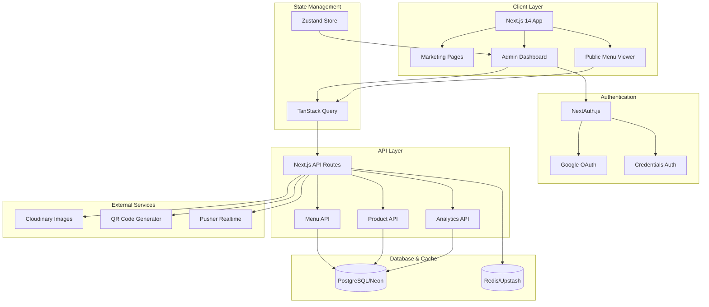
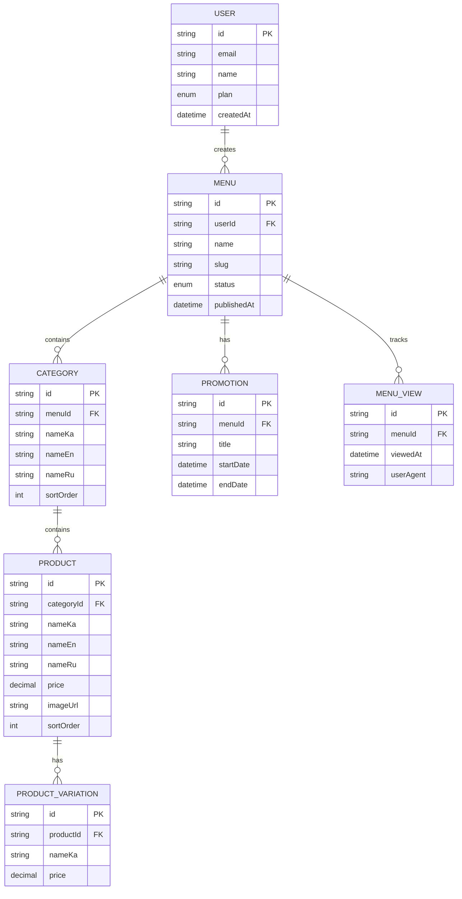

# Digital Menu - Project Plan

## 📋 Project Overview

**Project Name**: Digital Menu
**Type**: Full-Stack Web Application (SaaS)
**Status**: 🟢 In Progress
**Team Size**: Small (2-3 developers)
**Created**: 2026-01-26
**Last Updated**: 2026-02-12

### Description

Digital Menu is a SaaS platform enabling cafes and restaurants to create and manage digital menus via QR codes. The platform provides three main components:
- **Marketing Website** - Landing page with pricing and demo
- **Admin Panel** - Menu management dashboard for cafe owners
- **Public Menu** - Customer-facing menu accessed via QR code

### Target Users

- **Primary**: Cafe and restaurant owners who want to digitize their menus
- **Secondary**: Restaurant customers viewing menus via QR codes
- **Geographic Focus**: Georgia (Georgian, English, Russian language support)

---

## 🏗️ Architecture Overview



### Data Model Overview



---

## 🛠️ Tech Stack

### Frontend
- **Framework**: Next.js 14+ (App Router, Server Components)
- **Language**: TypeScript
- **Styling**: Tailwind CSS
- **UI Components**: shadcn/ui
- **Forms**: React Hook Form + Zod validation
- **State Management**:
  - TanStack Query (server state)
  - Zustand (client state)
- **Drag & Drop**: dnd-kit
- **i18n**: next-intl (Georgian, English, Russian)

### Backend
- **Runtime**: Node.js (Next.js API Routes)
- **Database**: PostgreSQL (Neon serverless)
- **ORM**: Prisma
- **Authentication**: NextAuth.js
- **Validation**: Zod schemas
- **Caching**: Redis (Upstash)
- **Real-time**: Pusher

### Infrastructure
- **Hosting**: Railway (full-stack with database)
- **Image Storage**: Cloudinary
- **QR Generation**: qrcode library
- **Email**: Resend
- **Monitoring**: Sentry
- **Analytics**: Google Analytics

### DevOps & Tools
- **Package Manager**: pnpm
- **Monorepo**: Turborepo
- **Testing**: Vitest + React Testing Library
- **Linting**: ESLint + Prettier
- **Version Control**: Git

---

## 📁 Project Structure

```
digital-menu/
├── apps/
│   └── web/                      # Main Next.js application
│       ├── app/
│       │   ├── (marketing)/      # Public pages
│       │   │   ├── page.tsx      # Landing page
│       │   │   ├── pricing/      # Pricing page
│       │   │   └── demo/         # Demo page
│       │   ├── (auth)/           # Auth pages
│       │   │   ├── login/
│       │   │   └── register/
│       │   ├── admin/            # Protected admin area
│       │   │   ├── dashboard/
│       │   │   ├── menus/
│       │   │   ├── products/
│       │   │   ├── analytics/
│       │   │   └── settings/
│       │   ├── m/
│       │   │   └── [slug]/       # Public menu viewer
│       │   └── api/              # API routes
│       │       ├── auth/
│       │       ├── menus/
│       │       ├── products/
│       │       ├── categories/
│       │       ├── promotions/
│       │       ├── qr/
│       │       ├── upload/
│       │       └── analytics/
│       ├── components/
│       │   ├── ui/               # shadcn/ui components
│       │   ├── admin/            # Admin-specific components
│       │   ├── public/           # Public menu components
│       │   ├── marketing/        # Marketing components
│       │   └── shared/           # Shared components
│       ├── lib/
│       │   ├── auth/             # NextAuth config & permissions
│       │   ├── db/               # Prisma client
│       │   ├── api/              # API utilities
│       │   ├── validations/      # Zod schemas
│       │   ├── cache/            # Redis utilities
│       │   ├── qr/               # QR code generation
│       │   └── cloudinary/       # Image management
│       ├── hooks/                # Custom React hooks
│       ├── stores/               # Zustand stores
│       ├── types/                # TypeScript types
│       └── middleware.ts         # Next.js middleware
├── packages/
│   ├── database/                 # Prisma schema & migrations
│   │   └── prisma/
│   │       └── schema.prisma
│   ├── config/                   # Shared configs
│   │   ├── eslint/
│   │   └── typescript/
│   └── types/                    # Shared TypeScript types
├── public/
│   └── locales/                  # i18n translation files
│       ├── ka/                   # Georgian
│       ├── en/                   # English
│       └── ru/                   # Russian
├── PROJECT_PLAN.md               # This file
├── CLAUDE.md                     # Claude Code instructions
└── package.json
```

---

## 🎯 MVP Features & Scope

### Essential Features (Must Have)
- ✅ User registration and login with email/password
- ✅ Google OAuth authentication
- ✅ Menu CRUD operations
- ✅ Category management with drag-drop reordering
- ✅ Product management with images
- ✅ QR code generation for menus
- ✅ Public menu display at `/m/{slug}`
- ✅ Responsive design (mobile-first)

### Advanced MVP Features (Must Have)
- ✅ Multi-language support (Georgian, English, Russian)
- ✅ Product variations (size/portion options)
- ✅ Promotions and special offers
- ✅ Basic analytics (menu views tracking)

### Post-MVP Features (Nice to Have)
- ⏳ Plan-based subscription system (Free, Starter, Pro)
- ⏳ Stripe payment integration
- ⏳ Custom branding (logo, colors)
- ⏳ Advanced analytics dashboard
- ⏳ Allergen information
- ⏳ QR codes with logo overlay
- ⏳ Email notifications
- ⏳ Progressive Web App (PWA)

---

## 📅 Implementation Phases

### Phase 1: Foundation & Infrastructure
**Goal**: Set up the project foundation and core infrastructure

#### T1.1: Project Initialization
- [x] **Status**: DONE ✅
- **Complexity**: Low
- **Estimated**: 2 hours
- **Dependencies**: None
- **Description**:
  - Initialize Next.js 14 project with TypeScript
  - Configure Turborepo monorepo structure
  - Set up pnpm workspaces
  - Configure Tailwind CSS
  - Install and configure shadcn/ui
  - Set up ESLint and Prettier

#### T1.2: Database Setup
- [x] **Status**: DONE ✅
- **Complexity**: Medium
- **Estimated**: 3 hours
- **Dependencies**: T1.1
- **Description**:
  - Create Neon PostgreSQL database
  - Define Prisma schema with all models (User, Menu, Category, Product, ProductVariation, Promotion, MenuView)
  - Set up enums (Plan, MenuStatus, Language, Allergen)
  - Configure relationships and cascading deletes
  - Run initial migration
  - Set up Prisma Client

#### T1.3: Authentication System
- [x] **Status**: DONE ✅
- **Complexity**: High
- **Estimated**: 6 hours
- **Dependencies**: T1.2
- **Description**:
  - Configure NextAuth.js with JWT strategy
  - Implement credentials provider (email/password)
  - Implement Google OAuth provider
  - Set up password hashing with bcrypt
  - Create user registration API route
  - Create login/register pages
  - Configure middleware for route protection
  - Implement session management

#### T1.4: Environment & Configuration
- [x] **Status**: DONE ✅
- **Complexity**: Low
- **Estimated**: 2 hours
- **Dependencies**: T1.1
- **Description**:
  - Set up environment variables (.env.example)
  - Configure Redis (Upstash) connection
  - Configure Cloudinary credentials
  - Configure Pusher credentials
  - Set up error tracking (Sentry)
  - Configure Google Analytics

#### T1.5: Core Library Setup
- [x] **Status**: DONE ✅
- **Complexity**: Medium
- **Estimated**: 4 hours
- **Dependencies**: T1.2
- **Description**:
  - Create Zod validation schemas for all entities
  - Set up TanStack Query client
  - Create API client utilities
  - Implement error handler utility
  - Set up Redis caching utilities
  - Create permission check functions

---

### Phase 2: Core Menu Management
**Goal**: Implement the core menu builder functionality

#### T2.1: Menu CRUD API
- [x] **Status**: DONE ✅
- **Complexity**: Medium
- **Estimated**: 5 hours
- **Dependencies**: T1.3, T1.5
- **Description**:
  - Create GET /api/menus (list user's menus)
  - Create POST /api/menus (create menu)
  - Create GET /api/menus/:id (get menu details)
  - Create PUT /api/menus/:id (update menu)
  - Create DELETE /api/menus/:id (delete menu)
  - Create POST /api/menus/:id/publish (publish/unpublish)
  - Implement user ownership validation
  - Add Redis caching for public menus

#### T2.2: Menu Admin UI
- [x] **Status**: DONE ✅
- **Complexity**: High
- **Estimated**: 6 hours
- **Dependencies**: T2.1
- **Description**:
  - Create admin dashboard layout with sidebar
  - Create menus list page with grid/list view
  - Create menu creation form with validation
  - Create menu edit page
  - Implement menu settings (name, slug, description)
  - Add publish/unpublish toggle
  - Create menu deletion with confirmation
  - Add real-time status updates

#### T2.3: Category Management API
- [x] **Status**: DONE ✅
- **Complexity**: Medium
- **Estimated**: 4 hours
- **Dependencies**: T2.1
- **Description**:
  - Create GET /api/menus/:id/categories
  - Create POST /api/menus/:id/categories
  - Create PUT /api/menus/:id/categories/:categoryId
  - Create DELETE /api/menus/:id/categories/:categoryId
  - Create POST /api/menus/:id/categories/reorder
  - Implement sortOrder management
  - Broadcast Pusher events

#### T2.4: Category Admin UI
- [x] **Status**: DONE ✅
- **Complexity**: High
- **Estimated**: 6 hours
- **Dependencies**: T2.3
- **Description**:
  - Create category list component with drag-drop
  - Integrate dnd-kit for reordering
  - Create category creation modal
  - Create category edit modal
  - Add multi-language fields (nameKa, nameEn, nameRu)
  - Implement category deletion with confirmation
  - Handle empty states

#### T2.5: Product Management API
- [x] **Status**: DONE ✅
- **Complexity**: High
- **Estimated**: 6 hours
- **Dependencies**: T2.3
- **Description**:
  - Create GET /api/menus/:id/products
  - Create POST /api/menus/:id/products
  - Create PUT /api/menus/:id/products/:productId
  - Create DELETE /api/menus/:id/products/:productId
  - Create POST /api/menus/:id/products/reorder
  - Implement product variation support
  - Handle image URL storage

#### T2.6: Product Admin UI
- [x] **Status**: DONE ✅
- **Complexity**: High
- **Estimated**: 8 hours
- **Dependencies**: T2.5
- **Description**:
  - Create product list component with drag-drop
  - Create product creation form
  - Create product edit form
  - Add multi-language fields
  - Implement image upload UI
  - Create product variation manager
  - Add price formatting
  - Implement product deletion

#### T2.7: Image Upload System
- [x] **Status**: DONE ✅
- **Complexity**: Medium
- **Estimated**: 4 hours
- **Dependencies**: T1.4
- **Description**:
  - Create POST /api/upload endpoint
  - Integrate Cloudinary SDK
  - Implement image transformation (400x400 for products)
  - Add format optimization (WebP/AVIF)
  - Handle upload errors
  - Create reusable upload component
  - Add image preview

---

### Phase 3: Advanced Features
**Goal**: Implement multi-language, variations, promotions, and analytics

#### T3.1: Multi-language System
- [x] **Status**: DONE ✅
- **Complexity**: Medium
- **Estimated**: 5 hours
- **Dependencies**: T2.4, T2.6
- **Description**:
  - Set up next-intl configuration
  - Create translation files for UI strings
  - Implement language switcher component
  - Add fallback logic (default to Georgian)
  - Update all forms to support multi-language
  - Test language switching on public menus

#### T3.2: Product Variations
- [x] **Status**: DONE ✅
- **Complexity**: High
- **Estimated**: 6 hours
- **Dependencies**: T2.6
- **Description**:
  - Create ProductVariation CRUD API routes
  - Create variation manager UI component
  - Add variation creation form (name, price)
  - Display variations on product cards
  - Update public menu to show variations
  - Handle pricing display logic

#### T3.3: Promotions System
- [x] **Status**: DONE ✅
- **Complexity**: Medium
- **Estimated**: 5 hours
- **Dependencies**: T2.1
- **Description**:
  - Create GET /api/menus/:id/promotions
  - Create POST /api/menus/:id/promotions
  - Create PUT /api/menus/:id/promotions/:id
  - Create DELETE /api/menus/:id/promotions/:id
  - Add promotion schema (title, description, start/end dates)
  - Create promotions admin UI
  - Display active promotions on public menu

#### T3.4: Analytics Foundation
- [x] **Status**: DONE ✅
- **Complexity**: Medium
- **Estimated**: 4 hours
- **Dependencies**: T2.1
- **Description**:
  - Create MenuView model tracking
  - Create POST /api/menus/:id/views (increment views)
  - Create GET /api/menus/:id/analytics
  - Track user agent and timestamp
  - Create basic analytics dashboard
  - Display total views chart
  - Add date range filters

---

### Phase 4: Public Menu & QR Codes
**Goal**: Build the customer-facing menu experience

#### T4.1: QR Code Generation
- [x] **Status**: DONE ✅
- **Complexity**: Low
- **Estimated**: 3 hours
- **Dependencies**: T2.1
- **Description**:
  - Install qrcode library
  - Create GET /api/qr/:menuId endpoint
  - Support PNG and SVG formats
  - Support multiple sizes (small, medium, large)
  - Generate QR pointing to /m/{slug}
  - Add download QR code button in admin

#### T4.2: Public Menu Display
- [x] **Status**: DONE ✅
- **Complexity**: High
- **Estimated**: 7 hours
- **Dependencies**: T2.1, T2.3, T2.5
- **Description**:
  - Create GET /m/[slug] page
  - Fetch menu with categories and products
  - Implement language switcher
  - Display menu header (name, description)
  - Display categories in order
  - Display products with images
  - Show product variations
  - Display active promotions
  - Add smooth scrolling navigation
  - Implement Redis caching (5 min TTL)

#### T4.3: Public Menu Styling
- [x] **Status**: DONE ✅
- **Complexity**: Medium
- **Estimated**: 5 hours
- **Dependencies**: T4.2
- **Description**:
  - Design mobile-first layout
  - Create product card component
  - Add category header styling
  - Implement image lazy loading
  - Add skeleton loading states
  - Create promotion banner
  - Add sticky category navigation
  - Test on multiple devices

#### T4.4: Menu View Tracking
- [x] **Status**: DONE ✅
- **Complexity**: Low
- **Estimated**: 2 hours
- **Dependencies**: T3.4, T4.2
- **Description**:
  - Track view on public menu load
  - Debounce repeated views (same IP/session)
  - Store user agent and timestamp
  - Invalidate cache on view increment
  - Test analytics dashboard updates

---

### Phase 5: Real-time & Polish
**Goal**: Add real-time updates and polish the user experience

#### T5.1: Real-time Updates (Pusher)
- [x] **Status**: DONE ✅
- **Complexity**: Medium
- **Estimated**: 5 hours
- **Dependencies**: T2.1, T2.3, T2.5
- **Description**:
  - Configure Pusher client and server
  - Create channel pattern: menu-{menuId}
  - Broadcast events from API routes
  - Subscribe to events in admin components
  - Update TanStack Query cache on events
  - Test real-time updates across tabs

#### T5.2: Drag-and-Drop Reordering
- [x] **Status**: DONE ✅
- **Complexity**: High
- **Estimated**: 6 hours
- **Dependencies**: T2.4, T2.6
- **Description**:
  - Integrate dnd-kit for categories
  - Integrate dnd-kit for products
  - Calculate new sortOrder values
  - Implement optimistic updates
  - Handle reorder API calls
  - Add visual feedback during drag
  - Test edge cases (empty lists, single item)

#### T5.3: Plan-Based Permissions
- [x] **Status**: DONE ✅
- **Complexity**: Medium
- **Estimated**: 4 hours
- **Dependencies**: T1.5, T2.1
- **Description**:
  - Implement canCreateMenu() checks
  - Implement hasFeature() checks
  - Enforce FREE plan limits (1 menu, 3 categories, 15 products)
  - Show upgrade prompts in UI
  - Disable features based on plan
  - Test limit enforcement

#### T5.4: Error Handling & Validation
- [x] **Status**: DONE ✅
- **Complexity**: Medium
- **Estimated**: 4 hours
- **Dependencies**: All previous tasks
- **Description**:
  - Add error boundaries to main sections
  - Implement toast notifications
  - Add form validation error displays
  - Handle API errors gracefully
  - Add loading states
  - Create 404 page
  - Create error pages

#### T5.5: UI Polish & Accessibility
- [x] **Status**: DONE ✅
- **Complexity**: Medium
- **Estimated**: 5 hours
- **Dependencies**: All previous tasks
- **Description**:
  - Add ARIA labels to interactive elements
  - Test keyboard navigation
  - Ensure color contrast ratios
  - Add focus indicators
  - Test with screen readers
  - Optimize animations
  - Add empty states

---

### Phase 6: Testing & Deployment
**Goal**: Ensure quality and deploy to production

#### T6.1: Component Testing
- [x] **Status**: DONE ✅
- **Complexity**: Medium
- **Estimated**: 6 hours
- **Dependencies**: T5.5
- **Description**:
  - Set up Vitest and React Testing Library
  - Write tests for UI components
  - Test form validation
  - Test error states
  - Mock API calls
  - Achieve 70%+ component coverage

#### T6.2: API Testing
- [x] **Status**: DONE ✅
- **Complexity**: Medium
- **Estimated**: 5 hours
- **Dependencies**: T5.5
- **Description**:
  - Write tests for API routes
  - Mock Prisma client
  - Test authentication flows
  - Test authorization checks
  - Test input validation
  - Test error handling

#### T6.3: Vercel Deployment Setup
- [x] **Status**: DONE ✅
- **Complexity**: Medium
- **Estimated**: 4 hours
- **Dependencies**: T1.4
- **Description**:
  - Create Vercel project
  - Connect to Neon PostgreSQL database
  - Configure environment variables
  - Set up automatic deployments from main branch
  - Configure custom domain
  - Test deployment process

#### T6.4: Production Database Migration
- [x] **Status**: DONE ✅
- **Complexity**: Low
- **Estimated**: 2 hours
- **Dependencies**: T6.3
- **Description**:
  - Run Prisma migrations on production DB
  - Seed initial data (if needed)
  - Test database connections
  - Set up automated backups
  - Configure connection pooling

#### T6.5: Monitoring & Analytics
- [x] **Status**: DONE ✅
- **Complexity**: Low
- **Estimated**: 3 hours
- **Dependencies**: T6.3
- **Description**:
  - Configure Sentry error tracking
  - Set up Google Analytics
  - Add performance monitoring
  - Configure uptime monitoring
  - Create alerting rules
  - Test error reporting

#### T6.6: Documentation
- [x] **Status**: DONE ✅
- **Complexity**: Low
- **Estimated**: 3 hours
- **Dependencies**: T6.5
- **Description**:
  - Update README.md with setup instructions
  - Document API endpoints
  - Create developer guide
  - Add deployment guide
  - Document environment variables
  - Create user guide for cafe owners

---

### Phase 7: Admin Live Preview
**Goal**: Add a live phone mockup preview to the menu editing page that updates in real-time as admin edits content

#### T7.1: Phone Preview Frame Component
- [x] **Status**: DONE ✅
- **Complexity**: Medium
- **Estimated**: 3 hours
- **Dependencies**: T2.2
- **Files**: `apps/web/components/admin/phone-preview.tsx`
- **Description**:
  - Create pure CSS phone mockup component (300px wide, no image assets)
  - Rounded corners, dark border simulating device bezel
  - Dynamic island/notch at top, home indicator at bottom
  - Inner screen: content rendered at 375px width, scaled to 0.8 to fit frame
  - Scrollable screen area (overflow-y-auto with scrollbar-hide)
  - "Preview" label above the phone
  - Desktop only (hidden below `lg` breakpoint)

#### T7.2: Menu Preview Content Component
- [x] **Status**: DONE ✅
- **Complexity**: High
- **Estimated**: 5 hours
- **Dependencies**: T7.1, T4.2
- **Files**: `apps/web/components/admin/menu-preview-content.tsx`
- **Description**:
  - Accept `MenuWithDetails` from `useMenu()` hook + locale
  - Data transformation via `useMemo`: filter unavailable products, empty categories, expired promotions
  - Reuse public components: `CategorySection`, `ProductCard`, `PromotionBanner`
  - Create simplified private sub-components:
    - `PreviewHeader` - menu header without sticky positioning
    - `PreviewCategoryNav` - static category pills (no scroll-spy)
    - `PreviewFooter` - simplified footer
    - `PreviewSkeleton` - loading skeleton matching phone layout
    - `EmptyMenuPreview` - empty state message
  - No new API calls — all data from existing `useMenu(id)` cache

#### T7.3: Integrate Live Preview into Menu Detail Page
- [x] **Status**: DONE ✅
- **Complexity**: Medium
- **Estimated**: 3 hours
- **Dependencies**: T7.1, T7.2
- **Files**: `apps/web/app/admin/menus/[id]/page.tsx`
- **Description**:
  - Convert single-column layout to two-column on `lg+` screens
  - Header and Stats Cards remain full-width above separator
  - Left column: Categories, Promotions, Info cards (flex-1 min-w-0)
  - Right column: PhonePreview > MenuPreviewContent (w-[340px] sticky top-6)
  - Hidden below `lg` breakpoint via `hidden lg:block`
  - Preview reactively updates from same TanStack Query cache the editor uses
  - Update `MenuDetailSkeleton` to include phone skeleton on lg+
  - No modifications to public components needed

---

### Phase 8: Marketing Website
**Goal**: Build a professional marketing landing page with full SEO optimization

#### T8.1: Landing Page Foundation & Layout
- [x] **Status**: DONE ✅
- **Complexity**: Medium
- **Estimated**: 4 hours
- **Dependencies**: T6.6
- **Description**:
  - Create `app/(marketing)/page.tsx` landing page structure
  - Set up Framer Motion for animations
  - Create responsive layout components (Container, Section)
  - Implement mobile-first design with Tailwind CSS
  - Add navigation header with language switcher
  - Create footer component with links and social media

#### T8.2: Hero Section with Demo Preview
- [ ] **Status**: TODO
- **Complexity**: High
- **Estimated**: 5 hours
- **Dependencies**: T8.1
- **Description**:
  - Design compelling hero section with headline and CTA
  - Create interactive QR menu demo preview component
  - Add Framer Motion entrance animations
  - Implement phone mockup showing live menu demo
  - Add "Try Demo" and "Start Free" CTA buttons
  - Create gradient backgrounds and visual effects

#### T8.3: Features Section
- [ ] **Status**: TODO
- **Complexity**: Medium
- **Estimated**: 4 hours
- **Dependencies**: T8.1
- **Description**:
  - Create features grid layout (6-8 features)
  - Design feature cards with icons (Lucide icons)
  - Add scroll-triggered animations with Framer Motion
  - Highlight key features: QR codes, multi-language, analytics
  - Create "How it works" 3-step process section
  - Add feature comparison table

#### T8.4: Pricing Section
- [ ] **Status**: TODO
- **Complexity**: Medium
- **Estimated**: 4 hours
- **Dependencies**: T8.1
- **Description**:
  - Create pricing cards for FREE, STARTER (29₾), PRO (59₾) plans
  - Highlight recommended plan (STARTER)
  - List features for each plan with checkmarks
  - Add "Most Popular" badge
  - Implement toggle for monthly/yearly pricing (future)
  - Add CTA buttons to register

#### T8.5: Testimonials & Social Proof
- [ ] **Status**: TODO
- **Complexity**: Medium
- **Estimated**: 3 hours
- **Dependencies**: T8.1
- **Description**:
  - Create testimonials carousel/grid
  - Design testimonial cards with photos and quotes
  - Add company logos section "Trusted by"
  - Create statistics section (users, menus, scans)
  - Implement smooth carousel with Framer Motion
  - Add star ratings display

#### T8.6: FAQ Section
- [ ] **Status**: TODO
- **Complexity**: Low
- **Estimated**: 2 hours
- **Dependencies**: T8.1
- **Description**:
  - Create accordion FAQ component with shadcn/ui
  - Write 8-10 common questions and answers
  - Add smooth expand/collapse animations
  - Organize by categories (General, Pricing, Technical)
  - Support multi-language FAQ content
  - Add "Contact Us" link for more questions

#### T8.7: Contact Form & Newsletter
- [ ] **Status**: TODO
- **Complexity**: Medium
- **Estimated**: 4 hours
- **Dependencies**: T8.1
- **Description**:
  - Create contact form with React Hook Form + Zod validation
  - Set up POST /api/contact endpoint
  - Integrate Resend for email notifications
  - Create newsletter signup form
  - Add success/error toast notifications
  - Implement honeypot spam protection

#### T8.8: SEO & Meta Tags
- [ ] **Status**: TODO
- **Complexity**: Medium
- **Estimated**: 3 hours
- **Dependencies**: T8.1
- **Description**:
  - Configure Next.js metadata API for all pages
  - Add Open Graph tags for social sharing
  - Create Twitter Card meta tags
  - Implement JSON-LD structured data (Organization, Product)
  - Generate dynamic sitemap.xml
  - Create robots.txt
  - Add canonical URLs

#### T8.9: Multi-language Landing Content
- [ ] **Status**: TODO
- **Complexity**: Medium
- **Estimated**: 4 hours
- **Dependencies**: T8.2, T8.3, T8.4, T8.5, T8.6
- **Description**:
  - Create translation files for marketing content (ka, en, ru)
  - Translate all landing page text
  - Implement language switcher in header
  - Add hreflang tags for SEO
  - Test all languages for proper display
  - Handle Georgian typography properly

#### T8.10: Live Chat Widget Integration
- [ ] **Status**: TODO
- **Complexity**: Low
- **Estimated**: 2 hours
- **Dependencies**: T8.1
- **Description**:
  - Integrate Crisp/Tawk.to/Intercom chat widget
  - Configure widget appearance and position
  - Set up automated greeting message
  - Add chat to all marketing pages
  - Configure mobile-friendly chat button
  - Test across all supported languages

---

## 📊 Progress Tracking

### Overall Progress
- **Total Tasks**: 44
- **Completed**: 35
- **In Progress**: 0
- **Blocked**: 0
- **Progress**: 80%

```
Progress: 🟩🟩🟩🟩🟩🟩🟩🟩🟨🟨 80%
```

### Phase Breakdown
- **Phase 1 - Foundation**: 5/5 (100%) ✅
- **Phase 2 - Core Menu Management**: 7/7 (100%) ✅
- **Phase 3 - Advanced Features**: 4/4 (100%) ✅
- **Phase 4 - Public Menu & QR**: 4/4 (100%) ✅
- **Phase 5 - Real-time & Polish**: 5/5 (100%) ✅
- **Phase 6 - Testing & Deployment**: 6/6 (100%) ✅
- **Phase 7 - Admin Live Preview**: 3/3 (100%) ✅
- **Phase 8 - Marketing Website**: 1/10 (10%) 🔄

### Current Focus
🎯 **Status**: Phase 8 - Marketing Website
📅 **Current Task**: T8.2 - Hero Section with Demo Preview
✨ **Goal**: Build a professional marketing landing page with full SEO optimization

---

## ✅ Success Criteria

### Minimum Viable Product (MVP)
- [ ] Users can register and log in with email or Google
- [ ] Users can create and manage multiple menus
- [ ] Users can add categories and products with images
- [ ] Products support multiple languages (KA, EN, RU)
- [ ] Products support variations (sizes/portions)
- [ ] Users can create promotions
- [ ] Users can generate QR codes for menus
- [ ] Public menus are viewable at `/m/{slug}`
- [ ] Public menus support language switching
- [ ] Basic analytics track menu views
- [ ] App is deployed to Railway and accessible online
- [ ] All core features work on mobile devices

### Quality Gates
- [ ] All API routes validate input with Zod schemas
- [ ] All database queries filter by userId for security
- [ ] Images are optimized via Cloudinary
- [ ] Public menus are cached in Redis
- [ ] No console errors on production build
- [ ] Component test coverage >70%
- [ ] Page load time <3 seconds
- [ ] Mobile responsive design tested on iOS and Android

### Post-MVP Goals
- [ ] Stripe payment integration
- [ ] Subscription plan enforcement
- [ ] Advanced analytics dashboard
- [ ] Allergen information
- [ ] Email notifications
- [ ] Progressive Web App (PWA) support
- [ ] Custom branding (logos, colors)

---

## 🚀 Next Steps

1. **Review this plan** - Make sure all tasks align with your vision
2. **Set up development environment** - Install dependencies and configure tools
3. **Start with T1.1** - Begin project initialization
4. **Update progress regularly** - Mark tasks as in-progress and completed
5. **Iterate and adjust** - Refine tasks as you learn more

### Quick Commands

```bash
# Start working on the first task
/plan:next

# Update task status
/plan:update T1.1 start
/plan:update T1.1 done

# View current progress
/plan:status

# View specific phase
/plan:phase 1
```

---

## 📝 Notes & Decisions

### Key Design Decisions
- **Next.js App Router**: Chosen for better performance and SEO
- **Prisma ORM**: Type-safe database access with migrations
- **TanStack Query**: Simplified server state management
- **shadcn/ui**: Customizable components without bloat
- **Multi-language fields**: Stored in database rather than translation files
- **Railway**: Balanced cost and ease of use for full-stack deployment

### Risk Mitigation
- **Plan Limits**: Enforce limits early to avoid refactoring later
- **Image Optimization**: Use Cloudinary to avoid storage issues
- **Caching**: Redis prevents database overload on public menus
- **Real-time**: Pusher provides reliable updates without custom WebSocket server

### Performance Considerations
- Public menus cached in Redis (5 min TTL)
- Images served via Cloudinary CDN
- Database indexes on foreign keys
- TanStack Query reduces unnecessary API calls
- Lazy loading images on public menus

---

**Generated by Claude Code Plan Creation Wizard**
Version: 1.0.0
Last Updated: 2026-01-26
