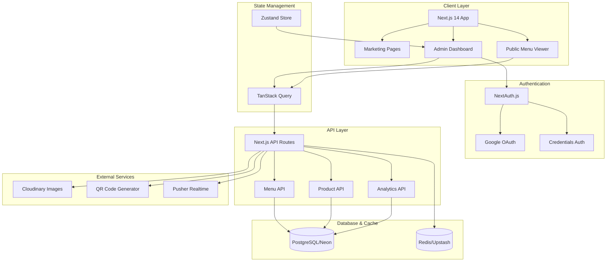
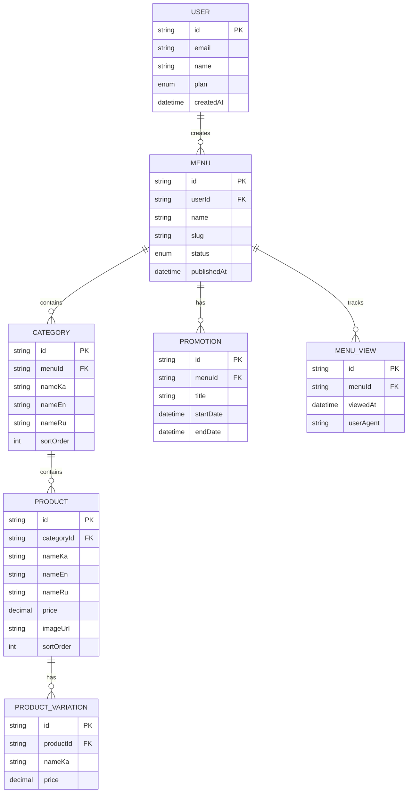

# Digital Menu - Project Plan

## 📋 Project Overview

**Project Name**: Digital Menu
**Type**: Full-Stack Web Application (SaaS)
**Status**: 🟢 In Progress
**Team Size**: Small (2-3 developers)
**Created**: 2026-01-26
**Last Updated**: 2026-04-21

### Description

Digital Menu is a SaaS platform enabling cafes and restaurants to create and manage digital menus via QR codes. The platform provides three main components:
- **Marketing Website** - Landing page with pricing and demo
- **Admin Panel** - Menu management dashboard for cafe owners
- **Public Menu** - Customer-facing menu accessed via QR code

### Target Users

- **Primary**: Cafe and restaurant owners who want to digitize their menus
- **Secondary**: Restaurant customers viewing menus via QR codes
- **Geographic Focus**: Georgia (Georgian, English, Russian language support)

---

## 🏗️ Architecture Overview


```mermaid
graph TB
    subgraph "Client Layer"
        A[Next.js 14 App]
        B[Marketing Pages]
        C[Admin Dashboard]
        D[Public Menu Viewer]
    end

    subgraph "Authentication"
        E[NextAuth.js]
        F[Google OAuth]
        G[Credentials Auth]
    end

    subgraph "API Layer"
        H[Next.js API Routes]
        I[Menu API]
        J[Product API]
        K[Analytics API]
    end

    subgraph "State Management"
        L[TanStack Query]
        M[Zustand Store]
    end

    subgraph "Database & Cache"
        N[(PostgreSQL/Neon)]
        O[(Redis/Upstash)]
    end

    subgraph "External Services"
        P[Cloudinary Images]
        Q[QR Code Generator]
        R[Pusher Realtime]
    end

    A --> B
    A --> C
    A --> D
    C --> E
    E --> F
    E --> G
    C --> L
    D --> L
    L --> H
    H --> I
    H --> J
    H --> K
    I --> N
    J --> N
    K --> N
    H --> O
    H --> P
    H --> Q
    H --> R
    M --> C
```

### Data Model Overview


```mermaid
erDiagram
    USER ||--o{ MENU : creates
    MENU ||--o{ CATEGORY : contains
    MENU ||--o{ PROMOTION : has
    MENU ||--o{ MENU_VIEW : tracks
    CATEGORY ||--o{ PRODUCT : contains
    PRODUCT ||--o{ PRODUCT_VARIATION : has

    USER {
        string id PK
        string email
        string name
        enum plan
        datetime createdAt
    }

    MENU {
        string id PK
        string userId FK
        string name
        string slug
        enum status
        datetime publishedAt
    }

    CATEGORY {
        string id PK
        string menuId FK
        string nameKa
        string nameEn
        string nameRu
        int sortOrder
    }

    PRODUCT {
        string id PK
        string categoryId FK
        string nameKa
        string nameEn
        string nameRu
        decimal price
        string imageUrl
        int sortOrder
    }

    PRODUCT_VARIATION {
        string id PK
        string productId FK
        string nameKa
        decimal price
    }

    PROMOTION {
        string id PK
        string menuId FK
        string title
        datetime startDate
        datetime endDate
    }

    MENU_VIEW {
        string id PK
        string menuId FK
        datetime viewedAt
        string userAgent
    }
```

---

## 🛠️ Tech Stack

### Frontend
- **Framework**: Next.js 14+ (App Router, Server Components)
- **Language**: TypeScript
- **Styling**: Tailwind CSS
- **UI Components**: shadcn/ui
- **Forms**: React Hook Form + Zod validation
- **State Management**:
  - TanStack Query (server state)
  - Zustand (client state)
- **Drag & Drop**: dnd-kit
- **i18n**: next-intl (Georgian, English, Russian)

### Backend
- **Runtime**: Node.js (Next.js API Routes)
- **Database**: PostgreSQL (Neon serverless)
- **ORM**: Prisma
- **Authentication**: NextAuth.js
- **Validation**: Zod schemas
- **Caching**: Redis (Upstash)
- **Real-time**: Pusher

### Infrastructure
- **Hosting**: Railway (full-stack with database)
- **Image Storage**: Cloudinary
- **QR Generation**: qrcode library
- **Email**: Resend
- **Monitoring**: Sentry
- **Analytics**: Google Analytics

### DevOps & Tools
- **Package Manager**: pnpm
- **Monorepo**: Turborepo
- **Testing**: Vitest + React Testing Library
- **Linting**: ESLint + Prettier
- **Version Control**: Git

---

## 📁 Project Structure

```
digital-menu/
├── apps/
│   └── web/                      # Main Next.js application
│       ├── app/
│       │   ├── (marketing)/      # Public pages
│       │   │   ├── page.tsx      # Landing page
│       │   │   ├── pricing/      # Pricing page
│       │   │   └── demo/         # Demo page
│       │   ├── (auth)/           # Auth pages
│       │   │   ├── login/
│       │   │   └── register/
│       │   ├── admin/            # Protected admin area
│       │   │   ├── dashboard/
│       │   │   ├── menus/
│       │   │   ├── products/
│       │   │   ├── analytics/
│       │   │   └── settings/
│       │   ├── m/
│       │   │   └── [slug]/       # Public menu viewer
│       │   └── api/              # API routes
│       │       ├── auth/
│       │       ├── menus/
│       │       ├── products/
│       │       ├── categories/
│       │       ├── promotions/
│       │       ├── qr/
│       │       ├── upload/
│       │       └── analytics/
│       ├── components/
│       │   ├── ui/               # shadcn/ui components
│       │   ├── admin/            # Admin-specific components
│       │   ├── public/           # Public menu components
│       │   ├── marketing/        # Marketing components
│       │   └── shared/           # Shared components
│       ├── lib/
│       │   ├── auth/             # NextAuth config & permissions
│       │   ├── db/               # Prisma client
│       │   ├── api/              # API utilities
│       │   ├── validations/      # Zod schemas
│       │   ├── cache/            # Redis utilities
│       │   ├── qr/               # QR code generation
│       │   └── cloudinary/       # Image management
│       ├── hooks/                # Custom React hooks
│       ├── stores/               # Zustand stores
│       ├── types/                # TypeScript types
│       └── middleware.ts         # Next.js middleware
├── packages/
│   ├── database/                 # Prisma schema & migrations
│   │   └── prisma/
│   │       └── schema.prisma
│   ├── config/                   # Shared configs
│   │   ├── eslint/
│   │   └── typescript/
│   └── types/                    # Shared TypeScript types
├── public/
│   └── locales/                  # i18n translation files
│       ├── ka/                   # Georgian
│       ├── en/                   # English
│       └── ru/                   # Russian
├── PROJECT_PLAN.md               # This file
├── CLAUDE.md                     # Claude Code instructions
└── package.json
```

---

## 🎯 MVP Features & Scope

### Essential Features (Must Have)
- ✅ User registration and login with email/password
- ✅ Google OAuth authentication
- ✅ Menu CRUD operations
- ✅ Category management with drag-drop reordering
- ✅ Product management with images
- ✅ QR code generation for menus
- ✅ Public menu display at `/m/{slug}`
- ✅ Responsive design (mobile-first)

### Advanced MVP Features (Must Have)
- ✅ Multi-language support (Georgian, English, Russian)
- ✅ Product variations (size/portion options)
- ✅ Promotions and special offers
- ✅ Basic analytics (menu views tracking)

### Post-MVP Features (Nice to Have)
- ⏳ Plan-based subscription system (Free, Starter, Pro)
- ⏳ Stripe payment integration
- ⏳ Custom branding (logo, colors)
- ⏳ Advanced analytics dashboard
- ⏳ Allergen information
- ⏳ QR codes with logo overlay
- ⏳ Email notifications
- ⏳ Progressive Web App (PWA)

---

## 📅 Implementation Phases

### Phase 1: Foundation & Infrastructure
**Goal**: Set up the project foundation and core infrastructure

#### T1.1: Project Initialization
- [x] **Status**: DONE ✅
- **Complexity**: Low
- **Estimated**: 2 hours
- **Dependencies**: None
- **Description**:
  - Initialize Next.js 14 project with TypeScript
  - Configure Turborepo monorepo structure
  - Set up pnpm workspaces
  - Configure Tailwind CSS
  - Install and configure shadcn/ui
  - Set up ESLint and Prettier

#### T1.2: Database Setup
- [x] **Status**: DONE ✅
- **Complexity**: Medium
- **Estimated**: 3 hours
- **Dependencies**: T1.1
- **Description**:
  - Create Neon PostgreSQL database
  - Define Prisma schema with all models (User, Menu, Category, Product, ProductVariation, Promotion, MenuView)
  - Set up enums (Plan, MenuStatus, Language, Allergen)
  - Configure relationships and cascading deletes
  - Run initial migration
  - Set up Prisma Client

#### T1.3: Authentication System
- [x] **Status**: DONE ✅
- **Complexity**: High
- **Estimated**: 6 hours
- **Dependencies**: T1.2
- **Description**:
  - Configure NextAuth.js with JWT strategy
  - Implement credentials provider (email/password)
  - Implement Google OAuth provider
  - Set up password hashing with bcrypt
  - Create user registration API route
  - Create login/register pages
  - Configure middleware for route protection
  - Implement session management

#### T1.4: Environment & Configuration
- [x] **Status**: DONE ✅
- **Complexity**: Low
- **Estimated**: 2 hours
- **Dependencies**: T1.1
- **Description**:
  - Set up environment variables (.env.example)
  - Configure Redis (Upstash) connection
  - Configure Cloudinary credentials
  - Configure Pusher credentials
  - Set up error tracking (Sentry)
  - Configure Google Analytics

#### T1.5: Core Library Setup
- [x] **Status**: DONE ✅
- **Complexity**: Medium
- **Estimated**: 4 hours
- **Dependencies**: T1.2
- **Description**:
  - Create Zod validation schemas for all entities
  - Set up TanStack Query client
  - Create API client utilities
  - Implement error handler utility
  - Set up Redis caching utilities
  - Create permission check functions

---

### Phase 2: Core Menu Management
**Goal**: Implement the core menu builder functionality

#### T2.1: Menu CRUD API
- [x] **Status**: DONE ✅
- **Complexity**: Medium
- **Estimated**: 5 hours
- **Dependencies**: T1.3, T1.5
- **Description**:
  - Create GET /api/menus (list user's menus)
  - Create POST /api/menus (create menu)
  - Create GET /api/menus/:id (get menu details)
  - Create PUT /api/menus/:id (update menu)
  - Create DELETE /api/menus/:id (delete menu)
  - Create POST /api/menus/:id/publish (publish/unpublish)
  - Implement user ownership validation
  - Add Redis caching for public menus

#### T2.2: Menu Admin UI
- [x] **Status**: DONE ✅
- **Complexity**: High
- **Estimated**: 6 hours
- **Dependencies**: T2.1
- **Description**:
  - Create admin dashboard layout with sidebar
  - Create menus list page with grid/list view
  - Create menu creation form with validation
  - Create menu edit page
  - Implement menu settings (name, slug, description)
  - Add publish/unpublish toggle
  - Create menu deletion with confirmation
  - Add real-time status updates

#### T2.3: Category Management API
- [x] **Status**: DONE ✅
- **Complexity**: Medium
- **Estimated**: 4 hours
- **Dependencies**: T2.1
- **Description**:
  - Create GET /api/menus/:id/categories
  - Create POST /api/menus/:id/categories
  - Create PUT /api/menus/:id/categories/:categoryId
  - Create DELETE /api/menus/:id/categories/:categoryId
  - Create POST /api/menus/:id/categories/reorder
  - Implement sortOrder management
  - Broadcast Pusher events

#### T2.4: Category Admin UI
- [x] **Status**: DONE ✅
- **Complexity**: High
- **Estimated**: 6 hours
- **Dependencies**: T2.3
- **Description**:
  - Create category list component with drag-drop
  - Integrate dnd-kit for reordering
  - Create category creation modal
  - Create category edit modal
  - Add multi-language fields (nameKa, nameEn, nameRu)
  - Implement category deletion with confirmation
  - Handle empty states

#### T2.5: Product Management API
- [x] **Status**: DONE ✅
- **Complexity**: High
- **Estimated**: 6 hours
- **Dependencies**: T2.3
- **Description**:
  - Create GET /api/menus/:id/products
  - Create POST /api/menus/:id/products
  - Create PUT /api/menus/:id/products/:productId
  - Create DELETE /api/menus/:id/products/:productId
  - Create POST /api/menus/:id/products/reorder
  - Implement product variation support
  - Handle image URL storage

#### T2.6: Product Admin UI
- [x] **Status**: DONE ✅
- **Complexity**: High
- **Estimated**: 8 hours
- **Dependencies**: T2.5
- **Description**:
  - Create product list component with drag-drop
  - Create product creation form
  - Create product edit form
  - Add multi-language fields
  - Implement image upload UI
  - Create product variation manager
  - Add price formatting
  - Implement product deletion

#### T2.7: Image Upload System
- [x] **Status**: DONE ✅
- **Complexity**: Medium
- **Estimated**: 4 hours
- **Dependencies**: T1.4
- **Description**:
  - Create POST /api/upload endpoint
  - Integrate Cloudinary SDK
  - Implement image transformation (400x400 for products)
  - Add format optimization (WebP/AVIF)
  - Handle upload errors
  - Create reusable upload component
  - Add image preview

---

### Phase 3: Advanced Features
**Goal**: Implement multi-language, variations, promotions, and analytics

#### T3.1: Multi-language System
- [x] **Status**: DONE ✅
- **Complexity**: Medium
- **Estimated**: 5 hours
- **Dependencies**: T2.4, T2.6
- **Description**:
  - Set up next-intl configuration
  - Create translation files for UI strings
  - Implement language switcher component
  - Add fallback logic (default to Georgian)
  - Update all forms to support multi-language
  - Test language switching on public menus

#### T3.2: Product Variations
- [x] **Status**: DONE ✅
- **Complexity**: High
- **Estimated**: 6 hours
- **Dependencies**: T2.6
- **Description**:
  - Create ProductVariation CRUD API routes
  - Create variation manager UI component
  - Add variation creation form (name, price)
  - Display variations on product cards
  - Update public menu to show variations
  - Handle pricing display logic

#### T3.3: Promotions System
- [x] **Status**: DONE ✅
- **Complexity**: Medium
- **Estimated**: 5 hours
- **Dependencies**: T2.1
- **Description**:
  - Create GET /api/menus/:id/promotions
  - Create POST /api/menus/:id/promotions
  - Create PUT /api/menus/:id/promotions/:id
  - Create DELETE /api/menus/:id/promotions/:id
  - Add promotion schema (title, description, start/end dates)
  - Create promotions admin UI
  - Display active promotions on public menu

#### T3.4: Analytics Foundation
- [x] **Status**: DONE ✅
- **Complexity**: Medium
- **Estimated**: 4 hours
- **Dependencies**: T2.1
- **Description**:
  - Create MenuView model tracking
  - Create POST /api/menus/:id/views (increment views)
  - Create GET /api/menus/:id/analytics
  - Track user agent and timestamp
  - Create basic analytics dashboard
  - Display total views chart
  - Add date range filters

---

### Phase 4: Public Menu & QR Codes
**Goal**: Build the customer-facing menu experience

#### T4.1: QR Code Generation
- [x] **Status**: DONE ✅
- **Complexity**: Low
- **Estimated**: 3 hours
- **Dependencies**: T2.1
- **Description**:
  - Install qrcode library
  - Create GET /api/qr/:menuId endpoint
  - Support PNG and SVG formats
  - Support multiple sizes (small, medium, large)
  - Generate QR pointing to /m/{slug}
  - Add download QR code button in admin

#### T4.2: Public Menu Display
- [x] **Status**: DONE ✅
- **Complexity**: High
- **Estimated**: 7 hours
- **Dependencies**: T2.1, T2.3, T2.5
- **Description**:
  - Create GET /m/[slug] page
  - Fetch menu with categories and products
  - Implement language switcher
  - Display menu header (name, description)
  - Display categories in order
  - Display products with images
  - Show product variations
  - Display active promotions
  - Add smooth scrolling navigation
  - Implement Redis caching (5 min TTL)

#### T4.3: Public Menu Styling
- [x] **Status**: DONE ✅
- **Complexity**: Medium
- **Estimated**: 5 hours
- **Dependencies**: T4.2
- **Description**:
  - Design mobile-first layout
  - Create product card component
  - Add category header styling
  - Implement image lazy loading
  - Add skeleton loading states
  - Create promotion banner
  - Add sticky category navigation
  - Test on multiple devices

#### T4.4: Menu View Tracking
- [x] **Status**: DONE ✅
- **Complexity**: Low
- **Estimated**: 2 hours
- **Dependencies**: T3.4, T4.2
- **Description**:
  - Track view on public menu load
  - Debounce repeated views (same IP/session)
  - Store user agent and timestamp
  - Invalidate cache on view increment
  - Test analytics dashboard updates

---

### Phase 5: Real-time & Polish
**Goal**: Add real-time updates and polish the user experience

#### T5.1: Real-time Updates (Pusher)
- [x] **Status**: DONE ✅
- **Complexity**: Medium
- **Estimated**: 5 hours
- **Dependencies**: T2.1, T2.3, T2.5
- **Description**:
  - Configure Pusher client and server
  - Create channel pattern: menu-{menuId}
  - Broadcast events from API routes
  - Subscribe to events in admin components
  - Update TanStack Query cache on events
  - Test real-time updates across tabs

#### T5.2: Drag-and-Drop Reordering
- [x] **Status**: DONE ✅
- **Complexity**: High
- **Estimated**: 6 hours
- **Dependencies**: T2.4, T2.6
- **Description**:
  - Integrate dnd-kit for categories
  - Integrate dnd-kit for products
  - Calculate new sortOrder values
  - Implement optimistic updates
  - Handle reorder API calls
  - Add visual feedback during drag
  - Test edge cases (empty lists, single item)

#### T5.3: Plan-Based Permissions
- [x] **Status**: DONE ✅
- **Complexity**: Medium
- **Estimated**: 4 hours
- **Dependencies**: T1.5, T2.1
- **Description**:
  - Implement canCreateMenu() checks
  - Implement hasFeature() checks
  - Enforce FREE plan limits (1 menu, 3 categories, 15 products)
  - Show upgrade prompts in UI
  - Disable features based on plan
  - Test limit enforcement

#### T5.4: Error Handling & Validation
- [x] **Status**: DONE ✅
- **Complexity**: Medium
- **Estimated**: 4 hours
- **Dependencies**: All previous tasks
- **Description**:
  - Add error boundaries to main sections
  - Implement toast notifications
  - Add form validation error displays
  - Handle API errors gracefully
  - Add loading states
  - Create 404 page
  - Create error pages

#### T5.5: UI Polish & Accessibility
- [x] **Status**: DONE ✅
- **Complexity**: Medium
- **Estimated**: 5 hours
- **Dependencies**: All previous tasks
- **Description**:
  - Add ARIA labels to interactive elements
  - Test keyboard navigation
  - Ensure color contrast ratios
  - Add focus indicators
  - Test with screen readers
  - Optimize animations
  - Add empty states

---

### Phase 6: Testing & Deployment
**Goal**: Ensure quality and deploy to production

#### T6.1: Component Testing
- [x] **Status**: DONE ✅
- **Complexity**: Medium
- **Estimated**: 6 hours
- **Dependencies**: T5.5
- **Description**:
  - Set up Vitest and React Testing Library
  - Write tests for UI components
  - Test form validation
  - Test error states
  - Mock API calls
  - Achieve 70%+ component coverage

#### T6.2: API Testing
- [x] **Status**: DONE ✅
- **Complexity**: Medium
- **Estimated**: 5 hours
- **Dependencies**: T5.5
- **Description**:
  - Write tests for API routes
  - Mock Prisma client
  - Test authentication flows
  - Test authorization checks
  - Test input validation
  - Test error handling

#### T6.3: Vercel Deployment Setup
- [x] **Status**: DONE ✅
- **Complexity**: Medium
- **Estimated**: 4 hours
- **Dependencies**: T1.4
- **Description**:
  - Create Vercel project
  - Connect to Neon PostgreSQL database
  - Configure environment variables
  - Set up automatic deployments from main branch
  - Configure custom domain
  - Test deployment process

#### T6.4: Production Database Migration
- [x] **Status**: DONE ✅
- **Complexity**: Low
- **Estimated**: 2 hours
- **Dependencies**: T6.3
- **Description**:
  - Run Prisma migrations on production DB
  - Seed initial data (if needed)
  - Test database connections
  - Set up automated backups
  - Configure connection pooling

#### T6.5: Monitoring & Analytics
- [x] **Status**: DONE ✅
- **Complexity**: Low
- **Estimated**: 3 hours
- **Dependencies**: T6.3
- **Description**:
  - Configure Sentry error tracking
  - Set up Google Analytics
  - Add performance monitoring
  - Configure uptime monitoring
  - Create alerting rules
  - Test error reporting

#### T6.6: Documentation
- [x] **Status**: DONE ✅
- **Complexity**: Low
- **Estimated**: 3 hours
- **Dependencies**: T6.5
- **Description**:
  - Update README.md with setup instructions
  - Document API endpoints
  - Create developer guide
  - Add deployment guide
  - Document environment variables
  - Create user guide for cafe owners

---

### Phase 7: Admin Live Preview
**Goal**: Add a live phone mockup preview to the menu editing page that updates in real-time as admin edits content

#### T7.1: Phone Preview Frame Component
- [x] **Status**: DONE ✅
- **Complexity**: Medium
- **Estimated**: 3 hours
- **Dependencies**: T2.2
- **Files**: `apps/web/components/admin/phone-preview.tsx`
- **Description**:
  - Create pure CSS phone mockup component (300px wide, no image assets)
  - Rounded corners, dark border simulating device bezel
  - Dynamic island/notch at top, home indicator at bottom
  - Inner screen: content rendered at 375px width, scaled to 0.8 to fit frame
  - Scrollable screen area (overflow-y-auto with scrollbar-hide)
  - "Preview" label above the phone
  - Desktop only (hidden below `lg` breakpoint)

#### T7.2: Menu Preview Content Component
- [x] **Status**: DONE ✅
- **Complexity**: High
- **Estimated**: 5 hours
- **Dependencies**: T7.1, T4.2
- **Files**: `apps/web/components/admin/menu-preview-content.tsx`
- **Description**:
  - Accept `MenuWithDetails` from `useMenu()` hook + locale
  - Data transformation via `useMemo`: filter unavailable products, empty categories, expired promotions
  - Reuse public components: `CategorySection`, `ProductCard`, `PromotionBanner`
  - Create simplified private sub-components:
    - `PreviewHeader` - menu header without sticky positioning
    - `PreviewCategoryNav` - static category pills (no scroll-spy)
    - `PreviewFooter` - simplified footer
    - `PreviewSkeleton` - loading skeleton matching phone layout
    - `EmptyMenuPreview` - empty state message
  - No new API calls — all data from existing `useMenu(id)` cache

#### T7.3: Integrate Live Preview into Menu Detail Page
- [x] **Status**: DONE ✅
- **Complexity**: Medium
- **Estimated**: 3 hours
- **Dependencies**: T7.1, T7.2
- **Files**: `apps/web/app/admin/menus/[id]/page.tsx`
- **Description**:
  - Convert single-column layout to two-column on `lg+` screens
  - Header and Stats Cards remain full-width above separator
  - Left column: Categories, Promotions, Info cards (flex-1 min-w-0)
  - Right column: PhonePreview > MenuPreviewContent (w-[340px] sticky top-6)
  - Hidden below `lg` breakpoint via `hidden lg:block`
  - Preview reactively updates from same TanStack Query cache the editor uses
  - Update `MenuDetailSkeleton` to include phone skeleton on lg+
  - No modifications to public components needed

---

### Phase 9: Design Foundation & Test Infrastructure
**Goal**: Establish the new design system tokens and Playwright testing infrastructure required for implementing the Claude Design handoff bundle.

**📌 Required reading for every Phase 9-17 task:**
- **Design bundle**: `qr-menu-design/` (Claude Design handoff — HTML + JSX prototypes, open `qr-menu-design/Digital Menu Dashboard.html` in a browser to view the canvas)
- **Token spec**: `docs/design-tokens.md` — 16 colors, 7 type levels, 6 radii, 10 spacing steps, 6 shadows
- **Artboard → source file mapping**: see `CLAUDE.md` → "Design System & Redesign Implementation" section
- **Non-negotiables** (plan tiers, identity, sidebar items, editor tabs, Georgian content): also in `CLAUDE.md`

**Design Reference**: 36 artboards across 10 sections (Dashboard, Menus, Menu Editor with 7 tabs, Product Drawer, Analytics, Promotions, QR codes, Settings, Mobile, Component Library). Tokens defined in Section H.

**Testing Mandate**: Every UI task in phases 9-17 MUST ship with Playwright tests that verify **both** visual fidelity (against a committed baseline screenshot, 5% threshold) **and** functional behavior (real data flowing through real API endpoints — no hard-coded mocks).

#### T9.1: Design Tokens Migration
- [x] **Status**: DONE ✅
- **Complexity**: Medium
- **Estimated**: 3 hours
- **Dependencies**: None
- **Description**:
  - Update `apps/web/app/globals.css` with HSL variables for the 16 Section H tokens: bg, card, chip, border, borderSoft, text, textMuted, textSubtle, accent, accentSoft, success, successSoft, warning, warningSoft, danger, dangerSoft
  - Extend `apps/web/tailwind.config.ts` with custom `colors.brand.*`, `borderRadius.{xs,sm,md,lg,xl,pill}`, `boxShadow.{xs,sm,md,lg,xl}`, and 4px-base spacing
  - Configure Inter via `next/font/google` in `apps/web/app/layout.tsx` with weights 400-700 and features `cv11, ss01`
  - Add `tabular-nums` utility class
- **Playwright test**:
  - `tests/e2e/design-system/tokens.spec.ts`
  - Visual: `tokens-showcase.png` — a `/test/tokens` page rendering every color swatch, radius, shadow, and type level
  - Functional: page reads computed CSS values and asserts each token resolves to the expected hex / px

#### T9.2: Playwright Setup + Visual Regression Infrastructure
- [ ] **Status**: TODO
- **Complexity**: Medium
- **Estimated**: 2 hours
- **Dependencies**: None
- **Description**:
  - Create `playwright.config.ts` at repo root with two projects: `desktop` (1440×900) and `mobile` (375×812, iPhone 13)
  - Configure `webServer` to start `pnpm dev` on port 3000, `baseURL: http://localhost:3000`
  - Enable `expect.toHaveScreenshot` with `maxDiffPixelRatio: 0.05`, threshold adjustable via env var
  - Create `tests/e2e/` structure: `components/`, `admin/`, `public/`, `fixtures/`, `__screenshots__/`
  - Add npm scripts: `test:e2e`, `test:e2e:ui`, `test:e2e:update` (regenerate baselines), `test:e2e:debug`
  - Install `@playwright/test` and browsers (`npx playwright install chromium firefox webkit`)
  - Commit baseline screenshots under `tests/e2e/__screenshots__/`
- **Playwright test**:
  - `tests/e2e/smoke.spec.ts` — hits `/` (landing), asserts title, takes `landing-desktop.png` baseline
  - `test:e2e` command passes green on fresh clone

#### T9.3: Test Data Seeding + Auth Bypass
- [ ] **Status**: TODO
- **Complexity**: Medium
- **Estimated**: 3 hours
- **Dependencies**: T9.2
- **Description**:
  - Create `tests/e2e/fixtures/seed.ts` exporting: `resetDb()`, `seedUser({ plan, name, email })`, `seedMenu({ userId, status, categoryCount, productCount })`, `seedPromotion()`, `seedMenuViews({ menuId, days, viewsPerDay, devices })`, `seedCompleteScenario(plan)` (everything at once)
  - Create `/api/test/session` endpoint guarded by `process.env.NODE_ENV === 'test'` that accepts `{ email }` and returns a signed JWT cookie (bypasses credential login)
  - Create `tests/e2e/fixtures/auth.ts` with `loginAs(page, email)` helper that sets the session cookie directly (<1s per test)
  - Document fixture patterns and conventions in `tests/e2e/README.md`
- **Playwright test**:
  - `tests/e2e/fixtures/seeding.spec.ts`
  - Functional: `resetDb()` empties user table, `seedUser()` creates a user with correct plan, `loginAs()` produces a session visible via `/api/auth/session`

#### T9.4: CI Integration (GitHub Actions)
- [ ] **Status**: TODO
- **Complexity**: Medium
- **Estimated**: 2 hours
- **Dependencies**: T9.2, T9.3
- **Description**:
  - Create `docker-compose.test.yml` with a Postgres 16 service on port 5433 (to avoid dev conflicts)
  - Create `.github/workflows/e2e.yml`: trigger on PR, services block for Postgres, steps for pnpm install, db push, build, playwright install, run `test:e2e`
  - Upload HTML report + failed screenshots as artifacts
  - On screenshot diff, post a PR comment linking to the diff image
  - Cache Playwright browsers between runs
- **Playwright test**:
  - CI workflow green on a PR with a trivial change
  - CI workflow fails (red) on a PR that changes a token color (proves visual regression actually blocks)

---

### Phase 10: Component Library (Section H port)
**Goal**: Port the complete Section H component library to the real codebase. Every primitive the redesign uses must exist as a typed React component with all states covered and tested.

**Strategy**: Wrap shadcn/ui where it already fits (Button, Input, Dialog), extend or replace where Section H needs more states, and build from scratch what's missing (Segmented, Dropzone, Kebab, StatCard, CommandPalette, MobileTabBar).

#### T10.1: Button + Icon Button
- [ ] **Status**: TODO
- **Complexity**: Medium
- **Estimated**: 4 hours
- **Dependencies**: T9.1, T9.2
- **Description**:
  - Rework `components/ui/button.tsx` with 5 variants: `primary` (slate bg, white text), `secondary` (white bg, 1px border), `ghost`, `destructive` (outlined red), `link`
  - 3 sizes: `sm` (26px, fs 12), `md` (32px, fs 13), `lg` (40px, fs 14)
  - States: default, hover, focused, disabled, loading (replaces leading icon with spinner)
  - Support leading icon (lucide) and icon-only variants
  - Match CLBtn spec in `component-library-a.jsx` lines 39-150
- **Playwright test**:
  - `tests/e2e/components/button.spec.ts`
  - Visual: `buttons-showcase.png` rendering all 5×3×5 combinations on `/test/components/buttons`
  - Functional: click handler fires, disabled prevents click, loading state disables click and shows spinner, focus-visible ring appears on keyboard tab

#### T10.2: Form Controls
- [ ] **Status**: TODO
- **Complexity**: High
- **Estimated**: 5 hours
- **Dependencies**: T10.1
- **Description**:
  - Input (default / focused / filled / error + helper / disabled; with prefix icon; with suffix action like clear-X)
  - Textarea with character counter
  - Select (closed + open popover, searchable combobox)
  - Multi-select tag input (chips inside)
  - Switch, Checkbox (+ indeterminate), Radio group
  - Segmented control (3/4 options, icon-only variant)
  - Slider (single + range with two handles)
  - Dropzone (empty / hover terracotta dashed / with thumbnail + remove)
  - Price input with ₾ prefix, tabular-nums
- **Playwright test**:
  - `tests/e2e/components/forms.spec.ts`
  - Visual: `forms-showcase.png`
  - Functional: typing into Input updates value, Zod error displays red border + helper, Switch toggles, Checkbox supports indeterminate, Segmented changes active, Dropzone accepts `file.set_input_files()`

#### T10.3: Feedback Primitives
- [ ] **Status**: TODO
- **Complexity**: Medium
- **Estimated**: 3 hours
- **Dependencies**: T10.1
- **Description**:
  - Toast (success/error/warning/info with icon, title, body, optional action button) — wire on top of `sonner`
  - Banner alert (4 tones, inline, with CTA)
  - Empty state components: small (for tables) and large (illustration + CTA)
  - Skeleton loaders: card, row, text line, avatar
  - Spinner (xs/sm/md in accent/slate/white)
  - Progress bar (determinate with value, indeterminate pulsing, segmented stepper)
- **Playwright test**:
  - `tests/e2e/components/feedback.spec.ts`
  - Visual: `feedback-showcase.png`
  - Functional: Toast auto-dismisses after 5s, Toast action button fires handler, Banner "close" dismisses, Progress bar `aria-valuenow` matches value

#### T10.4: Data Display
- [ ] **Status**: TODO
- **Complexity**: Medium
- **Estimated**: 4 hours
- **Dependencies**: T10.1
- **Description**:
  - Badge (FREE/STARTER/PRO plan tier, with standalone and inline variants)
  - StatusPill (Published/Draft/Archived/Scheduled/Active/Ended — colored dot + label)
  - Tag/chip (removable and static, 4 tones + suggest chip with dashed border)
  - Avatar (xs 24 / sm 32 / md 40 / lg 56 / xl 72 — initials colored bg, with image, stack group with +N overflow)
  - Breadcrumbs (2-level, 3-level, long-name truncation)
  - Tabs (underline + pill variants, vertical for settings)
  - StatCard (number-only; number + delta + sparkline; number + icon)
  - Pagination (page numbers; prev-next only; "1–10 of 200" counter)
  - Sortable table header (unsorted / asc / desc)
- **Playwright test**:
  - `tests/e2e/components/data-display.spec.ts`
  - Visual: `data-display-showcase.png`
  - Functional: Tabs keyboard navigation (arrow keys), Pagination prev/next buttons update page state, Sort header click toggles direction

#### T10.5: Overlays
- [ ] **Status**: TODO
- **Complexity**: High
- **Estimated**: 4 hours
- **Dependencies**: T10.1
- **Description**:
  - Dialog: confirm destructive (red variant), info, form variant with form body
  - Sheet/Drawer (right-side 540px, reuse from existing; match product drawer chrome)
  - Popover with arrow (sm/md)
  - Tooltip (dark default, light on dark surfaces)
  - KebabMenu: 5 items with divider and destructive red at bottom (View / Duplicate / — / Edit / Archive / Delete)
  - CommandPalette (⌘K) using `cmdk` library: floating centered modal, input + result groups (Menus, Products, Settings) with keyboard shortcut hints
- **Playwright test**:
  - `tests/e2e/components/overlays.spec.ts`
  - Visual: `overlays-showcase.png`
  - Functional: Dialog traps focus, Escape closes, backdrop click closes (configurable), Drawer slides in on open, Popover positions correctly, ⌘K opens palette and filters results as user types

#### T10.6: Navigation Primitives
- [ ] **Status**: TODO
- **Complexity**: Medium
- **Estimated**: 2 hours
- **Dependencies**: T10.1
- **Description**:
  - SidebarItem (default / hover / active / locked with lock icon / collapsed icon-only)
  - TopBar frame (breadcrumbs, search, actions slot)
  - EditorTabBar (horizontal underline, 7 tabs, truncates on overflow)
  - MobileTabBar (4 tabs with icon + label, active state)
- **Playwright test**:
  - `tests/e2e/components/navigation.spec.ts`
  - Visual: `navigation-showcase.png`
  - Functional: SidebarItem click navigates, active state reflects current route, locked item opens upgrade prompt

#### T10.7: Utility Primitives
- [ ] **Status**: TODO
- **Complexity**: Low
- **Estimated**: 2 hours
- **Dependencies**: T10.1
- **Description**:
  - Kbd (single-key and combo styles, e.g. `⌘K`, `⌘⇧N`, `Esc`)
  - Divider (horizontal, vertical, with centered label like "OR")
  - CodeBlock with copy button and language label
- **Playwright test**:
  - `tests/e2e/components/utility.spec.ts`
  - Visual: `utility-showcase.png`
  - Functional: CodeBlock copy button writes to clipboard (`page.evaluate(() => navigator.clipboard.readText())`)

---

### Phase 11: Admin Shell + Dashboard Redesign
**Goal**: Replace the current sidebar + dashboard with the new design. Dashboard must render real data from Prisma (no stubs).

**Design Reference**: Artboards `main`, `empty`, `free-locked`, `collapsed`.

#### T11.1: Sidebar (3-item simplified)
- [ ] **Status**: TODO
- **Complexity**: Medium
- **Estimated**: 3 hours
- **Dependencies**: T10.6
- **Description**:
  - Rewrite `components/admin/sidebar.tsx` to match design: 240px expanded / 64px collapsed, `#FCFBF8` bg, 1px right border
  - Nav items: Dashboard · Menus · Settings (remove Analytics/Promotions/QR Codes — they live in editor)
  - Org switcher card at top (business name + location + chevron, visible expanded only)
  - Plan badge section with "Upgrade" CTA for FREE/STARTER
  - User row with avatar + name + email + logout icon
  - Collapse animation (0.22s cubic-bezier)
  - Active state: dark pill with white text
- **Playwright test**:
  - `tests/e2e/admin/sidebar.spec.ts`
  - Visual: `sidebar-expanded.png`, `sidebar-collapsed.png`, `sidebar-free-plan.png`, `sidebar-pro-plan.png`
  - Functional: click item navigates, collapse toggle persists via localStorage across reloads, Upgrade CTA hidden on PRO

#### T11.2: TopBar
- [ ] **Status**: TODO
- **Complexity**: Medium
- **Estimated**: 3 hours
- **Dependencies**: T10.6
- **Description**:
  - Create `components/admin/top-bar.tsx`: 56px tall, breadcrumbs on left, ⌘K search middle, bell + avatar right
  - Bell shows terracotta dot when unread notifications exist
  - Avatar opens dropdown: Profile · Settings · Sign out
  - Search opens CommandPalette (T10.5) on click or ⌘K keyboard shortcut
  - Breadcrumbs read route segments dynamically
- **Playwright test**:
  - `tests/e2e/admin/top-bar.spec.ts`
  - Visual: `top-bar-default.png`, `top-bar-with-unread.png`
  - Functional: ⌘K opens palette, Escape closes, avatar dropdown menu items navigate correctly

#### T11.3: AdminShell Layout
- [ ] **Status**: TODO
- **Complexity**: Low
- **Estimated**: 2 hours
- **Dependencies**: T11.1, T11.2
- **Description**:
  - Update `app/admin/layout.tsx` to use new Sidebar + TopBar
  - Content area: `#FAFAF9` bg, 24px padding
  - Auth redirect to `/login` if unauthenticated (preserve existing behavior)
- **Playwright test**:
  - `tests/e2e/admin/shell.spec.ts`
  - Visual: `admin-shell-starter.png`
  - Functional: unauthenticated user redirected to `/login`, logged-in user sees shell

#### T11.4: Dashboard Welcome Header + Plan Usage Strip
- [ ] **Status**: TODO
- **Complexity**: Medium
- **Estimated**: 2 hours
- **Dependencies**: T11.3, T10.4
- **Description**:
  - Greeting: "Good afternoon, {firstName}" based on local time
  - Subtitle, "View public menu" + "Create new menu" buttons
  - Plan usage strip: 4 cards (Menus, Categories, Products, Storage) with progress bars; color changes at >80% (warning) and 100% (danger)
  - Pull real counts from Prisma (not mocks): `prisma.menu.count`, `prisma.category.count`, etc.
  - Upgrade link under strip for FREE/STARTER
- **Playwright test**:
  - `tests/e2e/admin/dashboard.spec.ts` (shared suite for T11.4-T11.9)
  - Visual: `dashboard-starter.png`, `dashboard-free.png`, `dashboard-pro.png`
  - Functional: seed user with 2 of 3 menus → usage card shows `2 / 3`, progress bar 66%; seed at limit → card shows danger color

#### T11.5: Dashboard Analytics Card + Device Breakdown
- [ ] **Status**: TODO
- **Complexity**: Medium
- **Estimated**: 3 hours
- **Dependencies**: T11.4
- **Description**:
  - Big analytics card (2/3 width): title, aggregate views number, delta badge vs previous period, period selector (7d/30d/90d), smooth area chart (Recharts or custom SVG)
  - Device breakdown card (1/3 width): donut chart Mobile/Desktop/Tablet with legend
  - Pull real data from existing `/api/menus/[id]/analytics` aggregated across all user's menus (new aggregate endpoint OR sum in the page)
  - FREE plan: locked overlay with terracotta lock icon + "Upgrade to PRO" CTA, chart blurred
- **Playwright test**:
  - Visual: chart renders with real data, locked overlay for FREE
  - Functional: seed 100 MenuViews across 30 days → chart shows them, period toggle refetches with new range, upgrade CTA on FREE click opens billing page

#### T11.6: Dashboard Your Menus Table
- [ ] **Status**: TODO
- **Complexity**: Medium
- **Estimated**: 2 hours
- **Dependencies**: T11.4
- **Description**:
  - Card with header (Your menus + filter pills All/Published/Draft + search input)
  - Rows: thumbnail + name + StatusPill + views today/week (tabular-nums) + last edited relative time + kebab menu
  - Kebab actions: Edit · Duplicate · Analytics · Delete (destructive)
  - Empty state if 0 menus (large empty card with 3 starter templates)
- **Playwright test**:
  - Visual: `dashboard-menus-table.png`, `dashboard-menus-empty.png`
  - Functional: filter pills filter rows, search filters by name, kebab Delete opens confirm dialog, Delete actually removes menu via DELETE /api/menus/[id]

#### T11.7: ActivityLog Model + Feed Widget
- [ ] **Status**: TODO
- **Complexity**: Medium
- **Estimated**: 3 hours
- **Dependencies**: T11.4
- **Description**:
  - Add `ActivityLog` Prisma model: id, userId, menuId?, type (enum: PRODUCT_CREATED, MENU_PUBLISHED, PRICE_CHANGED, CATEGORY_CREATED, PROMOTION_STARTED, PROMOTION_ENDED, QR_SCANNED), payload (Json), createdAt
  - Emit activity events from existing mutation handlers (menu create/publish, product create/update, etc.)
  - Create `/api/activity?limit=N` endpoint (last N events for current user)
  - Feed widget: 6 rows, icon + message + meta timestamp, color-tone per type
  - "View all" link to a future full activity page (out of scope for now)
- **Playwright test**:
  - Visual: `dashboard-activity-feed.png` with 6 varied events
  - Functional: seed activity events, widget renders them newest-first; creating a product via API immediately surfaces a new event (with Pusher refresh or simple refetch)

#### T11.8: Top Products Widget
- [ ] **Status**: TODO
- **Complexity**: Medium
- **Estimated**: 2 hours
- **Dependencies**: T11.4
- **Description**:
  - Add `/api/user/top-products?limit=5&days=30` endpoint: aggregates MenuView → product-level via (later — placeholder for now: sort products by createdAt or random for MVP since per-product view tracking is out of scope per user)
  - Note: because Advanced Analytics backend is deferred, this widget uses a **temporary heuristic** (most recently edited high-priced products) so the UI is functional but data quality matches the "Coming soon" expectation
  - Widget: ranked rows (#1-5) with thumbnail + name + category + view count + relative popularity bar
- **Playwright test**:
  - Visual: `dashboard-top-products.png`
  - Functional: seed products, widget renders 5 rows with rank borders on top-3

#### T11.9: Upgrade Card (Conditional)
- [ ] **Status**: TODO
- **Complexity**: Low
- **Estimated**: 1 hour
- **Dependencies**: T11.4
- **Description**:
  - Dark brand-gradient card (slate with radial terracotta corner glow)
  - Visible for FREE and STARTER; hidden for PRO
  - FREE shows STARTER upgrade (29₾/month); STARTER shows PRO upgrade (59₾/month)
  - 3 bullet features per target tier
  - Large price + "Upgrade" button navigating to `/admin/settings/billing`
- **Playwright test**:
  - Visual: `dashboard-upgrade-free.png`, `dashboard-upgrade-starter.png`, no upgrade card on PRO
  - Functional: Upgrade button navigates to billing page

---

### Phase 12: Menus List Redesign
**Goal**: Replace current `/admin/menus` with grid + table views matching design.

**Design Reference**: Artboards `menus-grid`, `menus-table`, `menus-empty`.

#### T12.1: Grid View + Menu Card
- [ ] **Status**: TODO
- **Complexity**: Medium
- **Estimated**: 2 hours
- **Dependencies**: T11.3, T10.4
- **Description**:
  - 3-column grid at 1440px, 2-column at 1024px, 1-column <768px
  - Card: 16:9 cover area (gradient placeholder + utensils icon if no image), StatusPill overlay top-left, kebab top-right, title, "N categories · M items" subtitle, footer with URL slug + weekly views
  - Hover: subtle lift, border darkens to accent
- **Playwright test**:
  - `tests/e2e/admin/menus-list.spec.ts`
  - Visual: `menus-grid-desktop.png`, `menus-grid-mobile.png`
  - Functional: seed 6 menus, grid renders 6 cards; card click navigates to `/admin/menus/[id]`

#### T12.2: Table View + View Toggle
- [ ] **Status**: TODO
- **Complexity**: Low
- **Estimated**: 2 hours
- **Dependencies**: T12.1
- **Description**:
  - ViewToggle component (Grid / Table icons, segmented style)
  - Toggle persists to localStorage
  - Table with columns: Menu (thumbnail + name) / Status / Categories / Items / Views (7d) / Last edited / Actions
  - Sortable headers (T10.4 SortableHeader)
- **Playwright test**:
  - Visual: `menus-table.png`
  - Functional: toggle switches view, sort by Views (7d) reorders rows desc→asc

#### T12.3: Empty State with Templates
- [ ] **Status**: TODO
- **Complexity**: Low
- **Estimated**: 1 hour
- **Dependencies**: T12.1
- **Description**:
  - When user has 0 menus, show large centered empty card with illustration (layered menu silhouettes) + 3 clickable template cards (Café & bakery / Full restaurant / Bar & cocktails)
  - Click template → `POST /api/menus` with preset categories/products, then navigate to editor
- **Playwright test**:
  - Visual: `menus-empty.png`
  - Functional: new user sees empty state; clicking "Café & bakery" creates menu with expected 3 categories preset

#### T12.4: Filter Chips + Search
- [ ] **Status**: TODO
- **Complexity**: Low
- **Estimated**: 1 hour
- **Dependencies**: T12.1
- **Description**:
  - Filter pills: All (n) / Published (n) / Draft (n) / Archived (n)
  - Search input filters by menu name (client-side for simplicity)
- **Playwright test**:
  - Functional: seed 3 Published + 2 Draft + 1 Archived menus, each pill shows correct count, clicking Draft filters to 2 rows, search "Brunch" filters to matching menu

#### T12.5: Plan-Limit Banner
- [ ] **Status**: TODO
- **Complexity**: Low
- **Estimated**: 0.5 hours
- **Dependencies**: T12.1
- **Description**:
  - When user hits plan limit (1/1 FREE, 3/3 STARTER), show banner at bottom with limit message + Upgrade button
  - "Create new menu" button disabled with tooltip
- **Playwright test**:
  - Visual: `menus-limit-banner.png`
  - Functional: seed FREE user with 1 menu → banner appears, create button disabled; upgrade button navigates to billing

---

### Phase 13: Menu Editor + Content Tab
**Goal**: Replace current menu editor with the 7-tab workspace. Content tab with categories + products + live phone preview.

**Design Reference**: Artboards `editor-content`, `editor-branding`, `editor-languages`.

#### T13.1: Editor Shell + 7-Tab Bar
- [ ] **Status**: TODO
- **Complexity**: Medium
- **Estimated**: 3 hours
- **Dependencies**: T11.3, T10.6
- **Description**:
  - EditorHeader component: menu name (editable inline), Draft/Published toggle, "Last published" timestamp, Share / View public / Save changes buttons
  - EditorTabBar with exactly 7 tabs in order: Content · Branding · Languages · Analytics · Promotions · QR · Settings
  - Tab URL routing: `/admin/menus/[id]?tab=content`, etc. (or `/admin/menus/[id]/content` sub-routes)
  - Unsaved changes indicator on the Save button
- **Playwright test**:
  - `tests/e2e/admin/editor-shell.spec.ts`
  - Visual: `editor-shell.png` with all 7 tabs visible
  - Functional: click each tab changes URL and active tab visual, keyboard left/right arrow navigates tabs, Draft→Published toggle calls POST /api/menus/[id]/publish

#### T13.2: Content Tab — Category List (Drag-Drop)
- [ ] **Status**: TODO
- **Complexity**: High
- **Estimated**: 3 hours
- **Dependencies**: T13.1
- **Description**:
  - Left column 360px: category list with drag handles (dnd-kit)
  - Each category: drag handle · emoji · name · item count · chevron (expand/collapse)
  - Expanded state shows nested products below
  - "+ Add category" dashed button at bottom
  - Search categories at top
  - Reorder calls `POST /api/menus/[id]/categories/reorder` with new sortOrder array
- **Playwright test**:
  - Visual: `editor-content-categories-expanded.png`, `editor-content-categories-collapsed.png`
  - Functional: drag category → order persists after reload, Pusher event broadcasts to other clients (seed second session, assert reorder reflected)

#### T13.3: Content Tab — Nested Product Rows
- [ ] **Status**: TODO
- **Complexity**: Medium
- **Estimated**: 2 hours
- **Dependencies**: T13.2
- **Description**:
  - When category expanded: product rows underneath with thumbnail + name + price + drag handle + kebab
  - Kebab: Edit (opens drawer T14.x) · Duplicate · Delete
  - Drag reorders within category; drag across categories reassigns categoryId
  - "+ Add product" inline at bottom of expanded category
- **Playwright test**:
  - Visual: `editor-content-products.png`
  - Functional: drag product within category reorders, drag product to different category updates categoryId via API, Delete confirms then removes

#### T13.4: Phone Preview (Live Sync)
- [ ] **Status**: TODO
- **Complexity**: Medium
- **Estimated**: 3 hours
- **Dependencies**: T13.2
- **Description**:
  - Right column: phone frame (iPhone 15 dimensions) rendering `/m/[slug]?preview=true&draft=true` in an iframe
  - Above phone: language tabs (KA/EN/RU) — switching rerenders iframe with locale param
  - Share button (copy public URL) + View public (external link)
  - Below phone: "Preview updates in real time" hint with pulse dot
  - Iframe receives Pusher events (shared client) and refetches on menu/category/product changes
- **Playwright test**:
  - Visual: `editor-content-with-preview.png`
  - Functional: edit category name → preview updates within 1s (wait for network idle)

#### T13.5: Branding Tab
- [ ] **Status**: TODO
- **Complexity**: Medium
- **Estimated**: 2 hours
- **Dependencies**: T13.1
- **Description**:
  - Left column: branding controls — logo upload (200×200 dropzone), cover image upload (16:9), primary color picker + palette swatches + hex input, font family select, corner radius slider (0–24px)
  - Right column: phone preview updating live
  - STARTER/PRO only; FREE shows locked overlay with upgrade CTA
- **Playwright test**:
  - Visual: `editor-branding.png`, `editor-branding-free-locked.png`
  - Functional: change primary color → preview frame reflects within 500ms (live via preview iframe postMessage), upload logo calls /api/upload

#### T13.6: Languages Tab (KA/EN/RU matrix)
- [ ] **Status**: TODO
- **Complexity**: Medium
- **Estimated**: 1 hour
- **Dependencies**: T13.1
- **Description**:
  - Toggle which languages are enabled (KA always on, EN/RU optional)
  - Translation status table: each product/category row × KA/EN/RU columns, filled dot or empty dot
  - "Auto-translate missing" button — PRO only, locked on STARTER
  - Coverage summary top: "87% translated · 12 missing fields"
- **Playwright test**:
  - Visual: `editor-languages-pro.png`, `editor-languages-starter-locked.png`
  - Functional: toggle EN off saves menu.supportedLanguages; coverage percentage accurate after adding a translation

---

### Phase 14: Product Drawer
**Goal**: Replace current product Dialog with a slide-over Sheet matching design.

**Design Reference**: Artboards `pd-basics`, `pd-basics-new`, `pd-basics-error`, `pd-variations`, `pd-allergens-locked`.

#### T14.1: Sheet Shell + Sticky Header/Footer
- [ ] **Status**: TODO
- **Complexity**: Medium
- **Estimated**: 2 hours
- **Dependencies**: T13.3, T10.5
- **Description**:
  - Replace `components/admin/product-dialog.tsx` with a Sheet (540px right-side, full height)
  - Sticky header: thumbnail + title ("Edit product" or "Add new product") + close X
  - Tabs: Basics · Variations · Allergens (lock badge if not PRO) · Nutrition · Visibility
  - Sticky footer: Delete product (left, destructive link) · Cancel + Save changes (right)
  - Backdrop semi-transparent (rgba 0,0,0,0.25)
- **Playwright test**:
  - `tests/e2e/admin/product-drawer.spec.ts`
  - Visual: `product-drawer-shell.png`
  - Functional: drawer opens on product kebab → Edit, Escape closes, outside click closes (configurable), tab keyboard navigation works

#### T14.2: Basics Tab
- [ ] **Status**: TODO
- **Complexity**: High
- **Estimated**: 3 hours
- **Dependencies**: T14.1, T10.2
- **Description**:
  - Product image 140×140 with Replace/Crop/Remove buttons
  - Multi-lang Name with KA/EN/RU tabs (filled/empty dot status indicator); PRO only for EN/RU
  - Multi-lang Description (textarea, 500 char counter)
  - Category select + Price input (₾ prefix, tabular-nums)
  - Discount toggle: when on, reveals Original + Sale + auto-calculated −N% badge
  - Tags multi-chip input with 4 color tones + suggest chips
  - Availability switch "In stock" + schedule button
- **Playwright test**:
  - Visual: `product-drawer-basics-filled.png`, `product-drawer-basics-new.png`
  - Functional: fill form and save → POST /api/menus/[id]/products creates product; invalid price shows red border + "Price must be greater than 0"; discount toggle reveals sale price input

#### T14.3: Variations Tab
- [ ] **Status**: TODO
- **Complexity**: Medium
- **Estimated**: 1.5 hours
- **Dependencies**: T14.1
- **Description**:
  - Table: drag handle · Name · Price modifier (+0/+3/+6 ₾) · Default radio · Kebab
  - "+ Add variation" dashed button below
  - Helper: "Price modifier is added to the base price (X₾)"
  - Drag reorders; existing POST /api/menus/[id]/products/[pid]/variations/reorder
- **Playwright test**:
  - Visual: `product-drawer-variations.png`
  - Functional: add variation → POST variations, drag reorder persists, setting default updates isDefault flag

#### T14.4: Allergens Tab (PRO unlocked)
- [ ] **Status**: TODO
- **Complexity**: Medium
- **Estimated**: 1 hour
- **Dependencies**: T14.1
- **Description**:
  - 2-column grid of allergen tiles (Gluten, Dairy, Eggs, Nuts, Seafood, Soy, Pork, Sesame) with icon + name + toggle
  - Active tile: accentSoft bg, accent border, toggle on
  - Dietary badges row: checkboxes for Vegan / Vegetarian / Halal / Kosher / Gluten-free (auto-suggested if no gluten)
- **Playwright test**:
  - Visual: `product-drawer-allergens-pro.png`
  - Functional: toggle gluten on → product.allergens array includes 'GLUTEN'; Gluten-free auto-suggests when all relevant allergens off

#### T14.5: Allergens Tab (STARTER locked)
- [ ] **Status**: TODO
- **Complexity**: Low
- **Estimated**: 0.5 hours
- **Dependencies**: T14.4
- **Description**:
  - Behind blur: faded grid preview
  - Centered overlay card: terracotta circle + lock icon + "Allergen info is a PRO feature" + description + bullets + "Upgrade to PRO" button
- **Playwright test**:
  - Visual: `product-drawer-allergens-locked.png`
  - Functional: STARTER user cannot interact with tiles behind overlay, Upgrade click navigates to billing

#### T14.6: Error + Saving States
- [ ] **Status**: TODO
- **Complexity**: Low
- **Estimated**: 0.5 hours
- **Dependencies**: T14.2
- **Description**:
  - Zod validation errors display inline with red border + helper
  - Save button: default → loading (spinner + "Saving…") → success toast → drawer closes
- **Playwright test**:
  - Visual: `product-drawer-error.png`, `product-drawer-saving.png`
  - Functional: submit with empty name → shows error, submit valid → shows loading → success toast appears

---

### Phase 15: Menu Editor — Advanced Tabs
**Goal**: Implement Analytics, Promotions, QR, and Menu Settings tabs inside the editor.

**Note**: Per scope decision, advanced analytics (heatmap, geography, traffic source, top products) backend is deferred — those sections render as "Coming soon" cards; existing analytics (views, device, browser) render with real data.

**Design Reference**: Artboards `an-*`, `promo-*`, `qr-*`, `settings-menu-tab`.

#### T15.1: Analytics Tab — KPI Row + Sparklines
- [ ] **Status**: TODO
- **Complexity**: Medium
- **Estimated**: 2 hours
- **Dependencies**: T13.1, T10.4
- **Description**:
  - 4 KPI cards with sparklines (reuse StatCard T10.4)
  - Card 1: Total views (real from MenuView aggregation)
  - Card 2: Unique scans (real — count distinct session/IP)
  - Card 3: Avg time on menu — "No data in this period" placeholder (out of scope)
  - Card 4: Peak hour (real from MenuView hour-of-day aggregation)
- **Playwright test**:
  - `tests/e2e/admin/editor-analytics.spec.ts`
  - Visual: `editor-analytics-kpis.png`
  - Functional: seed 500 MenuViews across 30 days → Total views matches count; Peak hour matches busiest hour

#### T15.2: Analytics Tab — Views-Over-Time Chart
- [ ] **Status**: TODO
- **Complexity**: Medium
- **Estimated**: 2 hours
- **Dependencies**: T15.1
- **Description**:
  - Dual-series line chart (views solid terracotta, unique scans dashed slate)
  - X-axis dates, Y-axis count, tooltip on hover with both values
  - Event pins (promotion started, menu published) — only if ActivityLog events exist for menu (T11.7)
- **Playwright test**:
  - Visual: `editor-analytics-chart.png`, `editor-analytics-chart-tooltip.png`
  - Functional: hover mid-chart → tooltip shows date + views + scans for that day matching seeded data

#### T15.3: Analytics Tab — Top Categories + Device Donut
- [ ] **Status**: TODO
- **Complexity**: Medium
- **Estimated**: 1.5 hours
- **Dependencies**: T15.1
- **Description**:
  - Left card (2/3): horizontal bars for top 5 categories by MenuView count (requires join MenuView × Category — add if missing)
  - Right card (1/3): donut chart Mobile/Desktop/Tablet + browsers list below
- **Playwright test**:
  - Visual: `editor-analytics-row-3.png`
  - Functional: seed views with device variety → percentages match, Mobile always first

#### T15.4: Analytics Tab — Advanced Sections (Coming Soon placeholders)
- [ ] **Status**: TODO
- **Complexity**: Low
- **Estimated**: 1 hour
- **Dependencies**: T15.1
- **Description**:
  - Heatmap card: show design layout with "Coming soon — we're working on hour-by-hour scan patterns" inline banner + disabled interaction
  - Geography card: same pattern
  - Traffic source card: same pattern
  - Top products card: uses T11.8 heuristic (reasonable but labeled "Preview" with tooltip)
- **Playwright test**:
  - Visual: `editor-analytics-coming-soon.png`
  - Functional: cards render, "Coming soon" banners visible

#### T15.5: Analytics Tab — Date Range Picker
- [ ] **Status**: TODO
- **Complexity**: Medium
- **Estimated**: 1.5 hours
- **Dependencies**: T15.1
- **Description**:
  - Period segmented control: 7d / 30d / 90d / Custom (opens popover)
  - Popover: 2-month calendar grid, 8 preset sidebar options, Apply button
  - Selected range passed to analytics API
- **Playwright test**:
  - Visual: `editor-analytics-daterange.png`
  - Functional: select custom range → API receives `from` + `to` params, chart updates

#### T15.6: Analytics Tab — FREE Locked + Empty States
- [ ] **Status**: TODO
- **Complexity**: Low
- **Estimated**: 1 hour
- **Dependencies**: T15.1
- **Description**:
  - FREE: entire page under blur with centered upgrade card (3 bullets + 59₾/month)
  - Empty (published menu, 0 views): QR ripple illustration + "Your analytics will appear here" + Download QR + Copy link buttons
- **Playwright test**:
  - Visual: `editor-analytics-free-locked.png`, `editor-analytics-empty.png`
  - Functional: seed FREE user → locked overlay visible; seed published menu with 0 views → empty state visible

#### T15.7: Promotions Tab — List + Filter
- [ ] **Status**: TODO
- **Complexity**: Medium
- **Estimated**: 2 hours
- **Dependencies**: T13.1, T10.4
- **Description**:
  - Filter chips with counts: All / Active / Scheduled / Ended
  - 2-column grid of promo cards: 16:9 gradient banner with burned-in title, StatusPill with pulse for Active, discount badge, date range, applied-to summary, 7d scan count, kebab
  - "Ideas to try" suggestions card at bottom (3 templates)
- **Playwright test**:
  - `tests/e2e/admin/editor-promotions.spec.ts`
  - Visual: `editor-promotions-list.png`
  - Functional: seed 4 promotions of varying statuses, filter pills show correct counts, click "Scheduled" filters grid

#### T15.8: Promotions Tab — Drawer (Details/Appearance/Schedule)
- [ ] **Status**: TODO
- **Complexity**: High
- **Estimated**: 3 hours
- **Dependencies**: T15.7, T10.5
- **Description**:
  - Right Sheet 540px: Title multi-lang + Description + Discount type segmented (Percentage/Fixed/Free add-on with icons) + Discount value (conditional input) + Apply to radio (Entire menu / Category / Items) + Time restrictions (day pills + time range)
  - Banner image upload (16:9) on Appearance tab
  - Schedule tab: date range + active dates
- **Playwright test**:
  - Visual: `editor-promotions-drawer.png`
  - Functional: create promotion with all fields → POST /api/menus/[id]/promotions, promo appears in list; discount type Percentage vs Fixed switches inputs

#### T15.9: Promotions Tab — FREE Locked
- [ ] **Status**: TODO
- **Complexity**: Low
- **Estimated**: 0.5 hours
- **Dependencies**: T15.7
- **Description**:
  - Blurred 2 ghost cards behind + 460px upgrade card ("Promotions are a STARTER feature" + "3× more scans" highlight + 3 bullets + STARTER 29₾/month CTA)
- **Playwright test**:
  - Visual: `editor-promotions-free-locked.png`
  - Functional: FREE user cannot create promotion; button disabled

#### T15.10: QR Tab — Customize Panel
- [ ] **Status**: TODO
- **Complexity**: High
- **Estimated**: 3 hours
- **Dependencies**: T13.1
- **Description**:
  - Left column: giant QR preview (360×360, real deterministic render from menu slug)
  - Style radio cards (Classic / Rounded / Dots) — each with mini preview
  - Foreground color picker + palette swatches + hex input
  - Background segmented (White / Transparent)
  - Size segmented (S 200 / M 400 / L 800)
  - Add logo toggle — PRO only (locked badge on STARTER/FREE)
- **Playwright test**:
  - `tests/e2e/admin/editor-qr.spec.ts`
  - Visual: `editor-qr-starter.png`, `editor-qr-pro-branded.png`
  - Functional: change style → SVG rerenders with correct module shapes; PRO logo toggle on → "CL" center logo appears

#### T15.11: QR Tab — Download Panel + Scan Stats
- [ ] **Status**: TODO
- **Complexity**: Medium
- **Estimated**: 2 hours
- **Dependencies**: T15.10
- **Description**:
  - Right column: Format radios (PNG/SVG/PDF), Include checkboxes (URL, CTA text, logo above QR — PRO), big Download button
  - Scan stats card: total scans "2,410 in last 30 days" + "Most active table: X"
  - Short URL card with copy button + tracking toggle
- **Playwright test**:
  - Visual: `editor-qr-download.png`
  - Functional: click Download PNG → triggers browser download of generated QR image; copy button writes to clipboard

#### T15.12: QR Tab — Template Picker Modal
- [ ] **Status**: TODO
- **Complexity**: Medium
- **Estimated**: 2 hours
- **Dependencies**: T15.10
- **Description**:
  - Modal 880×600 with 6 template cards: A4 tent, A3 poster, Minimal tent, Receipt insert, Window decal, Menu booklet
  - Each card: preview SVG + name + dimensions + "Use this template" button
  - Filter pills by type (All / Tent / Poster / Receipt / Decal / Booklet)
  - Footer: Close + Download selected (disabled until pick)
- **Playwright test**:
  - Visual: `editor-qr-templates.png`
  - Functional: select template → Download enables, click Download → triggers PDF download

#### T15.13: Menu Settings Tab — URL + Visibility
- [ ] **Status**: TODO
- **Complexity**: Medium
- **Estimated**: 2 hours
- **Dependencies**: T13.1
- **Description**:
  - Menu URL section: `cafelinville.ge/` prefix + editable slug input + copy button + amber warning banner "Changing the URL breaks existing QR codes"
  - Visibility section: 3 RadioCards (Published / Password protected / Private draft) — when Password selected, password input reveals below
  - Saves via PATCH /api/menus/[id]
- **Playwright test**:
  - `tests/e2e/admin/editor-settings.spec.ts`
  - Visual: `editor-settings-url-visibility.png`
  - Functional: change slug + save → public menu URL updates, password protection requires password to access `/m/[slug]`

#### T15.14: Menu Settings Tab — Schedule + SEO
- [ ] **Status**: TODO
- **Complexity**: Medium
- **Estimated**: 2 hours
- **Dependencies**: T15.13
- **Description**:
  - Schedule section: 2 toggle cards (Auto-publish / Auto-unpublish) with date+time inputs when enabled
  - SEO section: meta title + meta description (160 char counter) + share image dropzone (1200×630)
  - Right rail: live share preview card (Open Graph render)
  - Server-side cron or edge function to auto-publish/unpublish (out of scope if complex — mark TODO)
- **Playwright test**:
  - Visual: `editor-settings-schedule-seo.png`
  - Functional: change meta title → preview card updates; upload image → POST /api/upload

#### T15.15: Menu Settings Tab — Advanced (Clone/Archive/Delete)
- [ ] **Status**: TODO
- **Complexity**: Medium
- **Estimated**: 1 hour
- **Dependencies**: T15.13
- **Description**:
  - Clone this menu (secondary button) → POST new menu with copied content
  - Archive this menu (secondary)
  - Delete menu danger zone card (red border + warning + destructive button → confirmation dialog)
- **Playwright test**:
  - Visual: `editor-settings-advanced.png`
  - Functional: Clone → creates duplicate with "— Copy" suffix, Delete → confirmation dialog, confirm → DELETE /api/menus/[id], redirect to /admin/menus

---

### Phase 16: Account Settings
**Goal**: Build `/admin/settings` with 7 subtabs. Team, Billing, and Advanced analytics-backend are deferred — UI shows locked overlays or display-only.

**Design Reference**: Artboards `settings-profile`, `settings-business`, `settings-billing`, `settings-team-locked`, `settings-notifications`, `settings-security`, `settings-language`.

#### T16.1: Settings Shell + Left Nav Rail
- [ ] **Status**: TODO
- **Complexity**: Medium
- **Estimated**: 2 hours
- **Dependencies**: T11.3
- **Description**:
  - New route group `/admin/settings/[tab]/page.tsx` with tabs: profile, business-info, billing, team, notifications, security, language
  - Left rail 220px: grouped nav (Personal: Profile/Notifications/Security/Language; Business: Business info/Plan & billing/Team) with active state (2px terracotta left border + #FCFBF8 bg)
  - PRO badge on Team item for non-PRO users
  - Sticky save bar at bottom when dirty
- **Playwright test**:
  - `tests/e2e/admin/settings.spec.ts`
  - Visual: `settings-shell.png`
  - Functional: nav click navigates, save bar appears only when form is dirty

#### T16.2: Profile Tab
- [ ] **Status**: TODO
- **Complexity**: Medium
- **Estimated**: 2 hours
- **Dependencies**: T16.1, T10.2
- **Description**:
  - Avatar 72×72 with upload + remove
  - Personal info: First name + Last name + Email (verified badge + Change link) + Phone
  - Preferences: Timezone + Date format
  - Save via PATCH /api/user/profile (new endpoint)
- **Playwright test**:
  - Visual: `settings-profile.png`
  - Functional: change first name + Save → PATCH request fires, session updates, top bar avatar initials refresh

#### T16.3: Business Info Tab
- [ ] **Status**: TODO
- **Complexity**: High
- **Estimated**: 3 hours
- **Dependencies**: T16.1, T10.2
- **Description**:
  - Logo upload 92×92 + business name + tagline
  - Cuisine multi-chip input + Price range segmented (₾/₾₾/₾₾₾/₾₾₾₾)
  - Tax ID, business type, short description
  - Address (street + city + postal + country)
  - Contact & social (email, phone, website, instagram)
  - Opening hours table 7 rows with time inputs, "Closed" toggle per day, "Copy to all" link
  - New `Business` Prisma model with these fields (1:1 with User)
- **Playwright test**:
  - Visual: `settings-business.png`
  - Functional: change cuisine chip + Save → persists; opening hours toggle closed → times disabled; "Copy to all" applies Monday hours to all days

#### T16.4: Plan & Billing Tab (Display Only)
- [ ] **Status**: TODO
- **Complexity**: Medium
- **Estimated**: 2 hours
- **Dependencies**: T16.1
- **Description**:
  - Current plan card: STARTER · 29₾/month · "2 of 3 menus · Next invoice {next billing date}"
  - Usage strip (reuse T11.4)
  - Plan comparison 3-card grid: FREE (0₾) / STARTER (29₾, current+highlighted) / PRO (59₾) with feature bullets
  - Upgrade buttons — stub for now: show "Contact us at hello@cafelinville.ge" toast (real Stripe integration deferred)
  - Payment method card: "No payment method on file" with dashed border + "Add card" button (disabled)
  - Invoices section: empty state "No invoices yet"
- **Playwright test**:
  - Visual: `settings-billing.png`
  - Functional: plan card shows user's real plan; clicking Upgrade shows contact-us toast

#### T16.5: Team Tab (Locked Only — both FREE/STARTER/PRO currently)
- [ ] **Status**: TODO
- **Complexity**: Low
- **Estimated**: 0.5 hours
- **Dependencies**: T16.1
- **Description**:
  - Render only the locked/coming-soon state: blurred ghost rows + centered upgrade card ("Invite your team" + 3 bullets + "Coming soon — join waitlist" button)
  - Full team functionality deferred per scope decision
- **Playwright test**:
  - Visual: `settings-team-locked.png`
  - Functional: all plans see locked state; "Join waitlist" opens email client or shows toast

#### T16.6: Notifications Tab
- [ ] **Status**: TODO
- **Complexity**: Medium
- **Estimated**: 2 hours
- **Dependencies**: T16.1, T10.2
- **Description**:
  - Delivery channels: email input + paired iPhone indicator (mock for now — push not configured)
  - Menu activity section: event toggles (someone edits, out-of-stock auto-hidden, weekly digest)
  - Billing section: invoice ready, payment failed (locked on), new sign-in
  - `NotificationPreference` Prisma model (userId + flags JSON)
- **Playwright test**:
  - Visual: `settings-notifications.png`
  - Functional: toggle digest off → PATCH /api/user/notifications, payment-failed toggle locked visually

#### T16.7: Security Tab
- [ ] **Status**: TODO
- **Complexity**: High
- **Estimated**: 2 hours
- **Dependencies**: T16.1
- **Description**:
  - Password card: strength indicator + "Change password" button (opens dialog with current + new + confirm fields)
  - 2FA: Authenticator app toggle (shows QR + setup flow) + SMS backup toggle
  - Active sessions table: current device (badge) + other devices with "Sign out" per-row + "Sign out of all other sessions" bulk
  - Danger zone: Delete business
  - New endpoints: PATCH /api/user/password, POST /api/user/2fa/setup, DELETE /api/user/sessions/[id]
- **Playwright test**:
  - Visual: `settings-security.png`
  - Functional: change password with wrong current → error, correct current → success + re-login required; sign out another session → that session's next request returns 401

#### T16.8: Language Tab
- [ ] **Status**: TODO
- **Complexity**: Medium
- **Estimated**: 1 hour
- **Dependencies**: T16.1
- **Description**:
  - Admin interface language select (ქართული / English / Русский) → updates next-intl locale
  - Menu languages section: 4 LangToggleRows (KA primary, EN toggle, RU toggle, TR disabled) with translation coverage count
  - AI translate suggestion banner (PRO only) — non-functional stub for now
  - Currency & formatting: Currency select (GEL default) + Price format select
- **Playwright test**:
  - Visual: `settings-language.png`
  - Functional: change interface language → page reloads with new locale, UI text translates

---

### Phase 17: Mobile Responsive + Final Polish
**Goal**: Adapt all admin pages to mobile (375-768px), run accessibility and performance audits, final visual regression sweep.

**Design Reference**: `mobile-main` artboard + mobile adaptations described in Section I.

#### T17.1: Sidebar → Bottom Tab Bar (mobile)
- [ ] **Status**: TODO
- **Complexity**: Medium
- **Estimated**: 2 hours
- **Dependencies**: T11.1, T10.6
- **Description**:
  - Below 768px: sidebar hidden, MobileTabBar (T10.6) fixed at bottom with 4 tabs: Dashboard / Menus / Analytics / Settings
  - Tap tab navigates
  - Top bar collapses: breadcrumbs → back button + title
- **Playwright test**:
  - `tests/e2e/mobile/shell.spec.ts` (project: `mobile`)
  - Visual: `mobile-shell.png` at 375×812
  - Functional: tab tap navigates, active state reflects current route

#### T17.2: Dashboard Responsive
- [ ] **Status**: TODO
- **Complexity**: Low
- **Estimated**: 1.5 hours
- **Dependencies**: T17.1
- **Description**:
  - Plan usage strip → 2×2 grid on mobile
  - Analytics + Device stack vertically
  - Menus table → simplified list view
  - Activity feed + Top items stack
- **Playwright test**:
  - Visual: `mobile-dashboard.png`
  - Functional: all widgets readable without horizontal scroll

#### T17.3: Menu Editor Mobile
- [ ] **Status**: TODO
- **Complexity**: Medium
- **Estimated**: 2 hours
- **Dependencies**: T13.1, T17.1
- **Description**:
  - Single column: structure replaces preview on mobile
  - Preview becomes bottom sheet (swipe up to expand full-screen)
  - Tab bar becomes horizontal scrollable row
- **Playwright test**:
  - Visual: `mobile-editor.png`, `mobile-editor-preview-open.png`
  - Functional: swipe up on preview → expands; tab scroll works

#### T17.4: Product Drawer as Bottom Sheet (mobile)
- [ ] **Status**: TODO
- **Complexity**: Medium
- **Estimated**: 1.5 hours
- **Dependencies**: T14.1, T17.1
- **Description**:
  - Below 768px: drawer becomes bottom sheet taking 90% of viewport height
  - Swipe-down-to-dismiss gesture (optional — use Vaul or custom)
- **Playwright test**:
  - Visual: `mobile-product-sheet.png`
  - Functional: drawer opens from bottom, swipe down closes

#### T17.5: Settings Mobile (accordion)
- [ ] **Status**: TODO
- **Complexity**: Medium
- **Estimated**: 1 hour
- **Dependencies**: T16.1, T17.1
- **Description**:
  - Below 768px: left nav rail becomes accordion at top; tab content below
  - Sticky save bar becomes fixed bottom
- **Playwright test**:
  - Visual: `mobile-settings.png`
  - Functional: accordion expand reveals tab content, save bar always visible

#### T17.6: Accessibility Audit (WCAG AA)
- [ ] **Status**: TODO
- **Complexity**: Medium
- **Estimated**: 3 hours
- **Dependencies**: All UI phases (10-17)
- **Description**:
  - Install `@axe-core/playwright`
  - Create `tests/e2e/a11y/` suite running axe on every admin page
  - Fix: color contrast, keyboard navigation traps, missing ARIA labels, form field labels, focus management in drawers/dialogs
  - Target: 0 violations at WCAG AA level
- **Playwright test**:
  - `tests/e2e/a11y/admin-pages.spec.ts`
  - Functional: every page (dashboard, menus, editor tabs, product drawer, settings) passes `axeCheck()` with 0 violations

#### T17.7: Performance Budget (Lighthouse)
- [ ] **Status**: TODO
- **Complexity**: Medium
- **Estimated**: 2 hours
- **Dependencies**: All UI phases
- **Description**:
  - Install `lighthouse` in CI
  - Assert budgets: LCP <2.5s, CLS <0.1, TBT <300ms, FCP <1.8s
  - Optimize: code-splitting admin bundles, lazy-load Recharts, image optimization
- **Playwright test**:
  - Not strictly Playwright — Lighthouse CI job in GH Actions
  - Functional: PR with worse LCP fails CI

#### T17.8: Final Visual Regression Sweep
- [ ] **Status**: TODO
- **Complexity**: Low
- **Estimated**: 1 hour
- **Dependencies**: All previous
- **Description**:
  - Run `pnpm test:e2e` against all 36 design artboards to confirm baseline match
  - Regenerate baselines where intentional design drift has occurred
  - Document any accepted deviations in `tests/e2e/KNOWN_DIFFS.md`
- **Playwright test**:
  - Full test suite green
  - Visual regression report attached to final PR

---

### Phase 18: Marketing Website
**Goal**: Build a professional marketing landing page with full SEO optimization

**Note**: Previously Phase 8. Moved to the end so the redesign work (Phase 9-17) can proceed first.

#### T18.1: Landing Page Foundation & Layout
- [x] **Status**: DONE ✅
- **Complexity**: Medium
- **Estimated**: 4 hours
- **Dependencies**: T6.6
- **Description**:
  - Create `app/(marketing)/page.tsx` landing page structure
  - Set up Framer Motion for animations
  - Create responsive layout components (Container, Section)
  - Implement mobile-first design with Tailwind CSS
  - Add navigation header with language switcher
  - Create footer component with links and social media

#### T18.2: Hero Section with Demo Preview
- [ ] **Status**: IN_PROGRESS 🔄
- **Complexity**: High
- **Estimated**: 5 hours
- **Dependencies**: T18.1
- **Description**:
  - Design compelling hero section with headline and CTA
  - Create interactive QR menu demo preview component
  - Add Framer Motion entrance animations
  - Implement phone mockup showing live menu demo
  - Add "Try Demo" and "Start Free" CTA buttons
  - Create gradient backgrounds and visual effects

#### T18.3: Features Section
- [ ] **Status**: TODO
- **Complexity**: Medium
- **Estimated**: 4 hours
- **Dependencies**: T18.1
- **Description**:
  - Create features grid layout (6-8 features)
  - Design feature cards with icons (Lucide icons)
  - Add scroll-triggered animations with Framer Motion
  - Highlight key features: QR codes, multi-language, analytics
  - Create "How it works" 3-step process section
  - Add feature comparison table

#### T18.4: Pricing Section
- [ ] **Status**: TODO
- **Complexity**: Medium
- **Estimated**: 4 hours
- **Dependencies**: T18.1
- **Description**:
  - Create pricing cards for FREE, STARTER (29₾), PRO (59₾) plans
  - Highlight recommended plan (STARTER)
  - List features for each plan with checkmarks
  - Add "Most Popular" badge
  - Implement toggle for monthly/yearly pricing (future)
  - Add CTA buttons to register

#### T18.5: Testimonials & Social Proof
- [ ] **Status**: TODO
- **Complexity**: Medium
- **Estimated**: 3 hours
- **Dependencies**: T18.1
- **Description**:
  - Create testimonials carousel/grid
  - Design testimonial cards with photos and quotes
  - Add company logos section "Trusted by"
  - Create statistics section (users, menus, scans)
  - Implement smooth carousel with Framer Motion
  - Add star ratings display

#### T18.6: FAQ Section
- [ ] **Status**: TODO
- **Complexity**: Low
- **Estimated**: 2 hours
- **Dependencies**: T18.1
- **Description**:
  - Create accordion FAQ component with shadcn/ui
  - Write 8-10 common questions and answers
  - Add smooth expand/collapse animations
  - Organize by categories (General, Pricing, Technical)
  - Support multi-language FAQ content
  - Add "Contact Us" link for more questions

#### T18.7: Contact Form & Newsletter
- [ ] **Status**: TODO
- **Complexity**: Medium
- **Estimated**: 4 hours
- **Dependencies**: T18.1
- **Description**:
  - Create contact form with React Hook Form + Zod validation
  - Set up POST /api/contact endpoint
  - Integrate Resend for email notifications
  - Create newsletter signup form
  - Add success/error toast notifications
  - Implement honeypot spam protection

#### T18.8: SEO & Meta Tags
- [ ] **Status**: TODO
- **Complexity**: Medium
- **Estimated**: 3 hours
- **Dependencies**: T18.1
- **Description**:
  - Configure Next.js metadata API for all pages
  - Add Open Graph tags for social sharing
  - Create Twitter Card meta tags
  - Implement JSON-LD structured data (Organization, Product)
  - Generate dynamic sitemap.xml
  - Create robots.txt
  - Add canonical URLs

#### T18.9: Multi-language Landing Content
- [ ] **Status**: TODO
- **Complexity**: Medium
- **Estimated**: 4 hours
- **Dependencies**: T18.2, T18.3, T18.4, T18.5, T18.6
- **Description**:
  - Create translation files for marketing content (ka, en, ru)
  - Translate all landing page text
  - Implement language switcher in header
  - Add hreflang tags for SEO
  - Test all languages for proper display
  - Handle Georgian typography properly

#### T18.10: Live Chat Widget Integration
- [ ] **Status**: TODO
- **Complexity**: Low
- **Estimated**: 2 hours
- **Dependencies**: T18.1
- **Description**:
  - Integrate Crisp/Tawk.to/Intercom chat widget
  - Configure widget appearance and position
  - Set up automated greeting message
  - Add chat to all marketing pages
  - Configure mobile-friendly chat button
  - Test across all supported languages

---

## 📊 Progress Tracking

### Overall Progress
- **Total Tasks**: 112
- **Completed**: 36
- **In Progress**: 1
- **Blocked**: 0
- **Progress**: 32%

```
Progress: 🟩🟩🟩⬜⬜⬜⬜⬜⬜⬜ 32%
```

### Phase Breakdown
- **Phase 1 - Foundation**: 5/5 (100%) ✅
- **Phase 2 - Core Menu Management**: 7/7 (100%) ✅
- **Phase 3 - Advanced Features**: 4/4 (100%) ✅
- **Phase 4 - Public Menu & QR**: 4/4 (100%) ✅
- **Phase 5 - Real-time & Polish**: 5/5 (100%) ✅
- **Phase 6 - Testing & Deployment**: 6/6 (100%) ✅
- **Phase 7 - Admin Live Preview**: 3/3 (100%) ✅
- **Phase 9 - Design Foundation & Test Infra**: 1/4 (25%) ← **in progress**
- **Phase 10 - Component Library**: 0/7 (0%)
- **Phase 11 - Admin Shell + Dashboard**: 0/9 (0%)
- **Phase 12 - Menus List Redesign**: 0/5 (0%)
- **Phase 13 - Menu Editor + Content Tab**: 0/6 (0%)
- **Phase 14 - Product Drawer**: 0/6 (0%)
- **Phase 15 - Editor Advanced Tabs**: 0/15 (0%)
- **Phase 16 - Account Settings**: 0/8 (0%)
- **Phase 17 - Mobile Responsive + Polish**: 0/8 (0%)
- **Phase 18 - Marketing Website** (deferred): 1/10 (10%)

### Current Focus
🎯 **Status**: Phase 9 in progress — Design Foundation & Test Infrastructure
📅 **Next Task**: T9.2 — Playwright Setup + Visual Regression Infrastructure
✅ **Recently Done**: T9.1 — Design Tokens Migration (merged 2026-04-21, commit c8744cc)
✨ **Goal**: Port the Claude Design handoff bundle (36 artboards) into the real codebase with Playwright tests verifying both visual fidelity and functional behavior for every task

---

## ✅ Success Criteria

### Minimum Viable Product (MVP)
- [ ] Users can register and log in with email or Google
- [ ] Users can create and manage multiple menus
- [ ] Users can add categories and products with images
- [ ] Products support multiple languages (KA, EN, RU)
- [ ] Products support variations (sizes/portions)
- [ ] Users can create promotions
- [ ] Users can generate QR codes for menus
- [ ] Public menus are viewable at `/m/{slug}`
- [ ] Public menus support language switching
- [ ] Basic analytics track menu views
- [ ] App is deployed to Railway and accessible online
- [ ] All core features work on mobile devices

### Quality Gates
- [ ] All API routes validate input with Zod schemas
- [ ] All database queries filter by userId for security
- [ ] Images are optimized via Cloudinary
- [ ] Public menus are cached in Redis
- [ ] No console errors on production build
- [ ] Component test coverage >70%
- [ ] Page load time <3 seconds
- [ ] Mobile responsive design tested on iOS and Android

### Post-MVP Goals
- [ ] Stripe payment integration
- [ ] Subscription plan enforcement
- [ ] Advanced analytics dashboard
- [ ] Allergen information
- [ ] Email notifications
- [ ] Progressive Web App (PWA) support
- [ ] Custom branding (logos, colors)

---

## 🚀 Next Steps

1. **Review this plan** - Make sure all tasks align with your vision
2. **Set up development environment** - Install dependencies and configure tools
3. **Start with T1.1** - Begin project initialization
4. **Update progress regularly** - Mark tasks as in-progress and completed
5. **Iterate and adjust** - Refine tasks as you learn more

### Quick Commands

```bash
# Start working on the first task
/plan:next

# Update task status
/plan:update T1.1 start
/plan:update T1.1 done

# View current progress
/plan:status

# View specific phase
/plan:phase 1
```

---

## 📝 Notes & Decisions

### Key Design Decisions
- **Next.js App Router**: Chosen for better performance and SEO
- **Prisma ORM**: Type-safe database access with migrations
- **TanStack Query**: Simplified server state management
- **shadcn/ui**: Customizable components without bloat
- **Multi-language fields**: Stored in database rather than translation files
- **Railway**: Balanced cost and ease of use for full-stack deployment

### Risk Mitigation
- **Plan Limits**: Enforce limits early to avoid refactoring later
- **Image Optimization**: Use Cloudinary to avoid storage issues
- **Caching**: Redis prevents database overload on public menus
- **Real-time**: Pusher provides reliable updates without custom WebSocket server

### Performance Considerations
- Public menus cached in Redis (5 min TTL)
- Images served via Cloudinary CDN
- Database indexes on foreign keys
- TanStack Query reduces unnecessary API calls
- Lazy loading images on public menus

---

**Generated by Claude Code Plan Creation Wizard**
Version: 2.0.0 — Redesign expansion
Last Updated: 2026-04-21
