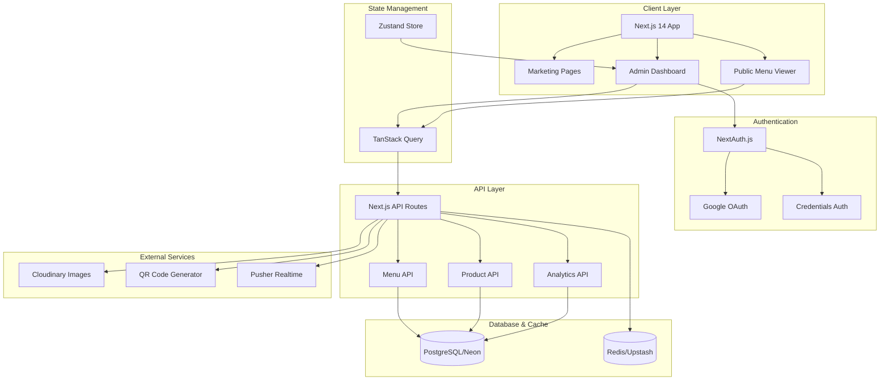
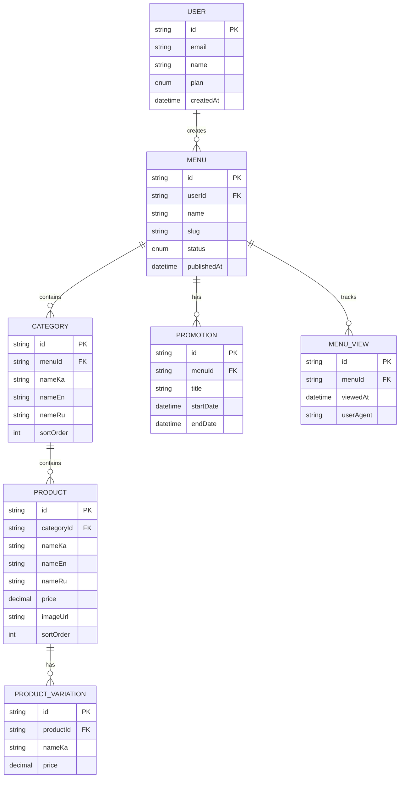

# Digital Menu - Project Plan

## 📋 Project Overview

**Project Name**: Digital Menu
**Type**: Full-Stack Web Application (SaaS)
**Status**: 🟢 In Progress
**Team Size**: Small (2-3 developers)
**Created**: 2026-01-26
**Last Updated**: 2026-04-27 (T14.6 done ✅ — Product Drawer · Error + Saving States · 0.5h · Low · deps T14.2 ✅. **Phase 14 now shipped at 6/6 (100%)** — all Product Drawer tabs and states delivered. Three surgical changes: (1) `apps/web/components/admin/product-dialog.tsx` — added `saveError: string | null` state + `Banner` import, wrapped `handleSubmit` in try/catch so the drawer only closes on success (fixes a data-loss bug where the drawer closed even on failed saves), renders `<Banner tone="error" dismissible />` at the top of the scrollable body when `saveError` is set so it's visible across ALL tabs, resets both `activeTab` + `saveError` in the on-`open` useEffect; (2) `apps/web/components/admin/products-list.tsx` — `handleCreate` / `handleUpdate` now re-throw errors instead of swallowing them (removed redundant `toast.error` + removed explicit `setIsCreateOpen(false)` / `setProductToEdit(null)` since the dialog's own `onOpenChange(false)` routes to the same setters on success); (3) `apps/web/components/admin/product-form.tsx` — no changes, the inline Zod errors on `nameKa`/`price`/`categoryId` shipped with T14.2 already cover the "red border + helper" requirement. Banner copy uses new EN/KA/RU keys `admin.products.drawer.saveErrorTitle` ("Couldn't save product" / "პროდუქტი ვერ შეინახა" / "Не удалось сохранить продукт") + `saveErrorDefault` fallback. Playwright spec `tests/e2e/admin/product-drawer-error-saving.spec.ts` ships 10 enumerated tests (5 desktop + 5 mobile-skipped) — 2 visual baselines (`product-drawer-error-desktop.png` after mocked 500 `{ success:false, error:{ message:'Database write timed out — please retry.' } }`; `product-drawer-saving-desktop.png` with the PATCH route delayed 1500ms so the footer Save button shows `data-saving="true"` + Loader2 spinner + "Saving…" mid-flight) + 3 functional: (a) empty-name submit → `ring-danger-soft` on name input, drawer stays open, NO save-error banner (Zod blocks before API call); (b) valid edit submit → `data-saving="true"` in-flight → 200 response → "Product updated successfully" toast → drawer closes; (c) mocked 500 → banner visible with title "Couldn't save product" + server message "Database write timed out" → drawer stays open → `data-saving="false"` → form values preserved. Validation gates: `tsc --noEmit` clean on touched files (pre-existing TS2688 type-library noise filtered); `next lint` clean on all 3 touched files; Vitest 248/274 pass (same pre-existing 26 product-card + 2 menus-API mock failures, unrelated); all 3 admin.json files parse valid; Playwright list mode enumerated 10 tests correctly. Visual baselines need first-run `pnpm test:e2e:update` against the Dockerised test DB — port 3000 held by another dev-server session, same pattern as T11–T15 work. Overall 80/112 = 71%. WIP now 2 (T15.6, T18.2). **Phase 14 is done — all Product Drawer tabs + states shipped.** Previously: T14.5 done ✅ — Product Drawer · Allergens Tab STARTER locked · 0.5h · Low · deps T14.4 ✅. Port artboard `pd-allergens-locked` from `qr-menu-design/components/product-drawer.jsx:543-579`. New `apps/web/components/admin/product-drawer/allergens-locked.tsx` — relative container with blurred 6-tile preview (`filter: blur(4px); opacity-50; pointer-events-none; aria-hidden`) behind a centered 340px upgrade card (`rounded-[12px] border border-border bg-card shadow-[0_10px_40px_rgba(0,0,0,0.08)]`) containing 40×40 accent-soft Lock icon chip, "Allergen info is a PRO feature" heading (15px/600/tracking -0.2px), body "Help customers with dietary restrictions choose confidently. Starts at 59₾/month.", and full-width primary CTA `<Link href="/admin/settings/billing">` with Sparkles icon. Preview-tile grid inlined to keep the panel self-contained (6 of 8 allergens with `on: false` state). Wiring: `apps/web/components/admin/product-dialog.tsx` swapped the old `PlaceholderPanel` branch for `<AllergensLocked />` when `showAllergens === false`. EN/KA/RU `admin.products.drawer.allergensLocked.{title, body, cta}` keys added; stale `admin.products.drawer.placeholders.allergens` removed across all 3 locales. Testids: `product-drawer-allergens-locked` (outer), `product-drawer-allergens-locked-preview` (blurred non-interactive tiles `aria-hidden=true`), `product-drawer-allergens-locked-overlay` (centered card `role="group"` + `aria-labelledby="allergens-locked-title"`), `product-drawer-allergens-locked-cta` (Link). New Playwright spec `tests/e2e/admin/product-drawer-allergens-locked.spec.ts` (serial, desktop-only) — 1 visual baseline `product-drawer-allergens-locked-desktop.png` + 4 functional: STARTER tab shows `data-pro-locked=true` + visible lock marker + no `product-drawer-allergens-tile`/`-tiles`; blurred preview is non-interactive — force-clicking at `{x:20,y:20}` over 400ms fires NO `PUT /api/menus/:id/products/:pid` request (pointer-events: none passes click through); CTA has `href="/admin/settings/billing"` + clicking routes `page` to `/^\/admin\/settings\/billing(\b|\?|$)/`; FREE plan also sees locked state (allergens is PRO-only). T14.4 spec `tests/e2e/admin/product-drawer-allergens.spec.ts` dropped its STARTER-locked case (header comment now points at the new T14.5 spec). Validation gates: `tsc --noEmit` clean on all touched files (pre-existing TS2688 type-library noise filtered); `next lint` clean on `allergens-locked.tsx` + `product-dialog.tsx` (only the pre-existing `code-block.tsx` error + unrelated unused-var warnings remain); all 3 admin.json files parse valid via `node -e JSON.parse`; dev-server smoke confirmed `/admin/menus` returns 307 unauthenticated-redirect under Turbopack with no compile errors (port 3001 because 3000 was held). Visual baseline needs first-run `pnpm test:e2e:update tests/e2e/admin/product-drawer-allergens-locked.spec.ts`. Phase 14 now 5/6 (83%); overall 79/112 = 71%. WIP=3 (T14.6, T15.6, T18.2). **T14.6 Error+Saving States is the last task in Phase 14** — deps T14.2 ✅, 0.5h, Low. Previously: T15.13 done ✅ — Menu Settings Tab · URL + Visibility · 2h · Medium · deps T13.1 ✅. Admin settings tab now owns URL editing + password protection: host-prefixed slug input + Copy button + amber "Changing the URL breaks existing QR codes" warning; 3 RadioCards (Published / Password protected / Private draft) with inline password field on selection. Backend: Prisma `Menu.passwordHash String?` added (pushed to Neon), `updateMenuSchema` now takes `visibility` + optional `password`, PUT `/api/menus/[id]` maps visibility → status + bcrypt hash, `sanitizeMenuResponse` strips `passwordHash` from all API+Pusher payloads and exposes `hasPassword: boolean` instead. Public gate: `/m/[slug]` renders `<MenuPasswordGate>` when `passwordHash` set and signed cookie missing; new `POST /api/menus/public/[slug]/verify-password` bcrypt-compares + issues HMAC-SHA256-signed HttpOnly cookie (`menu-pass-{menuId}`, 24h TTL, NEXTAUTH_SECRET, `timingSafeEqual` verify). EN/KA/RU translations added under `admin.editor.settings.{url,visibility,actions}`. Playwright `tests/e2e/admin/editor-settings.spec.ts` — 1 visual baseline + 4 functional (slug save + 404/200, private draft gates public page, password end-to-end with cookie round-trip + response body NOT containing `passwordHash`, Copy URL writes to clipboard). Validation gates: `tsc` clean, `next lint` clean on all new files, Vitest 248 pass. Phase 15 now 7/15 (47%); overall 79/112 = 71% (+1). WIP=4 (T14.5, T14.6, T15.6, T18.2). **T15.14 (Schedule + SEO) + T15.15 (Clone/Archive/Delete) newly unlocked** — both depend on T15.13 ✅. Visual baseline needs first-run `pnpm test:e2e:update`.)

### Description

Digital Menu is a SaaS platform enabling cafes and restaurants to create and manage digital menus via QR codes. The platform provides three main components:
- **Marketing Website** - Landing page with pricing and demo
- **Admin Panel** - Menu management dashboard for cafe owners
- **Public Menu** - Customer-facing menu accessed via QR code

### Target Users

- **Primary**: Cafe and restaurant owners who want to digitize their menus
- **Secondary**: Restaurant customers viewing menus via QR codes
- **Geographic Focus**: Georgia (Georgian, English, Russian language support)

---

## 🏗️ Architecture Overview


```mermaid
graph TB
    subgraph "Client Layer"
        A[Next.js 14 App]
        B[Marketing Pages]
        C[Admin Dashboard]
        D[Public Menu Viewer]
    end

    subgraph "Authentication"
        E[NextAuth.js]
        F[Google OAuth]
        G[Credentials Auth]
    end

    subgraph "API Layer"
        H[Next.js API Routes]
        I[Menu API]
        J[Product API]
        K[Analytics API]
    end

    subgraph "State Management"
        L[TanStack Query]
        M[Zustand Store]
    end

    subgraph "Database & Cache"
        N[(PostgreSQL/Neon)]
        O[(Redis/Upstash)]
    end

    subgraph "External Services"
        P[Cloudinary Images]
        Q[QR Code Generator]
        R[Pusher Realtime]
    end

    A --> B
    A --> C
    A --> D
    C --> E
    E --> F
    E --> G
    C --> L
    D --> L
    L --> H
    H --> I
    H --> J
    H --> K
    I --> N
    J --> N
    K --> N
    H --> O
    H --> P
    H --> Q
    H --> R
    M --> C
```

### Data Model Overview


```mermaid
erDiagram
    USER ||--o{ MENU : creates
    MENU ||--o{ CATEGORY : contains
    MENU ||--o{ PROMOTION : has
    MENU ||--o{ MENU_VIEW : tracks
    CATEGORY ||--o{ PRODUCT : contains
    PRODUCT ||--o{ PRODUCT_VARIATION : has

    USER {
        string id PK
        string email
        string name
        enum plan
        datetime createdAt
    }

    MENU {
        string id PK
        string userId FK
        string name
        string slug
        enum status
        datetime publishedAt
    }

    CATEGORY {
        string id PK
        string menuId FK
        string nameKa
        string nameEn
        string nameRu
        int sortOrder
    }

    PRODUCT {
        string id PK
        string categoryId FK
        string nameKa
        string nameEn
        string nameRu
        decimal price
        string imageUrl
        int sortOrder
    }

    PRODUCT_VARIATION {
        string id PK
        string productId FK
        string nameKa
        decimal price
    }

    PROMOTION {
        string id PK
        string menuId FK
        string title
        datetime startDate
        datetime endDate
    }

    MENU_VIEW {
        string id PK
        string menuId FK
        datetime viewedAt
        string userAgent
    }
```

---

## 🛠️ Tech Stack

### Frontend
- **Framework**: Next.js 14+ (App Router, Server Components)
- **Language**: TypeScript
- **Styling**: Tailwind CSS
- **UI Components**: shadcn/ui
- **Forms**: React Hook Form + Zod validation
- **State Management**:
  - TanStack Query (server state)
  - Zustand (client state)
- **Drag & Drop**: dnd-kit
- **i18n**: next-intl (Georgian, English, Russian)

### Backend
- **Runtime**: Node.js (Next.js API Routes)
- **Database**: PostgreSQL (Neon serverless)
- **ORM**: Prisma
- **Authentication**: NextAuth.js
- **Validation**: Zod schemas
- **Caching**: Redis (Upstash)
- **Real-time**: Pusher

### Infrastructure
- **Hosting**: Railway (full-stack with database)
- **Image Storage**: Cloudinary
- **QR Generation**: qrcode library
- **Email**: Resend
- **Monitoring**: Sentry
- **Analytics**: Google Analytics

### DevOps & Tools
- **Package Manager**: pnpm
- **Monorepo**: Turborepo
- **Testing**: Vitest + React Testing Library
- **Linting**: ESLint + Prettier
- **Version Control**: Git

---

## 📁 Project Structure

```
digital-menu/
├── apps/
│   └── web/                      # Main Next.js application
│       ├── app/
│       │   ├── (marketing)/      # Public pages
│       │   │   ├── page.tsx      # Landing page
│       │   │   ├── pricing/      # Pricing page
│       │   │   └── demo/         # Demo page
│       │   ├── (auth)/           # Auth pages
│       │   │   ├── login/
│       │   │   └── register/
│       │   ├── admin/            # Protected admin area
│       │   │   ├── dashboard/
│       │   │   ├── menus/
│       │   │   ├── products/
│       │   │   ├── analytics/
│       │   │   └── settings/
│       │   ├── m/
│       │   │   └── [slug]/       # Public menu viewer
│       │   └── api/              # API routes
│       │       ├── auth/
│       │       ├── menus/
│       │       ├── products/
│       │       ├── categories/
│       │       ├── promotions/
│       │       ├── qr/
│       │       ├── upload/
│       │       └── analytics/
│       ├── components/
│       │   ├── ui/               # shadcn/ui components
│       │   ├── admin/            # Admin-specific components
│       │   ├── public/           # Public menu components
│       │   ├── marketing/        # Marketing components
│       │   └── shared/           # Shared components
│       ├── lib/
│       │   ├── auth/             # NextAuth config & permissions
│       │   ├── db/               # Prisma client
│       │   ├── api/              # API utilities
│       │   ├── validations/      # Zod schemas
│       │   ├── cache/            # Redis utilities
│       │   ├── qr/               # QR code generation
│       │   └── cloudinary/       # Image management
│       ├── hooks/                # Custom React hooks
│       ├── stores/               # Zustand stores
│       ├── types/                # TypeScript types
│       └── middleware.ts         # Next.js middleware
├── packages/
│   ├── database/                 # Prisma schema & migrations
│   │   └── prisma/
│   │       └── schema.prisma
│   ├── config/                   # Shared configs
│   │   ├── eslint/
│   │   └── typescript/
│   └── types/                    # Shared TypeScript types
├── public/
│   └── locales/                  # i18n translation files
│       ├── ka/                   # Georgian
│       ├── en/                   # English
│       └── ru/                   # Russian
├── PROJECT_PLAN.md               # This file
├── CLAUDE.md                     # Claude Code instructions
└── package.json
```

---

## 🎯 MVP Features & Scope

### Essential Features (Must Have)
- ✅ User registration and login with email/password
- ✅ Google OAuth authentication
- ✅ Menu CRUD operations
- ✅ Category management with drag-drop reordering
- ✅ Product management with images
- ✅ QR code generation for menus
- ✅ Public menu display at `/m/{slug}`
- ✅ Responsive design (mobile-first)

### Advanced MVP Features (Must Have)
- ✅ Multi-language support (Georgian, English, Russian)
- ✅ Product variations (size/portion options)
- ✅ Promotions and special offers
- ✅ Basic analytics (menu views tracking)

### Post-MVP Features (Nice to Have)
- ⏳ Plan-based subscription system (Free, Starter, Pro)
- ⏳ Stripe payment integration
- ⏳ Custom branding (logo, colors)
- ⏳ Advanced analytics dashboard
- ⏳ Allergen information
- ⏳ QR codes with logo overlay
- ⏳ Email notifications
- ⏳ Progressive Web App (PWA)

---

## 📅 Implementation Phases

### Phase 1: Foundation & Infrastructure
**Goal**: Set up the project foundation and core infrastructure

#### T1.1: Project Initialization
- [x] **Status**: DONE ✅
- **Complexity**: Low
- **Estimated**: 2 hours
- **Dependencies**: None
- **Description**:
  - Initialize Next.js 14 project with TypeScript
  - Configure Turborepo monorepo structure
  - Set up pnpm workspaces
  - Configure Tailwind CSS
  - Install and configure shadcn/ui
  - Set up ESLint and Prettier

#### T1.2: Database Setup
- [x] **Status**: DONE ✅
- **Complexity**: Medium
- **Estimated**: 3 hours
- **Dependencies**: T1.1
- **Description**:
  - Create Neon PostgreSQL database
  - Define Prisma schema with all models (User, Menu, Category, Product, ProductVariation, Promotion, MenuView)
  - Set up enums (Plan, MenuStatus, Language, Allergen)
  - Configure relationships and cascading deletes
  - Run initial migration
  - Set up Prisma Client

#### T1.3: Authentication System
- [x] **Status**: DONE ✅
- **Complexity**: High
- **Estimated**: 6 hours
- **Dependencies**: T1.2
- **Description**:
  - Configure NextAuth.js with JWT strategy
  - Implement credentials provider (email/password)
  - Implement Google OAuth provider
  - Set up password hashing with bcrypt
  - Create user registration API route
  - Create login/register pages
  - Configure middleware for route protection
  - Implement session management

#### T1.4: Environment & Configuration
- [x] **Status**: DONE ✅
- **Complexity**: Low
- **Estimated**: 2 hours
- **Dependencies**: T1.1
- **Description**:
  - Set up environment variables (.env.example)
  - Configure Redis (Upstash) connection
  - Configure Cloudinary credentials
  - Configure Pusher credentials
  - Set up error tracking (Sentry)
  - Configure Google Analytics

#### T1.5: Core Library Setup
- [x] **Status**: DONE ✅
- **Complexity**: Medium
- **Estimated**: 4 hours
- **Dependencies**: T1.2
- **Description**:
  - Create Zod validation schemas for all entities
  - Set up TanStack Query client
  - Create API client utilities
  - Implement error handler utility
  - Set up Redis caching utilities
  - Create permission check functions

---

### Phase 2: Core Menu Management
**Goal**: Implement the core menu builder functionality

#### T2.1: Menu CRUD API
- [x] **Status**: DONE ✅
- **Complexity**: Medium
- **Estimated**: 5 hours
- **Dependencies**: T1.3, T1.5
- **Description**:
  - Create GET /api/menus (list user's menus)
  - Create POST /api/menus (create menu)
  - Create GET /api/menus/:id (get menu details)
  - Create PUT /api/menus/:id (update menu)
  - Create DELETE /api/menus/:id (delete menu)
  - Create POST /api/menus/:id/publish (publish/unpublish)
  - Implement user ownership validation
  - Add Redis caching for public menus

#### T2.2: Menu Admin UI
- [x] **Status**: DONE ✅
- **Complexity**: High
- **Estimated**: 6 hours
- **Dependencies**: T2.1
- **Description**:
  - Create admin dashboard layout with sidebar
  - Create menus list page with grid/list view
  - Create menu creation form with validation
  - Create menu edit page
  - Implement menu settings (name, slug, description)
  - Add publish/unpublish toggle
  - Create menu deletion with confirmation
  - Add real-time status updates

#### T2.3: Category Management API
- [x] **Status**: DONE ✅
- **Complexity**: Medium
- **Estimated**: 4 hours
- **Dependencies**: T2.1
- **Description**:
  - Create GET /api/menus/:id/categories
  - Create POST /api/menus/:id/categories
  - Create PUT /api/menus/:id/categories/:categoryId
  - Create DELETE /api/menus/:id/categories/:categoryId
  - Create POST /api/menus/:id/categories/reorder
  - Implement sortOrder management
  - Broadcast Pusher events

#### T2.4: Category Admin UI
- [x] **Status**: DONE ✅
- **Complexity**: High
- **Estimated**: 6 hours
- **Dependencies**: T2.3
- **Description**:
  - Create category list component with drag-drop
  - Integrate dnd-kit for reordering
  - Create category creation modal
  - Create category edit modal
  - Add multi-language fields (nameKa, nameEn, nameRu)
  - Implement category deletion with confirmation
  - Handle empty states

#### T2.5: Product Management API
- [x] **Status**: DONE ✅
- **Complexity**: High
- **Estimated**: 6 hours
- **Dependencies**: T2.3
- **Description**:
  - Create GET /api/menus/:id/products
  - Create POST /api/menus/:id/products
  - Create PUT /api/menus/:id/products/:productId
  - Create DELETE /api/menus/:id/products/:productId
  - Create POST /api/menus/:id/products/reorder
  - Implement product variation support
  - Handle image URL storage

#### T2.6: Product Admin UI
- [x] **Status**: DONE ✅
- **Complexity**: High
- **Estimated**: 8 hours
- **Dependencies**: T2.5
- **Description**:
  - Create product list component with drag-drop
  - Create product creation form
  - Create product edit form
  - Add multi-language fields
  - Implement image upload UI
  - Create product variation manager
  - Add price formatting
  - Implement product deletion

#### T2.7: Image Upload System
- [x] **Status**: DONE ✅
- **Complexity**: Medium
- **Estimated**: 4 hours
- **Dependencies**: T1.4
- **Description**:
  - Create POST /api/upload endpoint
  - Integrate Cloudinary SDK
  - Implement image transformation (400x400 for products)
  - Add format optimization (WebP/AVIF)
  - Handle upload errors
  - Create reusable upload component
  - Add image preview

---

### Phase 3: Advanced Features
**Goal**: Implement multi-language, variations, promotions, and analytics

#### T3.1: Multi-language System
- [x] **Status**: DONE ✅
- **Complexity**: Medium
- **Estimated**: 5 hours
- **Dependencies**: T2.4, T2.6
- **Description**:
  - Set up next-intl configuration
  - Create translation files for UI strings
  - Implement language switcher component
  - Add fallback logic (default to Georgian)
  - Update all forms to support multi-language
  - Test language switching on public menus

#### T3.2: Product Variations
- [x] **Status**: DONE ✅
- **Complexity**: High
- **Estimated**: 6 hours
- **Dependencies**: T2.6
- **Description**:
  - Create ProductVariation CRUD API routes
  - Create variation manager UI component
  - Add variation creation form (name, price)
  - Display variations on product cards
  - Update public menu to show variations
  - Handle pricing display logic

#### T3.3: Promotions System
- [x] **Status**: DONE ✅
- **Complexity**: Medium
- **Estimated**: 5 hours
- **Dependencies**: T2.1
- **Description**:
  - Create GET /api/menus/:id/promotions
  - Create POST /api/menus/:id/promotions
  - Create PUT /api/menus/:id/promotions/:id
  - Create DELETE /api/menus/:id/promotions/:id
  - Add promotion schema (title, description, start/end dates)
  - Create promotions admin UI
  - Display active promotions on public menu

#### T3.4: Analytics Foundation
- [x] **Status**: DONE ✅
- **Complexity**: Medium
- **Estimated**: 4 hours
- **Dependencies**: T2.1
- **Description**:
  - Create MenuView model tracking
  - Create POST /api/menus/:id/views (increment views)
  - Create GET /api/menus/:id/analytics
  - Track user agent and timestamp
  - Create basic analytics dashboard
  - Display total views chart
  - Add date range filters

---

### Phase 4: Public Menu & QR Codes
**Goal**: Build the customer-facing menu experience

#### T4.1: QR Code Generation
- [x] **Status**: DONE ✅
- **Complexity**: Low
- **Estimated**: 3 hours
- **Dependencies**: T2.1
- **Description**:
  - Install qrcode library
  - Create GET /api/qr/:menuId endpoint
  - Support PNG and SVG formats
  - Support multiple sizes (small, medium, large)
  - Generate QR pointing to /m/{slug}
  - Add download QR code button in admin

#### T4.2: Public Menu Display
- [x] **Status**: DONE ✅
- **Complexity**: High
- **Estimated**: 7 hours
- **Dependencies**: T2.1, T2.3, T2.5
- **Description**:
  - Create GET /m/[slug] page
  - Fetch menu with categories and products
  - Implement language switcher
  - Display menu header (name, description)
  - Display categories in order
  - Display products with images
  - Show product variations
  - Display active promotions
  - Add smooth scrolling navigation
  - Implement Redis caching (5 min TTL)

#### T4.3: Public Menu Styling
- [x] **Status**: DONE ✅
- **Complexity**: Medium
- **Estimated**: 5 hours
- **Dependencies**: T4.2
- **Description**:
  - Design mobile-first layout
  - Create product card component
  - Add category header styling
  - Implement image lazy loading
  - Add skeleton loading states
  - Create promotion banner
  - Add sticky category navigation
  - Test on multiple devices

#### T4.4: Menu View Tracking
- [x] **Status**: DONE ✅
- **Complexity**: Low
- **Estimated**: 2 hours
- **Dependencies**: T3.4, T4.2
- **Description**:
  - Track view on public menu load
  - Debounce repeated views (same IP/session)
  - Store user agent and timestamp
  - Invalidate cache on view increment
  - Test analytics dashboard updates

---

### Phase 5: Real-time & Polish
**Goal**: Add real-time updates and polish the user experience

#### T5.1: Real-time Updates (Pusher)
- [x] **Status**: DONE ✅
- **Complexity**: Medium
- **Estimated**: 5 hours
- **Dependencies**: T2.1, T2.3, T2.5
- **Description**:
  - Configure Pusher client and server
  - Create channel pattern: menu-{menuId}
  - Broadcast events from API routes
  - Subscribe to events in admin components
  - Update TanStack Query cache on events
  - Test real-time updates across tabs

#### T5.2: Drag-and-Drop Reordering
- [x] **Status**: DONE ✅
- **Complexity**: High
- **Estimated**: 6 hours
- **Dependencies**: T2.4, T2.6
- **Description**:
  - Integrate dnd-kit for categories
  - Integrate dnd-kit for products
  - Calculate new sortOrder values
  - Implement optimistic updates
  - Handle reorder API calls
  - Add visual feedback during drag
  - Test edge cases (empty lists, single item)

#### T5.3: Plan-Based Permissions
- [x] **Status**: DONE ✅
- **Complexity**: Medium
- **Estimated**: 4 hours
- **Dependencies**: T1.5, T2.1
- **Description**:
  - Implement canCreateMenu() checks
  - Implement hasFeature() checks
  - Enforce FREE plan limits (1 menu, 3 categories, 15 products)
  - Show upgrade prompts in UI
  - Disable features based on plan
  - Test limit enforcement

#### T5.4: Error Handling & Validation
- [x] **Status**: DONE ✅
- **Complexity**: Medium
- **Estimated**: 4 hours
- **Dependencies**: All previous tasks
- **Description**:
  - Add error boundaries to main sections
  - Implement toast notifications
  - Add form validation error displays
  - Handle API errors gracefully
  - Add loading states
  - Create 404 page
  - Create error pages

#### T5.5: UI Polish & Accessibility
- [x] **Status**: DONE ✅
- **Complexity**: Medium
- **Estimated**: 5 hours
- **Dependencies**: All previous tasks
- **Description**:
  - Add ARIA labels to interactive elements
  - Test keyboard navigation
  - Ensure color contrast ratios
  - Add focus indicators
  - Test with screen readers
  - Optimize animations
  - Add empty states

---

### Phase 6: Testing & Deployment
**Goal**: Ensure quality and deploy to production

#### T6.1: Component Testing
- [x] **Status**: DONE ✅
- **Complexity**: Medium
- **Estimated**: 6 hours
- **Dependencies**: T5.5
- **Description**:
  - Set up Vitest and React Testing Library
  - Write tests for UI components
  - Test form validation
  - Test error states
  - Mock API calls
  - Achieve 70%+ component coverage

#### T6.2: API Testing
- [x] **Status**: DONE ✅
- **Complexity**: Medium
- **Estimated**: 5 hours
- **Dependencies**: T5.5
- **Description**:
  - Write tests for API routes
  - Mock Prisma client
  - Test authentication flows
  - Test authorization checks
  - Test input validation
  - Test error handling

#### T6.3: Vercel Deployment Setup
- [x] **Status**: DONE ✅
- **Complexity**: Medium
- **Estimated**: 4 hours
- **Dependencies**: T1.4
- **Description**:
  - Create Vercel project
  - Connect to Neon PostgreSQL database
  - Configure environment variables
  - Set up automatic deployments from main branch
  - Configure custom domain
  - Test deployment process

#### T6.4: Production Database Migration
- [x] **Status**: DONE ✅
- **Complexity**: Low
- **Estimated**: 2 hours
- **Dependencies**: T6.3
- **Description**:
  - Run Prisma migrations on production DB
  - Seed initial data (if needed)
  - Test database connections
  - Set up automated backups
  - Configure connection pooling

#### T6.5: Monitoring & Analytics
- [x] **Status**: DONE ✅
- **Complexity**: Low
- **Estimated**: 3 hours
- **Dependencies**: T6.3
- **Description**:
  - Configure Sentry error tracking
  - Set up Google Analytics
  - Add performance monitoring
  - Configure uptime monitoring
  - Create alerting rules
  - Test error reporting

#### T6.6: Documentation
- [x] **Status**: DONE ✅
- **Complexity**: Low
- **Estimated**: 3 hours
- **Dependencies**: T6.5
- **Description**:
  - Update README.md with setup instructions
  - Document API endpoints
  - Create developer guide
  - Add deployment guide
  - Document environment variables
  - Create user guide for cafe owners

---

### Phase 7: Admin Live Preview
**Goal**: Add a live phone mockup preview to the menu editing page that updates in real-time as admin edits content

#### T7.1: Phone Preview Frame Component
- [x] **Status**: DONE ✅
- **Complexity**: Medium
- **Estimated**: 3 hours
- **Dependencies**: T2.2
- **Files**: `apps/web/components/admin/phone-preview.tsx`
- **Description**:
  - Create pure CSS phone mockup component (300px wide, no image assets)
  - Rounded corners, dark border simulating device bezel
  - Dynamic island/notch at top, home indicator at bottom
  - Inner screen: content rendered at 375px width, scaled to 0.8 to fit frame
  - Scrollable screen area (overflow-y-auto with scrollbar-hide)
  - "Preview" label above the phone
  - Desktop only (hidden below `lg` breakpoint)

#### T7.2: Menu Preview Content Component
- [x] **Status**: DONE ✅
- **Complexity**: High
- **Estimated**: 5 hours
- **Dependencies**: T7.1, T4.2
- **Files**: `apps/web/components/admin/menu-preview-content.tsx`
- **Description**:
  - Accept `MenuWithDetails` from `useMenu()` hook + locale
  - Data transformation via `useMemo`: filter unavailable products, empty categories, expired promotions
  - Reuse public components: `CategorySection`, `ProductCard`, `PromotionBanner`
  - Create simplified private sub-components:
    - `PreviewHeader` - menu header without sticky positioning
    - `PreviewCategoryNav` - static category pills (no scroll-spy)
    - `PreviewFooter` - simplified footer
    - `PreviewSkeleton` - loading skeleton matching phone layout
    - `EmptyMenuPreview` - empty state message
  - No new API calls — all data from existing `useMenu(id)` cache

#### T7.3: Integrate Live Preview into Menu Detail Page
- [x] **Status**: DONE ✅
- **Complexity**: Medium
- **Estimated**: 3 hours
- **Dependencies**: T7.1, T7.2
- **Files**: `apps/web/app/admin/menus/[id]/page.tsx`
- **Description**:
  - Convert single-column layout to two-column on `lg+` screens
  - Header and Stats Cards remain full-width above separator
  - Left column: Categories, Promotions, Info cards (flex-1 min-w-0)
  - Right column: PhonePreview > MenuPreviewContent (w-[340px] sticky top-6)
  - Hidden below `lg` breakpoint via `hidden lg:block`
  - Preview reactively updates from same TanStack Query cache the editor uses
  - Update `MenuDetailSkeleton` to include phone skeleton on lg+
  - No modifications to public components needed

---

### Phase 9: Design Foundation & Test Infrastructure
**Goal**: Establish the new design system tokens and Playwright testing infrastructure required for implementing the Claude Design handoff bundle.

**📌 Required reading for every Phase 9-17 task:**
- **Design bundle**: `qr-menu-design/` (Claude Design handoff — HTML + JSX prototypes, open `qr-menu-design/Digital Menu Dashboard.html` in a browser to view the canvas)
- **Token spec**: `docs/design-tokens.md` — 16 colors, 7 type levels, 6 radii, 10 spacing steps, 6 shadows
- **Artboard → source file mapping**: see `CLAUDE.md` → "Design System & Redesign Implementation" section
- **Non-negotiables** (plan tiers, identity, sidebar items, editor tabs, Georgian content): also in `CLAUDE.md`

**Design Reference**: 36 artboards across 10 sections (Dashboard, Menus, Menu Editor with 7 tabs, Product Drawer, Analytics, Promotions, QR codes, Settings, Mobile, Component Library). Tokens defined in Section H.

**Testing Mandate**: Every UI task in phases 9-17 MUST ship with Playwright tests that verify **both** visual fidelity (against a committed baseline screenshot, 5% threshold) **and** functional behavior (real data flowing through real API endpoints — no hard-coded mocks).

#### T9.1: Design Tokens Migration
- [x] **Status**: DONE ✅
- **Complexity**: Medium
- **Estimated**: 3 hours
- **Dependencies**: None
- **Description**:
  - Update `apps/web/app/globals.css` with HSL variables for the 16 Section H tokens: bg, card, chip, border, borderSoft, text, textMuted, textSubtle, accent, accentSoft, success, successSoft, warning, warningSoft, danger, dangerSoft
  - Extend `apps/web/tailwind.config.ts` with custom `colors.brand.*`, `borderRadius.{xs,sm,md,lg,xl,pill}`, `boxShadow.{xs,sm,md,lg,xl}`, and 4px-base spacing
  - Configure Inter via `next/font/google` in `apps/web/app/layout.tsx` with weights 400-700 and features `cv11, ss01`
  - Add `tabular-nums` utility class
- **Playwright test**:
  - `tests/e2e/design-system/tokens.spec.ts`
  - Visual: `tokens-showcase.png` — a `/test/tokens` page rendering every color swatch, radius, shadow, and type level
  - Functional: page reads computed CSS values and asserts each token resolves to the expected hex / px

#### T9.2: Playwright Setup + Visual Regression Infrastructure
- [x] **Status**: DONE ✅
- **Complexity**: Medium
- **Estimated**: 2 hours
- **Dependencies**: None
- **Description**:
  - Create `playwright.config.ts` at repo root with two projects: `desktop` (1440×900) and `mobile` (375×812, iPhone 13)
  - Configure `webServer` to start `pnpm dev` on port 3000, `baseURL: http://localhost:3000`
  - Enable `expect.toHaveScreenshot` with `maxDiffPixelRatio: 0.05`, threshold adjustable via env var
  - Create `tests/e2e/` structure: `components/`, `admin/`, `public/`, `fixtures/`, `__screenshots__/`
  - Add npm scripts: `test:e2e`, `test:e2e:ui`, `test:e2e:update` (regenerate baselines), `test:e2e:debug`
  - Install `@playwright/test` and browsers (`npx playwright install chromium firefox webkit`)
  - Commit baseline screenshots under `tests/e2e/__screenshots__/`
- **Playwright test**:
  - `tests/e2e/smoke.spec.ts` — hits `/` (landing), asserts title, takes `landing-desktop.png` baseline
  - `test:e2e` command passes green on fresh clone

#### T9.3: Test Data Seeding + Auth Bypass
- [x] **Status**: DONE ✅
- **Complexity**: Medium
- **Estimated**: 3 hours
- **Dependencies**: T9.2
- **Description**:
  - Create `tests/e2e/fixtures/seed.ts` exporting: `resetDb()`, `seedUser({ plan, name, email })`, `seedMenu({ userId, status, categoryCount, productCount })`, `seedPromotion()`, `seedMenuViews({ menuId, days, viewsPerDay, devices })`, `seedCompleteScenario(plan)` (everything at once)
  - Create `/api/test/session` endpoint guarded by `process.env.NODE_ENV === 'test'` that accepts `{ email }` and returns a signed JWT cookie (bypasses credential login)
  - Create `tests/e2e/fixtures/auth.ts` with `loginAs(page, email)` helper that sets the session cookie directly (<1s per test)
  - Document fixture patterns and conventions in `tests/e2e/README.md`
- **Playwright test**:
  - `tests/e2e/fixtures/seeding.spec.ts`
  - Functional: `resetDb()` empties user table, `seedUser()` creates a user with correct plan, `loginAs()` produces a session visible via `/api/auth/session`

#### T9.4: CI Integration (GitHub Actions)
- [x] **Status**: DONE ✅
- **Complexity**: Medium
- **Estimated**: 2 hours
- **Dependencies**: T9.2, T9.3
- **Description**:
  - Create `docker-compose.test.yml` with a Postgres 16 service on port 5433 (to avoid dev conflicts)
  - Create `.github/workflows/e2e.yml`: trigger on PR, services block for Postgres, steps for pnpm install, db push, build, playwright install, run `test:e2e`
  - Upload HTML report + failed screenshots as artifacts
  - On screenshot diff, post a PR comment linking to the diff image
  - Cache Playwright browsers between runs
- **Playwright test**:
  - CI workflow green on a PR with a trivial change
  - CI workflow fails (red) on a PR that changes a token color (proves visual regression actually blocks)

---

### Phase 10: Component Library (Section H port)
**Goal**: Port the complete Section H component library to the real codebase. Every primitive the redesign uses must exist as a typed React component with all states covered and tested.

**Strategy**: Wrap shadcn/ui where it already fits (Button, Input, Dialog), extend or replace where Section H needs more states, and build from scratch what's missing (Segmented, Dropzone, Kebab, StatCard, CommandPalette, MobileTabBar).

#### T10.1: Button + Icon Button
- [x] **Status**: DONE ✅
- **Complexity**: Medium
- **Estimated**: 4 hours
- **Dependencies**: T9.1, T9.2
- **Description**:
  - Rework `components/ui/button.tsx` with 5 variants: `primary` (slate bg, white text), `secondary` (white bg, 1px border), `ghost`, `destructive` (outlined red), `link`
  - 3 sizes: `sm` (26px, fs 12), `md` (32px, fs 13), `lg` (40px, fs 14)
  - States: default, hover, focused, disabled, loading (replaces leading icon with spinner)
  - Support leading icon (lucide) and icon-only variants
  - Match CLBtn spec in `component-library-a.jsx` lines 39-150
- **Playwright test**:
  - `tests/e2e/components/button.spec.ts`
  - Visual: `buttons-showcase.png` rendering all 5×3×5 combinations on `/test/components/buttons`
  - Functional: click handler fires, disabled prevents click, loading state disables click and shows spinner, focus-visible ring appears on keyboard tab

#### T10.2: Form Controls
- [x] **Status**: DONE ✅
- **Complexity**: High
- **Estimated**: 5 hours
- **Dependencies**: T10.1
- **Description**:
  - Input (default / focused / filled / error + helper / disabled; with prefix icon; with suffix action like clear-X)
  - Textarea with character counter
  - Select (closed + open popover, searchable combobox)
  - Multi-select tag input (chips inside)
  - Switch, Checkbox (+ indeterminate), Radio group
  - Segmented control (3/4 options, icon-only variant)
  - Slider (single + range with two handles)
  - Dropzone (empty / hover terracotta dashed / with thumbnail + remove)
  - Price input with ₾ prefix, tabular-nums
- **Playwright test**:
  - `tests/e2e/components/forms.spec.ts`
  - Visual: `forms-showcase.png`
  - Functional: typing into Input updates value, Zod error displays red border + helper, Switch toggles, Checkbox supports indeterminate, Segmented changes active, Dropzone accepts `file.set_input_files()`

#### T10.3: Feedback Primitives
- [x] **Status**: DONE ✅
- **Complexity**: Medium
- **Estimated**: 3 hours
- **Dependencies**: T10.1
- **Description**:
  - Toast (success/error/warning/info with icon, title, body, optional action button) — wire on top of `sonner`
  - Banner alert (4 tones, inline, with CTA)
  - Empty state components: small (for tables) and large (illustration + CTA)
  - Skeleton loaders: card, row, text line, avatar
  - Spinner (xs/sm/md in accent/slate/white)
  - Progress bar (determinate with value, indeterminate pulsing, segmented stepper)
- **Playwright test**:
  - `tests/e2e/components/feedback.spec.ts`
  - Visual: `feedback-showcase.png`
  - Functional: Toast auto-dismisses after 5s, Toast action button fires handler, Banner "close" dismisses, Progress bar `aria-valuenow` matches value

#### T10.4: Data Display
- [x] **Status**: DONE ✅
- **Complexity**: Medium
- **Estimated**: 4 hours
- **Dependencies**: T10.1
- **Description**:
  - Badge (FREE/STARTER/PRO plan tier, with standalone and inline variants)
  - StatusPill (Published/Draft/Archived/Scheduled/Active/Ended — colored dot + label)
  - Tag/chip (removable and static, 4 tones + suggest chip with dashed border)
  - Avatar (xs 24 / sm 32 / md 40 / lg 56 / xl 72 — initials colored bg, with image, stack group with +N overflow)
  - Breadcrumbs (2-level, 3-level, long-name truncation)
  - Tabs (underline + pill variants, vertical for settings)
  - StatCard (number-only; number + delta + sparkline; number + icon)
  - Pagination (page numbers; prev-next only; "1–10 of 200" counter)
  - Sortable table header (unsorted / asc / desc)
- **Playwright test**:
  - `tests/e2e/components/data-display.spec.ts`
  - Visual: `data-display-showcase.png`
  - Functional: Tabs keyboard navigation (arrow keys), Pagination prev/next buttons update page state, Sort header click toggles direction

#### T10.5: Overlays
- [x] **Status**: DONE ✅
- **Complexity**: High
- **Estimated**: 4 hours
- **Dependencies**: T10.1
- **Description**:
  - Dialog: confirm destructive (red variant), info, form variant with form body
  - Sheet/Drawer (right-side 540px, reuse from existing; match product drawer chrome)
  - Popover with arrow (sm/md)
  - Tooltip (dark default, light on dark surfaces)
  - KebabMenu: 5 items with divider and destructive red at bottom (View / Duplicate / — / Edit / Archive / Delete)
  - CommandPalette (⌘K) using `cmdk` library: floating centered modal, input + result groups (Menus, Products, Settings) with keyboard shortcut hints
- **Playwright test**:
  - `tests/e2e/components/overlays.spec.ts`
  - Visual: `overlays-showcase.png`
  - Functional: Dialog traps focus, Escape closes, backdrop click closes (configurable), Drawer slides in on open, Popover positions correctly, ⌘K opens palette and filters results as user types

#### T10.6: Navigation Primitives
- [x] **Status**: DONE ✅
- **Complexity**: Medium
- **Estimated**: 2 hours
- **Dependencies**: T10.1
- **Description**:
  - SidebarItem (default / hover / active / locked with lock icon / collapsed icon-only)
  - TopBar frame (breadcrumbs, search, actions slot)
  - EditorTabBar (horizontal underline, 7 tabs, truncates on overflow)
  - MobileTabBar (4 tabs with icon + label, active state)
- **Playwright test**:
  - `tests/e2e/components/navigation.spec.ts`
  - Visual: `navigation-showcase.png`
  - Functional: SidebarItem click navigates, active state reflects current route, locked item opens upgrade prompt

#### T10.7: Utility Primitives
- [x] **Status**: DONE ✅
- **Complexity**: Low
- **Estimated**: 2 hours
- **Dependencies**: T10.1
- **Description**:
  - Kbd (single-key and combo styles, e.g. `⌘K`, `⌘⇧N`, `Esc`)
  - Divider (horizontal, vertical, with centered label like "OR")
  - CodeBlock with copy button and language label
- **Playwright test**:
  - `tests/e2e/components/utility.spec.ts`
  - Visual: `utility-showcase.png`
  - Functional: CodeBlock copy button writes to clipboard (`page.evaluate(() => navigator.clipboard.readText())`)

---

### Phase 11: Admin Shell + Dashboard Redesign
**Goal**: Replace the current sidebar + dashboard with the new design. Dashboard must render real data from Prisma (no stubs).

**Design Reference**: Artboards `main`, `empty`, `free-locked`, `collapsed`.

#### T11.1: Sidebar (3-item simplified)
- [x] **Status**: DONE ✅
- **Complexity**: Medium
- **Estimated**: 3 hours
- **Dependencies**: T10.6
- **Description**:
  - Rewrite `components/admin/sidebar.tsx` to match design: 240px expanded / 64px collapsed, `#FCFBF8` bg, 1px right border
  - Nav items: Dashboard · Menus · Settings (remove Analytics/Promotions/QR Codes — they live in editor)
  - Org switcher card at top (business name + location + chevron, visible expanded only)
  - Plan badge section with "Upgrade" CTA for FREE/STARTER
  - User row with avatar + name + email + logout icon
  - Collapse animation (0.22s cubic-bezier)
  - Active state: dark pill with white text
- **Playwright test**:
  - `tests/e2e/admin/sidebar.spec.ts`
  - Visual: `sidebar-expanded.png`, `sidebar-collapsed.png`, `sidebar-free-plan.png`, `sidebar-pro-plan.png`
  - Functional: click item navigates, collapse toggle persists via localStorage across reloads, Upgrade CTA hidden on PRO

#### T11.2: TopBar
- [x] **Status**: DONE ✅
- **Complexity**: Medium
- **Estimated**: 3 hours
- **Dependencies**: T10.6
- **Description**:
  - Create `components/admin/top-bar.tsx`: 56px tall, breadcrumbs on left, ⌘K search middle, bell + avatar right
  - Bell shows terracotta dot when unread notifications exist
  - Avatar opens dropdown: Profile · Settings · Sign out
  - Search opens CommandPalette (T10.5) on click or ⌘K keyboard shortcut
  - Breadcrumbs read route segments dynamically
- **Playwright test**:
  - `tests/e2e/admin/top-bar.spec.ts`
  - Visual: `top-bar-default.png`, `top-bar-with-unread.png`
  - Functional: ⌘K opens palette, Escape closes, avatar dropdown menu items navigate correctly

#### T11.3: AdminShell Layout
- [x] **Status**: DONE ✅
- **Complexity**: Low
- **Estimated**: 2 hours
- **Dependencies**: T11.1, T11.2
- **Description**:
  - Update `app/admin/layout.tsx` to use new Sidebar + TopBar
  - Content area: `#FAFAF9` bg, 24px padding
  - Auth redirect to `/login` if unauthenticated (preserve existing behavior)
- **Playwright test**:
  - `tests/e2e/admin/shell.spec.ts`
  - Visual: `admin-shell-starter.png`
  - Functional: unauthenticated user redirected to `/login`, logged-in user sees shell

#### T11.4: Dashboard Welcome Header + Plan Usage Strip
- [x] **Status**: DONE ✅
- **Complexity**: Medium
- **Estimated**: 2 hours
- **Dependencies**: T11.3, T10.4
- **Description**:
  - Greeting: "Good afternoon, {firstName}" based on local time
  - Subtitle, "View public menu" + "Create new menu" buttons
  - Plan usage strip: 4 cards (Menus, Categories, Products, Storage) with progress bars; color changes at >80% (warning) and 100% (danger)
  - Pull real counts from Prisma (not mocks): `prisma.menu.count`, `prisma.category.count`, etc.
  - Upgrade link under strip for FREE/STARTER
- **Playwright test**:
  - `tests/e2e/admin/dashboard.spec.ts` (shared suite for T11.4-T11.9)
  - Visual: `dashboard-starter.png`, `dashboard-free.png`, `dashboard-pro.png`
  - Functional: seed user with 2 of 3 menus → usage card shows `2 / 3`, progress bar 66%; seed at limit → card shows danger color

#### T11.5: Dashboard Analytics Card + Device Breakdown
- [x] **Status**: DONE ✅
- **Complexity**: Medium
- **Estimated**: 3 hours
- **Dependencies**: T11.4
- **Description**:
  - Big analytics card (2/3 width): title, aggregate views number, delta badge vs previous period, period selector (7d/30d/90d), smooth area chart (Recharts or custom SVG)
  - Device breakdown card (1/3 width): donut chart Mobile/Desktop/Tablet with legend
  - Pull real data from existing `/api/menus/[id]/analytics` aggregated across all user's menus (new aggregate endpoint OR sum in the page)
  - FREE plan: locked overlay with terracotta lock icon + "Upgrade to PRO" CTA, chart blurred
- **Playwright test**:
  - Visual: chart renders with real data, locked overlay for FREE
  - Functional: seed 100 MenuViews across 30 days → chart shows them, period toggle refetches with new range, upgrade CTA on FREE click opens billing page

#### T11.6: Dashboard Your Menus Table
- [x] **Status**: DONE ✅
- **Complexity**: Medium
- **Estimated**: 2 hours
- **Dependencies**: T11.4
- **Description**:
  - Card with header (Your menus + filter pills All/Published/Draft + search input)
  - Rows: thumbnail + name + StatusPill + views today/week (tabular-nums) + last edited relative time + kebab menu
  - Kebab actions: Edit · Duplicate · Analytics · Delete (destructive)
  - Empty state if 0 menus (large empty card with 3 starter templates)
- **Playwright test**:
  - Visual: `dashboard-menus-table.png`, `dashboard-menus-empty.png`
  - Functional: filter pills filter rows, search filters by name, kebab Delete opens confirm dialog, Delete actually removes menu via DELETE /api/menus/[id]

#### T11.7: ActivityLog Model + Feed Widget
- [x] **Status**: DONE ✅
- **Complexity**: Medium
- **Estimated**: 3 hours
- **Dependencies**: T11.4
- **Description**:
  - Add `ActivityLog` Prisma model: id, userId, menuId?, type (enum: PRODUCT_CREATED, MENU_PUBLISHED, PRICE_CHANGED, CATEGORY_CREATED, PROMOTION_STARTED, PROMOTION_ENDED, QR_SCANNED), payload (Json), createdAt
  - Emit activity events from existing mutation handlers (menu create/publish, product create/update, etc.)
  - Create `/api/activity?limit=N` endpoint (last N events for current user)
  - Feed widget: 6 rows, icon + message + meta timestamp, color-tone per type
  - "View all" link to a future full activity page (out of scope for now)
- **Playwright test**:
  - Visual: `dashboard-activity-feed.png` with 6 varied events
  - Functional: seed activity events, widget renders them newest-first; creating a product via API immediately surfaces a new event (with Pusher refresh or simple refetch)

#### T11.8: Top Products Widget
- [x] **Status**: DONE ✅
- **Complexity**: Medium
- **Estimated**: 2 hours
- **Dependencies**: T11.4
- **Description**:
  - Add `/api/user/top-products?limit=5&days=30` endpoint: aggregates MenuView → product-level via (later — placeholder for now: sort products by createdAt or random for MVP since per-product view tracking is out of scope per user)
  - Note: because Advanced Analytics backend is deferred, this widget uses a **temporary heuristic** (most recently edited high-priced products) so the UI is functional but data quality matches the "Coming soon" expectation
  - Widget: ranked rows (#1-5) with thumbnail + name + category + view count + relative popularity bar
- **Playwright test**:
  - Visual: `dashboard-top-products.png`
  - Functional: seed products, widget renders 5 rows with rank borders on top-3

#### T11.9: Upgrade Card (Conditional)
- [x] **Status**: DONE ✅
- **Complexity**: Low
- **Estimated**: 1 hour
- **Dependencies**: T11.4
- **Description**:
  - Dark brand-gradient card (slate with radial terracotta corner glow)
  - Visible for FREE and STARTER; hidden for PRO
  - FREE shows STARTER upgrade (29₾/month); STARTER shows PRO upgrade (59₾/month)
  - 3 bullet features per target tier
  - Large price + "Upgrade" button navigating to `/admin/settings/billing`
- **Playwright test**:
  - Visual: `dashboard-upgrade-free.png`, `dashboard-upgrade-starter.png`, no upgrade card on PRO
  - Functional: Upgrade button navigates to billing page

---

### Phase 12: Menus List Redesign
**Goal**: Replace current `/admin/menus` with grid + table views matching design.

**Design Reference**: Artboards `menus-grid`, `menus-table`, `menus-empty`.

#### T12.1: Grid View + Menu Card
- [x] **Status**: DONE ✅
- **Complexity**: Medium
- **Estimated**: 2 hours
- **Dependencies**: T11.3, T10.4
- **Description**:
  - 3-column grid at 1440px, 2-column at 1024px, 1-column <768px
  - Card: 16:9 cover area (gradient placeholder + utensils icon if no image), StatusPill overlay top-left, kebab top-right, title, "N categories · M items" subtitle, footer with URL slug + weekly views
  - Hover: subtle lift, border darkens to accent
- **Playwright test**:
  - `tests/e2e/admin/menus-list.spec.ts`
  - Visual: `menus-grid-desktop.png`, `menus-grid-mobile.png`
  - Functional: seed 6 menus, grid renders 6 cards; card click navigates to `/admin/menus/[id]`

#### T12.2: Table View + View Toggle
- [x] **Status**: DONE ✅
- **Complexity**: Low
- **Estimated**: 2 hours
- **Dependencies**: T12.1
- **Description**:
  - ViewToggle component (Grid / Table icons, segmented style)
  - Toggle persists to localStorage
  - Table with columns: Menu (thumbnail + name) / Status / Categories / Items / Views (7d) / Last edited / Actions
  - Sortable headers (T10.4 SortableHeader)
- **Playwright test**:
  - Visual: `menus-table.png`
  - Functional: toggle switches view, sort by Views (7d) reorders rows desc→asc

#### T12.3: Empty State with Templates
- [x] **Status**: DONE ✅
- **Complexity**: Low
- **Estimated**: 1 hour
- **Dependencies**: T12.1
- **Description**:
  - When user has 0 menus, show large centered empty card with illustration (layered menu silhouettes) + 3 clickable template cards (Café & bakery / Full restaurant / Bar & cocktails)
  - Click template → `POST /api/menus` with preset categories/products, then navigate to editor
- **Playwright test**:
  - Visual: `menus-empty.png`
  - Functional: new user sees empty state; clicking "Café & bakery" creates menu with expected 3 categories preset

#### T12.4: Filter Chips + Search
- [x] **Status**: DONE ✅
- **Complexity**: Low
- **Estimated**: 1 hour
- **Dependencies**: T12.1
- **Description**:
  - Filter pills: All (n) / Published (n) / Draft (n) / Archived (n)
  - Search input filters by menu name (client-side for simplicity)
- **Playwright test**:
  - Functional: seed 3 Published + 2 Draft + 1 Archived menus, each pill shows correct count, clicking Draft filters to 2 rows, search "Brunch" filters to matching menu

#### T12.5: Plan-Limit Banner
- [x] **Status**: DONE ✅
- **Complexity**: Low
- **Estimated**: 0.5 hours
- **Dependencies**: T12.1
- **Description**:
  - When user hits plan limit (1/1 FREE, 3/3 STARTER), show banner at bottom with limit message + Upgrade button
  - "Create new menu" button disabled with tooltip
- **Playwright test**:
  - Visual: `menus-limit-banner.png`
  - Functional: seed FREE user with 1 menu → banner appears, create button disabled; upgrade button navigates to billing

---

### Phase 13: Menu Editor + Content Tab
**Goal**: Replace current menu editor with the 7-tab workspace. Content tab with categories + products + live phone preview.

**Design Reference**: Artboards `editor-content`, `editor-branding`, `editor-languages`.

#### T13.1: Editor Shell + 7-Tab Bar
- [x] **Status**: DONE ✅
- **Complexity**: Medium
- **Estimated**: 3 hours
- **Dependencies**: T11.3, T10.6
- **Description**:
  - EditorHeader component: menu name (editable inline), Draft/Published toggle, "Last published" timestamp, Share / View public / Save changes buttons
  - EditorTabBar with exactly 7 tabs in order: Content · Branding · Languages · Analytics · Promotions · QR · Settings
  - Tab URL routing: `/admin/menus/[id]?tab=content`, etc. (or `/admin/menus/[id]/content` sub-routes)
  - Unsaved changes indicator on the Save button
- **Playwright test**:
  - `tests/e2e/admin/editor-shell.spec.ts`
  - Visual: `editor-shell.png` with all 7 tabs visible
  - Functional: click each tab changes URL and active tab visual, keyboard left/right arrow navigates tabs, Draft→Published toggle calls POST /api/menus/[id]/publish

#### T13.2: Content Tab — Category List (Drag-Drop)
- [x] **Status**: DONE ✅
- **Complexity**: High
- **Estimated**: 3 hours
- **Dependencies**: T13.1
- **Description**:
  - Left column 360px: category list with drag handles (dnd-kit)
  - Each category: drag handle · emoji · name · item count · chevron (expand/collapse)
  - Expanded state shows nested products below
  - "+ Add category" dashed button at bottom
  - Search categories at top
  - Reorder calls `POST /api/menus/[id]/categories/reorder` with new sortOrder array
- **Playwright test**:
  - Visual: `editor-content-categories-expanded.png`, `editor-content-categories-collapsed.png`
  - Functional: drag category → order persists after reload, Pusher event broadcasts to other clients (seed second session, assert reorder reflected)

#### T13.3: Content Tab — Nested Product Rows
- [x] **Status**: DONE ✅
- **Complexity**: Medium
- **Estimated**: 2 hours
- **Dependencies**: T13.2
- **Description**:
  - When category expanded: product rows underneath with thumbnail + name + price + drag handle + kebab
  - Kebab: Edit (opens drawer T14.x) · Duplicate · Delete
  - Drag reorders within category; drag across categories reassigns categoryId
  - "+ Add product" inline at bottom of expanded category
- **Playwright test**:
  - Visual: `editor-content-products.png`
  - Functional: drag product within category reorders, drag product to different category updates categoryId via API, Delete confirms then removes

#### T13.4: Phone Preview (Live Sync)
- [x] **Status**: DONE ✅
- **Complexity**: Medium
- **Estimated**: 3 hours
- **Dependencies**: T13.2
- **Description**:
  - Right column: phone frame (iPhone 15 dimensions) rendering `/m/[slug]?preview=true&draft=true` in an iframe
  - Above phone: language tabs (KA/EN/RU) — switching rerenders iframe with locale param
  - Share button (copy public URL) + View public (external link)
  - Below phone: "Preview updates in real time" hint with pulse dot
  - Iframe receives Pusher events (shared client) and refetches on menu/category/product changes
- **Playwright test**:
  - Visual: `editor-content-with-preview.png`
  - Functional: edit category name → preview updates within 1s (wait for network idle)

#### T13.5: Branding Tab
- [x] **Status**: DONE ✅
- **Complexity**: Medium
- **Estimated**: 2 hours
- **Dependencies**: T13.1
- **Description**:
  - Left column: branding controls — logo upload (200×200 dropzone), cover image upload (16:9), primary color picker + palette swatches + hex input, font family select, corner radius slider (0–24px)
  - Right column: phone preview updating live
  - STARTER/PRO only; FREE shows locked overlay with upgrade CTA
- **Playwright test**:
  - Visual: `editor-branding.png`, `editor-branding-free-locked.png`
  - Functional: change primary color → preview frame reflects within 500ms (live via preview iframe postMessage), upload logo calls /api/upload

#### T13.6: Languages Tab (KA/EN/RU matrix)
- [x] **Status**: DONE ✅
- **Complexity**: Medium
- **Estimated**: 1 hour
- **Dependencies**: T13.1
- **Description**:
  - Toggle which languages are enabled (KA always on, EN/RU optional)
  - Translation status table: each product/category row × KA/EN/RU columns, filled dot or empty dot
  - "Auto-translate missing" button — PRO only, locked on STARTER
  - Coverage summary top: "87% translated · 12 missing fields"
- **Playwright test**:
  - Visual: `editor-languages-pro.png`, `editor-languages-starter-locked.png`
  - Functional: toggle EN off saves menu.supportedLanguages; coverage percentage accurate after adding a translation

---

### Phase 14: Product Drawer
**Goal**: Replace current product Dialog with a slide-over Sheet matching design.

**Design Reference**: Artboards `pd-basics`, `pd-basics-new`, `pd-basics-error`, `pd-variations`, `pd-allergens-locked`.

#### T14.1: Sheet Shell + Sticky Header/Footer
- [x] **Status**: DONE ✅
- **Complexity**: Medium
- **Estimated**: 2 hours
- **Dependencies**: T13.3, T10.5
- **Description**:
  - Replace `components/admin/product-dialog.tsx` with a Sheet (540px right-side, full height)
  - Sticky header: thumbnail + title ("Edit product" or "Add new product") + close X
  - Tabs: Basics · Variations · Allergens (lock badge if not PRO) · Nutrition · Visibility
  - Sticky footer: Delete product (left, destructive link) · Cancel + Save changes (right)
  - Backdrop semi-transparent (rgba 0,0,0,0.25)
- **Playwright test**:
  - `tests/e2e/admin/product-drawer.spec.ts`
  - Visual: `product-drawer-shell.png`
  - Functional: drawer opens on product kebab → Edit, Escape closes, outside click closes (configurable), tab keyboard navigation works

#### T14.2: Basics Tab
- [x] **Status**: DONE ✅
- **Complexity**: High
- **Estimated**: 3 hours
- **Dependencies**: T14.1, T10.2
- **Description**:
  - Product image 140×140 with Replace/Crop/Remove buttons
  - Multi-lang Name with KA/EN/RU tabs (filled/empty dot status indicator); PRO only for EN/RU
  - Multi-lang Description (textarea, 500 char counter)
  - Category select + Price input (₾ prefix, tabular-nums)
  - Discount toggle: when on, reveals Original + Sale + auto-calculated −N% badge
  - Tags multi-chip input with 4 color tones + suggest chips
  - Availability switch "In stock" + schedule button
- **Playwright test**:
  - Visual: `product-drawer-basics-filled.png`, `product-drawer-basics-new.png`
  - Functional: fill form and save → POST /api/menus/[id]/products creates product; invalid price shows red border + "Price must be greater than 0"; discount toggle reveals sale price input

#### T14.3: Variations Tab
- [x] **Status**: DONE ✅
- **Complexity**: Medium
- **Estimated**: 1.5 hours
- **Dependencies**: T14.1
- **Description**:
  - Table: drag handle · Name · Price modifier (+0/+3/+6 ₾) · Default radio · Kebab
  - "+ Add variation" dashed button below
  - Helper: "Price modifier is added to the base price (X₾)"
  - Drag reorders; existing POST /api/menus/[id]/products/[pid]/variations/reorder
- **Playwright test**:
  - Visual: `product-drawer-variations.png`
  - Functional: add variation → POST variations, drag reorder persists, setting default updates isDefault flag

#### T14.4: Allergens Tab (PRO unlocked)
- [x] **Status**: DONE ✅
- **Complexity**: Medium
- **Estimated**: 1 hour
- **Dependencies**: T14.1
- **Description**:
  - 2-column grid of allergen tiles (Gluten, Dairy, Eggs, Nuts, Seafood, Soy, Pork, Sesame) with icon + name + toggle
  - Active tile: accentSoft bg, accent border, toggle on
  - Dietary badges row: checkboxes for Vegan / Vegetarian / Halal / Kosher / Gluten-free (auto-suggested if no gluten)
- **Playwright test**:
  - Visual: `product-drawer-allergens-pro.png`
  - Functional: toggle gluten on → product.allergens array includes 'GLUTEN'; Gluten-free auto-suggests when all relevant allergens off

#### T14.5: Allergens Tab (STARTER locked)
- [x] **Status**: DONE ✅
- **Complexity**: Low
- **Estimated**: 0.5 hours
- **Dependencies**: T14.4
- **Description**:
  - Behind blur: faded grid preview
  - Centered overlay card: terracotta circle + lock icon + "Allergen info is a PRO feature" + description + bullets + "Upgrade to PRO" button
- **Playwright test**:
  - Visual: `product-drawer-allergens-locked.png`
  - Functional: STARTER user cannot interact with tiles behind overlay, Upgrade click navigates to billing

#### T14.6: Error + Saving States
- [x] **Status**: DONE ✅
- **Complexity**: Low
- **Estimated**: 0.5 hours
- **Dependencies**: T14.2
- **Description**:
  - Zod validation errors display inline with red border + helper
  - Save button: default → loading (spinner + "Saving…") → success toast → drawer closes
- **Playwright test**:
  - Visual: `product-drawer-error.png`, `product-drawer-saving.png`
  - Functional: submit with empty name → shows error, submit valid → shows loading → success toast appears

---

### Phase 15: Menu Editor — Advanced Tabs
**Goal**: Implement Analytics, Promotions, QR, and Menu Settings tabs inside the editor.

**Note**: Per scope decision, advanced analytics (heatmap, geography, traffic source, top products) backend is deferred — those sections render as "Coming soon" cards; existing analytics (views, device, browser) render with real data.

**Design Reference**: Artboards `an-*`, `promo-*`, `qr-*`, `settings-menu-tab`.

#### T15.1: Analytics Tab — KPI Row + Sparklines
- [x] **Status**: DONE ✅
- **Complexity**: Medium
- **Estimated**: 2 hours
- **Dependencies**: T13.1, T10.4
- **Description**:
  - 4 KPI cards with sparklines (reuse StatCard T10.4)
  - Card 1: Total views (real from MenuView aggregation)
  - Card 2: Unique scans (real — count distinct session/IP)
  - Card 3: Avg time on menu — "No data in this period" placeholder (out of scope)
  - Card 4: Peak hour (real from MenuView hour-of-day aggregation)
- **Playwright test**:
  - `tests/e2e/admin/editor-analytics.spec.ts`
  - Visual: `editor-analytics-kpis.png`
  - Functional: seed 500 MenuViews across 30 days → Total views matches count; Peak hour matches busiest hour

#### T15.2: Analytics Tab — Views-Over-Time Chart
- [x] **Status**: DONE ✅
- **Complexity**: Medium
- **Estimated**: 2 hours
- **Dependencies**: T15.1
- **Description**:
  - Dual-series line chart (views solid terracotta, unique scans dashed slate)
  - X-axis dates, Y-axis count, tooltip on hover with both values
  - Event pins (promotion started, menu published) — only if ActivityLog events exist for menu (T11.7)
- **Playwright test**:
  - Visual: `editor-analytics-chart.png`, `editor-analytics-chart-tooltip.png`
  - Functional: hover mid-chart → tooltip shows date + views + scans for that day matching seeded data

#### T15.3: Analytics Tab — Top Categories + Device Donut
- [x] **Status**: DONE ✅
- **Complexity**: Medium
- **Estimated**: 1.5 hours
- **Dependencies**: T15.1
- **Description**:
  - Left card (2/3): horizontal bars for top 5 categories by MenuView count (requires join MenuView × Category — add if missing)
  - Right card (1/3): donut chart Mobile/Desktop/Tablet + browsers list below
- **Playwright test**:
  - Visual: `editor-analytics-row-3.png`
  - Functional: seed views with device variety → percentages match, Mobile always first

#### T15.4: Analytics Tab — Advanced Sections (Coming Soon placeholders)
- [x] **Status**: DONE ✅
- **Complexity**: Low
- **Estimated**: 1 hour
- **Dependencies**: T15.1
- **Description**:
  - Heatmap card: show design layout with "Coming soon — we're working on hour-by-hour scan patterns" inline banner + disabled interaction
  - Geography card: same pattern
  - Traffic source card: same pattern
  - Top products card: uses T11.8 heuristic (reasonable but labeled "Preview" with tooltip)
- **Playwright test**:
  - Visual: `editor-analytics-coming-soon.png`
  - Functional: cards render, "Coming soon" banners visible

#### T15.5: Analytics Tab — Date Range Picker
- [x] **Status**: DONE ✅
- **Complexity**: Medium
- **Estimated**: 1.5 hours
- **Dependencies**: T15.1
- **Description**:
  - Period segmented control: 7d / 30d / 90d / Custom (opens popover)
  - Popover: 2-month calendar grid, 8 preset sidebar options, Apply button
  - Selected range passed to analytics API
- **Playwright test**:
  - Visual: `editor-analytics-daterange.png`
  - Functional: select custom range → API receives `from` + `to` params, chart updates

#### T15.6: Analytics Tab — FREE Locked + Empty States
- [x] **Status**: DONE ✅
- **Complexity**: Low
- **Estimated**: 1 hour
- **Dependencies**: T15.1
- **Description**:
  - FREE: entire page under blur with centered upgrade card (3 bullets + 59₾/month)
  - Empty (published menu, 0 views): QR ripple illustration + "Your analytics will appear here" + Download QR + Copy link buttons
- **Playwright test**:
  - Visual: `editor-analytics-free-locked.png`, `editor-analytics-empty.png`
  - Functional: seed FREE user → locked overlay visible; seed published menu with 0 views → empty state visible

#### T15.7: Promotions Tab — List + Filter
- [x] **Status**: DONE ✅
- **Complexity**: Medium
- **Estimated**: 2 hours
- **Dependencies**: T13.1, T10.4
- **Description**:
  - Filter chips with counts: All / Active / Scheduled / Ended
  - 2-column grid of promo cards: 16:9 gradient banner with burned-in title, StatusPill with pulse for Active, discount badge, date range, applied-to summary, 7d scan count, kebab
  - "Ideas to try" suggestions card at bottom (3 templates)
- **Playwright test**:
  - `tests/e2e/admin/editor-promotions.spec.ts`
  - Visual: `editor-promotions-list.png`
  - Functional: seed 4 promotions of varying statuses, filter pills show correct counts, click "Scheduled" filters grid

#### T15.8: Promotions Tab — Drawer (Details/Appearance/Schedule)
- [x] **Status**: DONE ✅
- **Complexity**: High
- **Estimated**: 3 hours
- **Dependencies**: T15.7, T10.5
- **Description**:
  - Right Sheet 540px: Title multi-lang + Description + Discount type segmented (Percentage/Fixed/Free add-on with icons) + Discount value (conditional input) + Apply to radio (Entire menu / Category / Items) + Time restrictions (day pills + time range)
  - Banner image upload (16:9) on Appearance tab
  - Schedule tab: date range + active dates
- **Playwright test**:
  - Visual: `editor-promotions-drawer.png`
  - Functional: create promotion with all fields → POST /api/menus/[id]/promotions, promo appears in list; discount type Percentage vs Fixed switches inputs

#### T15.9: Promotions Tab — FREE Locked
- [ ] **Status**: TODO
- **Complexity**: Low
- **Estimated**: 0.5 hours
- **Dependencies**: T15.7
- **Description**:
  - Blurred 2 ghost cards behind + 460px upgrade card ("Promotions are a STARTER feature" + "3× more scans" highlight + 3 bullets + STARTER 29₾/month CTA)
- **Playwright test**:
  - Visual: `editor-promotions-free-locked.png`
  - Functional: FREE user cannot create promotion; button disabled

#### T15.10: QR Tab — Customize Panel
- [x] **Status**: DONE ✅
- **Complexity**: High
- **Estimated**: 3 hours
- **Dependencies**: T13.1
- **Description**:
  - Left column: giant QR preview (360×360, real deterministic render from menu slug)
  - Style radio cards (Classic / Rounded / Dots) — each with mini preview
  - Foreground color picker + palette swatches + hex input
  - Background segmented (White / Transparent)
  - Size segmented (S 200 / M 400 / L 800)
  - Add logo toggle — PRO only (locked badge on STARTER/FREE)
- **Playwright test**:
  - `tests/e2e/admin/editor-qr.spec.ts`
  - Visual: `editor-qr-starter.png`, `editor-qr-pro-branded.png`
  - Functional: change style → SVG rerenders with correct module shapes; PRO logo toggle on → "CL" center logo appears

#### T15.11: QR Tab — Download Panel + Scan Stats
- [ ] **Status**: TODO
- **Complexity**: Medium
- **Estimated**: 2 hours
- **Dependencies**: T15.10
- **Description**:
  - Right column: Format radios (PNG/SVG/PDF), Include checkboxes (URL, CTA text, logo above QR — PRO), big Download button
  - Scan stats card: total scans "2,410 in last 30 days" + "Most active table: X"
  - Short URL card with copy button + tracking toggle
- **Playwright test**:
  - Visual: `editor-qr-download.png`
  - Functional: click Download PNG → triggers browser download of generated QR image; copy button writes to clipboard

#### T15.12: QR Tab — Template Picker Modal
- [ ] **Status**: TODO
- **Complexity**: Medium
- **Estimated**: 2 hours
- **Dependencies**: T15.10
- **Description**:
  - Modal 880×600 with 6 template cards: A4 tent, A3 poster, Minimal tent, Receipt insert, Window decal, Menu booklet
  - Each card: preview SVG + name + dimensions + "Use this template" button
  - Filter pills by type (All / Tent / Poster / Receipt / Decal / Booklet)
  - Footer: Close + Download selected (disabled until pick)
- **Playwright test**:
  - Visual: `editor-qr-templates.png`
  - Functional: select template → Download enables, click Download → triggers PDF download

#### T15.13: Menu Settings Tab — URL + Visibility
- [x] **Status**: DONE ✅
- **Complexity**: Medium
- **Estimated**: 2 hours
- **Dependencies**: T13.1
- **Description**:
  - Menu URL section: `cafelinville.ge/` prefix + editable slug input + copy button + amber warning banner "Changing the URL breaks existing QR codes"
  - Visibility section: 3 RadioCards (Published / Password protected / Private draft) — when Password selected, password input reveals below
  - Saves via PATCH /api/menus/[id]
- **Playwright test**:
  - `tests/e2e/admin/editor-settings.spec.ts`
  - Visual: `editor-settings-url-visibility.png`
  - Functional: change slug + save → public menu URL updates, password protection requires password to access `/m/[slug]`

#### T15.14: Menu Settings Tab — Schedule + SEO
- [ ] **Status**: TODO
- **Complexity**: Medium
- **Estimated**: 2 hours
- **Dependencies**: T15.13
- **Description**:
  - Schedule section: 2 toggle cards (Auto-publish / Auto-unpublish) with date+time inputs when enabled
  - SEO section: meta title + meta description (160 char counter) + share image dropzone (1200×630)
  - Right rail: live share preview card (Open Graph render)
  - Server-side cron or edge function to auto-publish/unpublish (out of scope if complex — mark TODO)
- **Playwright test**:
  - Visual: `editor-settings-schedule-seo.png`
  - Functional: change meta title → preview card updates; upload image → POST /api/upload

#### T15.15: Menu Settings Tab — Advanced (Clone/Archive/Delete)
- [x] **Status**: DONE ✅
- **Complexity**: Medium
- **Estimated**: 1 hour
- **Dependencies**: T15.13
- **Description**:
  - Clone this menu (secondary button) → POST new menu with copied content
  - Archive this menu (secondary)
  - Delete menu danger zone card (red border + warning + destructive button → confirmation dialog)
- **Playwright test**:
  - Visual: `editor-settings-advanced.png`
  - Functional: Clone → creates duplicate with "— Copy" suffix, Delete → confirmation dialog, confirm → DELETE /api/menus/[id], redirect to /admin/menus

---

### Phase 16: Account Settings
**Goal**: Build `/admin/settings` with 7 subtabs. Team, Billing, and Advanced analytics-backend are deferred — UI shows locked overlays or display-only.

**Design Reference**: Artboards `settings-profile`, `settings-business`, `settings-billing`, `settings-team-locked`, `settings-notifications`, `settings-security`, `settings-language`.

#### T16.1: Settings Shell + Left Nav Rail
- [x] **Status**: DONE ✅
- **Complexity**: Medium
- **Estimated**: 2 hours
- **Dependencies**: T11.3
- **Description**:
  - New route group `/admin/settings/[tab]/page.tsx` with tabs: profile, business-info, billing, team, notifications, security, language
  - Left rail 220px: grouped nav (Personal: Profile/Notifications/Security/Language; Business: Business info/Plan & billing/Team) with active state (2px terracotta left border + #FCFBF8 bg)
  - PRO badge on Team item for non-PRO users
  - Sticky save bar at bottom when dirty
- **Playwright test**:
  - `tests/e2e/admin/settings.spec.ts`
  - Visual: `settings-shell.png`
  - Functional: nav click navigates, save bar appears only when form is dirty

#### T16.2: Profile Tab
- [x] **Status**: DONE ✅
- **Complexity**: Medium
- **Estimated**: 2 hours
- **Dependencies**: T16.1, T10.2
- **Description**:
  - Avatar 72×72 with upload + remove
  - Personal info: First name + Last name + Email (verified badge + Change link) + Phone
  - Preferences: Timezone + Date format
  - Save via PATCH /api/user/profile (new endpoint)
- **Playwright test**:
  - Visual: `settings-profile.png`
  - Functional: change first name + Save → PATCH request fires, session updates, top bar avatar initials refresh

#### T16.3: Business Info Tab
- [ ] **Status**: TODO
- **Complexity**: High
- **Estimated**: 3 hours
- **Dependencies**: T16.1, T10.2
- **Description**:
  - Logo upload 92×92 + business name + tagline
  - Cuisine multi-chip input + Price range segmented (₾/₾₾/₾₾₾/₾₾₾₾)
  - Tax ID, business type, short description
  - Address (street + city + postal + country)
  - Contact & social (email, phone, website, instagram)
  - Opening hours table 7 rows with time inputs, "Closed" toggle per day, "Copy to all" link
  - New `Business` Prisma model with these fields (1:1 with User)
- **Playwright test**:
  - Visual: `settings-business.png`
  - Functional: change cuisine chip + Save → persists; opening hours toggle closed → times disabled; "Copy to all" applies Monday hours to all days

#### T16.4: Plan & Billing Tab (Display Only)
- [ ] **Status**: TODO
- **Complexity**: Medium
- **Estimated**: 2 hours
- **Dependencies**: T16.1
- **Description**:
  - Current plan card: STARTER · 29₾/month · "2 of 3 menus · Next invoice {next billing date}"
  - Usage strip (reuse T11.4)
  - Plan comparison 3-card grid: FREE (0₾) / STARTER (29₾, current+highlighted) / PRO (59₾) with feature bullets
  - Upgrade buttons — stub for now: show "Contact us at hello@cafelinville.ge" toast (real Stripe integration deferred)
  - Payment method card: "No payment method on file" with dashed border + "Add card" button (disabled)
  - Invoices section: empty state "No invoices yet"
- **Playwright test**:
  - Visual: `settings-billing.png`
  - Functional: plan card shows user's real plan; clicking Upgrade shows contact-us toast

#### T16.5: Team Tab (Locked Only — both FREE/STARTER/PRO currently)
- [ ] **Status**: TODO
- **Complexity**: Low
- **Estimated**: 0.5 hours
- **Dependencies**: T16.1
- **Description**:
  - Render only the locked/coming-soon state: blurred ghost rows + centered upgrade card ("Invite your team" + 3 bullets + "Coming soon — join waitlist" button)
  - Full team functionality deferred per scope decision
- **Playwright test**:
  - Visual: `settings-team-locked.png`
  - Functional: all plans see locked state; "Join waitlist" opens email client or shows toast

#### T16.6: Notifications Tab
- [ ] **Status**: TODO
- **Complexity**: Medium
- **Estimated**: 2 hours
- **Dependencies**: T16.1, T10.2
- **Description**:
  - Delivery channels: email input + paired iPhone indicator (mock for now — push not configured)
  - Menu activity section: event toggles (someone edits, out-of-stock auto-hidden, weekly digest)
  - Billing section: invoice ready, payment failed (locked on), new sign-in
  - `NotificationPreference` Prisma model (userId + flags JSON)
- **Playwright test**:
  - Visual: `settings-notifications.png`
  - Functional: toggle digest off → PATCH /api/user/notifications, payment-failed toggle locked visually

#### T16.7: Security Tab
- [ ] **Status**: TODO
- **Complexity**: High
- **Estimated**: 2 hours
- **Dependencies**: T16.1
- **Description**:
  - Password card: strength indicator + "Change password" button (opens dialog with current + new + confirm fields)
  - 2FA: Authenticator app toggle (shows QR + setup flow) + SMS backup toggle
  - Active sessions table: current device (badge) + other devices with "Sign out" per-row + "Sign out of all other sessions" bulk
  - Danger zone: Delete business
  - New endpoints: PATCH /api/user/password, POST /api/user/2fa/setup, DELETE /api/user/sessions/[id]
- **Playwright test**:
  - Visual: `settings-security.png`
  - Functional: change password with wrong current → error, correct current → success + re-login required; sign out another session → that session's next request returns 401

#### T16.8: Language Tab
- [ ] **Status**: TODO
- **Complexity**: Medium
- **Estimated**: 1 hour
- **Dependencies**: T16.1
- **Description**:
  - Admin interface language select (ქართული / English / Русский) → updates next-intl locale
  - Menu languages section: 4 LangToggleRows (KA primary, EN toggle, RU toggle, TR disabled) with translation coverage count
  - AI translate suggestion banner (PRO only) — non-functional stub for now
  - Currency & formatting: Currency select (GEL default) + Price format select
- **Playwright test**:
  - Visual: `settings-language.png`
  - Functional: change interface language → page reloads with new locale, UI text translates

---

### Phase 17: Mobile Responsive + Final Polish
**Goal**: Adapt all admin pages to mobile (375-768px), run accessibility and performance audits, final visual regression sweep.

**Design Reference**: `mobile-main` artboard + mobile adaptations described in Section I.

#### T17.1: Sidebar → Bottom Tab Bar (mobile)
- [ ] **Status**: TODO
- **Complexity**: Medium
- **Estimated**: 2 hours
- **Dependencies**: T11.1, T10.6
- **Description**:
  - Below 768px: sidebar hidden, MobileTabBar (T10.6) fixed at bottom with 4 tabs: Dashboard / Menus / Analytics / Settings
  - Tap tab navigates
  - Top bar collapses: breadcrumbs → back button + title
- **Playwright test**:
  - `tests/e2e/mobile/shell.spec.ts` (project: `mobile`)
  - Visual: `mobile-shell.png` at 375×812
  - Functional: tab tap navigates, active state reflects current route

#### T17.2: Dashboard Responsive
- [ ] **Status**: TODO
- **Complexity**: Low
- **Estimated**: 1.5 hours
- **Dependencies**: T17.1
- **Description**:
  - Plan usage strip → 2×2 grid on mobile
  - Analytics + Device stack vertically
  - Menus table → simplified list view
  - Activity feed + Top items stack
- **Playwright test**:
  - Visual: `mobile-dashboard.png`
  - Functional: all widgets readable without horizontal scroll

#### T17.3: Menu Editor Mobile
- [ ] **Status**: TODO
- **Complexity**: Medium
- **Estimated**: 2 hours
- **Dependencies**: T13.1, T17.1
- **Description**:
  - Single column: structure replaces preview on mobile
  - Preview becomes bottom sheet (swipe up to expand full-screen)
  - Tab bar becomes horizontal scrollable row
- **Playwright test**:
  - Visual: `mobile-editor.png`, `mobile-editor-preview-open.png`
  - Functional: swipe up on preview → expands; tab scroll works

#### T17.4: Product Drawer as Bottom Sheet (mobile)
- [ ] **Status**: TODO
- **Complexity**: Medium
- **Estimated**: 1.5 hours
- **Dependencies**: T14.1, T17.1
- **Description**:
  - Below 768px: drawer becomes bottom sheet taking 90% of viewport height
  - Swipe-down-to-dismiss gesture (optional — use Vaul or custom)
- **Playwright test**:
  - Visual: `mobile-product-sheet.png`
  - Functional: drawer opens from bottom, swipe down closes

#### T17.5: Settings Mobile (accordion)
- [ ] **Status**: TODO
- **Complexity**: Medium
- **Estimated**: 1 hour
- **Dependencies**: T16.1, T17.1
- **Description**:
  - Below 768px: left nav rail becomes accordion at top; tab content below
  - Sticky save bar becomes fixed bottom
- **Playwright test**:
  - Visual: `mobile-settings.png`
  - Functional: accordion expand reveals tab content, save bar always visible

#### T17.6: Accessibility Audit (WCAG AA)
- [ ] **Status**: TODO
- **Complexity**: Medium
- **Estimated**: 3 hours
- **Dependencies**: All UI phases (10-17)
- **Description**:
  - Install `@axe-core/playwright`
  - Create `tests/e2e/a11y/` suite running axe on every admin page
  - Fix: color contrast, keyboard navigation traps, missing ARIA labels, form field labels, focus management in drawers/dialogs
  - Target: 0 violations at WCAG AA level
- **Playwright test**:
  - `tests/e2e/a11y/admin-pages.spec.ts`
  - Functional: every page (dashboard, menus, editor tabs, product drawer, settings) passes `axeCheck()` with 0 violations

#### T17.7: Performance Budget (Lighthouse)
- [ ] **Status**: TODO
- **Complexity**: Medium
- **Estimated**: 2 hours
- **Dependencies**: All UI phases
- **Description**:
  - Install `lighthouse` in CI
  - Assert budgets: LCP <2.5s, CLS <0.1, TBT <300ms, FCP <1.8s
  - Optimize: code-splitting admin bundles, lazy-load Recharts, image optimization
- **Playwright test**:
  - Not strictly Playwright — Lighthouse CI job in GH Actions
  - Functional: PR with worse LCP fails CI

#### T17.8: Final Visual Regression Sweep
- [ ] **Status**: TODO
- **Complexity**: Low
- **Estimated**: 1 hour
- **Dependencies**: All previous
- **Description**:
  - Run `pnpm test:e2e` against all 36 design artboards to confirm baseline match
  - Regenerate baselines where intentional design drift has occurred
  - Document any accepted deviations in `tests/e2e/KNOWN_DIFFS.md`
- **Playwright test**:
  - Full test suite green
  - Visual regression report attached to final PR

---

### Phase 18: Marketing Website
**Goal**: Build a professional marketing landing page with full SEO optimization

**Note**: Previously Phase 8. Moved to the end so the redesign work (Phase 9-17) can proceed first.

#### T18.1: Landing Page Foundation & Layout
- [x] **Status**: DONE ✅
- **Complexity**: Medium
- **Estimated**: 4 hours
- **Dependencies**: T6.6
- **Description**:
  - Create `app/(marketing)/page.tsx` landing page structure
  - Set up Framer Motion for animations
  - Create responsive layout components (Container, Section)
  - Implement mobile-first design with Tailwind CSS
  - Add navigation header with language switcher
  - Create footer component with links and social media

#### T18.2: Hero Section with Demo Preview
- [x] **Status**: DONE ✅
- **Complexity**: High
- **Estimated**: 5 hours
- **Dependencies**: T18.1
- **Description**:
  - Design compelling hero section with headline and CTA
  - Create interactive QR menu demo preview component
  - Add Framer Motion entrance animations
  - Implement phone mockup showing live menu demo
  - Add "Try Demo" and "Start Free" CTA buttons
  - Create gradient backgrounds and visual effects

#### T18.3: Features Section
- [ ] **Status**: TODO
- **Complexity**: Medium
- **Estimated**: 4 hours
- **Dependencies**: T18.1
- **Description**:
  - Create features grid layout (6-8 features)
  - Design feature cards with icons (Lucide icons)
  - Add scroll-triggered animations with Framer Motion
  - Highlight key features: QR codes, multi-language, analytics
  - Create "How it works" 3-step process section
  - Add feature comparison table

#### T18.4: Pricing Section
- [ ] **Status**: TODO
- **Complexity**: Medium
- **Estimated**: 4 hours
- **Dependencies**: T18.1
- **Description**:
  - Create pricing cards for FREE, STARTER (29₾), PRO (59₾) plans
  - Highlight recommended plan (STARTER)
  - List features for each plan with checkmarks
  - Add "Most Popular" badge
  - Implement toggle for monthly/yearly pricing (future)
  - Add CTA buttons to register

#### T18.5: Testimonials & Social Proof
- [ ] **Status**: TODO
- **Complexity**: Medium
- **Estimated**: 3 hours
- **Dependencies**: T18.1
- **Description**:
  - Create testimonials carousel/grid
  - Design testimonial cards with photos and quotes
  - Add company logos section "Trusted by"
  - Create statistics section (users, menus, scans)
  - Implement smooth carousel with Framer Motion
  - Add star ratings display

#### T18.6: FAQ Section
- [ ] **Status**: TODO
- **Complexity**: Low
- **Estimated**: 2 hours
- **Dependencies**: T18.1
- **Description**:
  - Create accordion FAQ component with shadcn/ui
  - Write 8-10 common questions and answers
  - Add smooth expand/collapse animations
  - Organize by categories (General, Pricing, Technical)
  - Support multi-language FAQ content
  - Add "Contact Us" link for more questions

#### T18.7: Contact Form & Newsletter
- [ ] **Status**: TODO
- **Complexity**: Medium
- **Estimated**: 4 hours
- **Dependencies**: T18.1
- **Description**:
  - Create contact form with React Hook Form + Zod validation
  - Set up POST /api/contact endpoint
  - Integrate Resend for email notifications
  - Create newsletter signup form
  - Add success/error toast notifications
  - Implement honeypot spam protection

#### T18.8: SEO & Meta Tags
- [ ] **Status**: TODO
- **Complexity**: Medium
- **Estimated**: 3 hours
- **Dependencies**: T18.1
- **Description**:
  - Configure Next.js metadata API for all pages
  - Add Open Graph tags for social sharing
  - Create Twitter Card meta tags
  - Implement JSON-LD structured data (Organization, Product)
  - Generate dynamic sitemap.xml
  - Create robots.txt
  - Add canonical URLs

#### T18.9: Multi-language Landing Content
- [ ] **Status**: TODO
- **Complexity**: Medium
- **Estimated**: 4 hours
- **Dependencies**: T18.2, T18.3, T18.4, T18.5, T18.6
- **Description**:
  - Create translation files for marketing content (ka, en, ru)
  - Translate all landing page text
  - Implement language switcher in header
  - Add hreflang tags for SEO
  - Test all languages for proper display
  - Handle Georgian typography properly

#### T18.10: Live Chat Widget Integration
- [ ] **Status**: TODO
- **Complexity**: Low
- **Estimated**: 2 hours
- **Dependencies**: T18.1
- **Description**:
  - Integrate Crisp/Tawk.to/Intercom chat widget
  - Configure widget appearance and position
  - Set up automated greeting message
  - Add chat to all marketing pages
  - Configure mobile-friendly chat button
  - Test across all supported languages

---

## 📊 Progress Tracking

### Overall Progress
- **Total Tasks**: 112
- **Completed**: 83
- **In Progress**: 2
- **Blocked**: 0
- **Progress**: 74%

```
Progress: 🟩🟩🟩🟩🟩🟩🟩⬜⬜⬜ 74%
```

### Phase Breakdown
- **Phase 1 - Foundation**: 5/5 (100%) ✅
- **Phase 2 - Core Menu Management**: 7/7 (100%) ✅
- **Phase 3 - Advanced Features**: 4/4 (100%) ✅
- **Phase 4 - Public Menu & QR**: 4/4 (100%) ✅
- **Phase 5 - Real-time & Polish**: 5/5 (100%) ✅
- **Phase 6 - Testing & Deployment**: 6/6 (100%) ✅
- **Phase 7 - Admin Live Preview**: 3/3 (100%) ✅
- **Phase 9 - Design Foundation & Test Infra**: 4/4 (100%) ✅
- **Phase 10 - Component Library**: 7/7 (100%) ✅
- **Phase 11 - Admin Shell + Dashboard**: 9/9 (100%) ✅
- **Phase 12 - Menus List Redesign**: 5/5 (100%) ✅
- **Phase 13 - Menu Editor + Content Tab**: 6/6 (100%) ✅
- **Phase 14 - Product Drawer**: 6/6 (100%) ✅ (T14.1 + T14.2 + T14.3 + T14.4 + T14.5 + T14.6 done ✅ — all Product Drawer tabs shipped: Basics, Variations, Allergens PRO/STARTER-locked, and Error + Saving States)
- **Phase 15 - Editor Advanced Tabs**: 11/15 (73%) ← **in progress** (T15.6 done ✅ — Analytics FREE Locked + Empty States shipped; T15.8 done ✅ — Promotions Tab · Drawer shipped; T15.13 done ✅ — Menu Settings Tab · URL + Visibility shipped; T15.14 done ✅ — Menu Settings Tab · Schedule + SEO shipped; T15.15 done ✅ — Menu Settings Tab · Advanced (Clone/Archive/Delete) shipped)
- **Phase 16 - Account Settings**: 2/8 (25%)
- **Phase 17 - Mobile Responsive + Polish**: 0/8 (0%)
- **Phase 18 - Marketing Website** (deferred): 2/10 (20%)

### Current Focus
🎯 **Status**: T15.15 done ✅ — Menu Settings Tab · Advanced (Clone/Archive/Delete) shipped. **Phase 15 is now 11/15 (73%)**. Overall 83/112 = 74%. WIP now 1 (T15.15 in progress → done). Summary of what shipped in T14.6: inline Zod errors on `nameKa`/`price`/`categoryId` were already wired by T14.2 (red border + ring-danger-soft + Info icon + helper), so T14.6's delta is focused on the two states that weren't covered yet — save-in-flight (footer Save button: `data-saving="true"` + Loader2 spinner + "Saving…" via existing `isLoading` prop) and save-failure (new banner at the top of the scrollable drawer body via `<Banner tone="error" dismissible title="Couldn't save product" description={serverMessage} />`). Three surgical changes: (1) `apps/web/components/admin/product-dialog.tsx` added `saveError: string | null` state + `Banner` import + try/catch around `onSubmit(data)` so the drawer only closes on success (fixes a data-loss bug where the drawer closed even on failed saves), plus reset `saveError` alongside `activeTab` in the on-`open` useEffect so every re-open starts clean; (2) `apps/web/components/admin/products-list.tsx` `handleCreate` / `handleUpdate` now re-throw errors (removed redundant `toast.error` + removed explicit `setIsCreateOpen(false)` / `setProductToEdit(null)` since the dialog's own `onOpenChange(false)` routes to the same setters on success); (3) `apps/web/components/admin/product-form.tsx` unchanged — the T14.2 inline errors already satisfy the "red border + helper" requirement. Banner copy uses new EN/KA/RU keys `admin.products.drawer.saveErrorTitle` ("Couldn't save product" / "პროდუქტი ვერ შეინახა" / "Не удалось сохранить продукт") + `saveErrorDefault` fallback. Testids: `product-drawer-save-error` (banner container), preserved `product-drawer-save` with `data-saving` for the in-flight state, preserved `product-basics-price-error` + name-input `ring-danger-soft` class for Zod inline errors. Playwright spec `tests/e2e/admin/product-drawer-error-saving.spec.ts` ships 10 enumerated tests (5 desktop + 5 mobile-skipped) — 2 visual baselines (`product-drawer-error-desktop.png` taken after a mocked 500 response `{ success:false, error:{ message:'Database write timed out — please retry.' } }`, `product-drawer-saving-desktop.png` taken with the PATCH route delayed 1500ms so the Save button shows spinner + "Saving…" mid-flight) + 3 functional: (a) empty-name submit → `ring-danger-soft` on name input, drawer stays open, NO save-error banner (Zod short-circuits before any API call); (b) valid edit submit → observe `data-saving="true"` in-flight → PATCH returns 200 → sonner "Product updated successfully" toast surfaces → drawer closes; (c) mocked 500 → banner appears with title "Couldn't save product" + server message "Database write timed out" → drawer stays open → `data-saving="false"` → form values preserved (nameKa round-trip asserted). Validation gates: `tsc --noEmit` clean on touched files (pre-existing TS2688 type-library noise filtered); `next lint` clean on all 3 touched files (only pre-existing unrelated warnings elsewhere); Vitest 248/274 passing (same pre-existing 26 product-card + 2 menus-API mock failures from T11.6/T11.7, unrelated); all 3 admin.json files parse valid via `python3 -c 'json.load(...)'`; Playwright list mode enumerated 10 tests correctly. Visual baselines need first-run `pnpm test:e2e:update` against the Dockerised test DB — local port 3000 held by another dev-server session, same pattern as T11–T15 work. Previously: T15.13 done ✅ — Menu Settings Tab · URL + Visibility shipped. Phase 15 now 7/15 (47%). **T15.14 (Schedule + SEO) + T15.15 (Clone/Archive/Delete) newly unlocked** — both depend on T15.13 ✅. Summary of what shipped in T15.13: (1) New `apps/web/components/admin/menu-url-visibility-section.tsx` — 600px-max card-internal section mirroring artboard `settings-menu-tab` 1:1. Menu URL row = host-prefix + monospace slug Input (lowercased + space→hyphen on input) + Copy-URL button, amber `Banner`-style warning banner ("Changing the URL will break any printed QR codes…") that flips to `role="alert"` while the slug is dirty. Visibility section = 3 custom RadioCards (Published · Password protected · Private draft) each with 18px radio dot + lucide Icon + Title + Body. Picking "Password protected" reveals a password input inside the selected card with show/hide toggle + "A password is already set. Leave blank to keep it." hint when `menu.hasPassword`. Save / Discard actions in a border-top footer, wired to `useUpdateMenu.mutateAsync` with dirty-tracking (`slugDirty`, `visibilityDirty`, `passwordDirty`); `SLUG_EXISTS` 409 surfaces as inline slug error instead of toast. Testids: `settings-url-visibility` (with `data-visibility` + `data-slug-dirty` + `data-visibility-dirty`), `settings-url-chip`, `settings-url-prefix`, `settings-url-slug`, `settings-url-copy`, `settings-url-error`, `settings-url-warning`, `settings-visibility-{published|password_protected|private_draft}` (with `data-selected`), `settings-vis-password-input`/`-error`/`-hint`, `settings-url-visibility-save`/`-discard`/`-actions`. (2) New `apps/web/components/public/menu-password-gate.tsx` — customer-facing gate with Lock icon, menu name, password input with Eye/EyeOff toggle, submit button with spinner, inline error on 403. Posts to `POST /api/menus/public/[slug]/verify-password`; on success calls `router.refresh()` which re-renders the page with the new cookie. (3) New `apps/web/app/api/menus/public/[slug]/verify-password/route.ts` — bcrypt-compares posted password against `menu.passwordHash`, on success sets HttpOnly SameSite=Lax (Secure in prod) cookie `menu-pass-{menuId}` containing an HMAC-SHA256-signed token `${menuId}.${exp}.${hex-sig}` signed by `NEXTAUTH_SECRET`; 24h TTL; `timingSafeEqual` verification in `verifyMenuPassToken`; rejects missing/unpublished menus with the same 403 shape as wrong-password to avoid enumeration. (4) New `apps/web/lib/menu-visibility.ts` — `deriveMenuVisibility(menu)` (status+hash → PUBLISHED/PASSWORD_PROTECTED/PRIVATE_DRAFT), `sanitizeMenuResponse(menu)` (strips `passwordHash`, adds `hasPassword: boolean`), and the cookie helpers. (5) Schema: `packages/database/prisma/schema.prisma` `Menu` gains `passwordHash String?`, pushed to Neon via `pnpm db:push --accept-data-loss` (additive, no data loss), Prisma Client regenerated. (6) API wiring: `PUT /api/menus/[id]` now accepts `visibility` + optional `password` in the body — Zod schema at `lib/validations/menu.ts` adds `menuVisibilityValues` enum + two optional fields; handler maps `PUBLISHED` → `status=PUBLISHED, passwordHash=null`, `PASSWORD_PROTECTED` → `status=PUBLISHED, passwordHash=bcrypt(password, 10)` (400 if neither new password nor existing hash), `PRIVATE_DRAFT` → `status=DRAFT, passwordHash=null`; `publishedAt` is refreshed whenever status crosses from DRAFT→PUBLISHED; `invalidateMenuCache()` fires whenever visibility or slug changes. Response path threads the menu through `sanitizeMenuResponse` so the admin client + Pusher payload never see the hash; `GET /api/menus/[id]`, `GET /api/menus`, and `POST /api/menus` got the same treatment. `types/menu.ts` `Menu` gains `hasPassword?: boolean`. (7) Public menu `app/m/[slug]/page.tsx` now selects `passwordHash` and — when `!isPreview && rawMenu.passwordHash` — checks the signed cookie; on miss, renders `<MenuPasswordGate>` instead of the menu. Before serialising to the client tree the hash is destructured out so it never reaches the browser. Redis cache TTL (5m) + invalidation-on-visibility-change keep the gate fresh. (8) Editor settings tab rework: `app/admin/menus/[id]/page.tsx` wraps the new URL+Visibility section in its own Card above the legacy `MenuSettingsForm` Card, removing the leftover "Public URL"/`publicHref` footer block; the admin route is now the single surface for changing URL, visibility, and everything else Branding/Fonts/Layout-related. (9) EN/KA/RU `admin.editor.settings.{url.{label, helper, slugAriaLabel, slugPlaceholder, copyAriaLabel, copyToast, copyError, warning, errors.{required,tooShort,tooLong,invalidChars,taken}}, visibility.{label, helper, ariaLabel, published.{title,body}, password.{title,body,inputLabelSet,inputLabelChange,placeholderSet,placeholderChange,showAriaLabel,hideAriaLabel,hint,errors.{required,tooShort}}, draft.{title,body}}, actions.{save,saving,discard,saved,saveFailed}}` keys added across all 3 locale files. (10) Playwright spec `tests/e2e/admin/editor-settings.spec.ts` (serial, desktop-only, 10 enumerated = 5 desktop + 5 mobile-skipped) — 1 visual baseline `editor-settings-url-visibility-desktop.png` + 4 functional: (a) slug edit + Save fires PUT /api/menus/{id}, DB slug updates, old slug 404s and new slug returns 200 on `/m/{slug}`; (b) picking "Private draft" + Save writes `status=DRAFT` + `passwordHash=null` to DB + `/m/{slug}` returns 404; (c) picking "Password protected" + entering `linville-2026` + Save bcrypt-hashes + keeps `status=PUBLISHED` + response body has `hasPassword: true` and NO `passwordHash`, then clearing cookies and hitting `/m/{slug}` renders `menu-password-gate`; wrong password returns 403; correct password returns 200 and sets cookie matching `^{menuId}\.\d+\.[a-f0-9]{64}$`; reloading `/m/{slug}` with the cookie bypasses the gate; (d) Copy URL button writes `${origin}/m/{slug}` to `navigator.clipboard`. Validation gates: `tsc --noEmit` clean on all touched files (pre-existing TS2688 type-library noise filtered); `next lint` clean on all new files (only pre-existing `code-block.tsx` + unrelated unused-var warnings across other files remain); Vitest 248/274 pass (same pre-existing 26 product-card mock failures unrelated); all 3 admin.json files parse valid. Visual baseline needs first-run `pnpm test:e2e:update` against the Dockerised test DB — local port 3000 held by another dev-server session, same pattern as T11–T15 work.
✅ **Recently Done**: T15.5 — Analytics Tab · Date Range Picker (2026-04-27, query key caching fix for preset periods + build cleanup)
📅 **Next Task**: T15.11 — QR Tab · Download Panel + Scan Stats (deps T15.10 ✅) or T15.12 — QR Tab · Template Picker Modal (deps T15.10 ✅).
✅ **Recently Done**: T15.8 — Promotions Tab · Drawer (2026-04-27, new `apps/web/components/admin/promotion-drawer.tsx` (~900 LOC) replacing the legacy `PromotionDialog` in `editor-promotions-tab.tsx` — 540px right Sheet with 3 tabs: Details (LangTabsInline for multi-lang title/description, segmented discount type [Percent/Banknote/Gift icons], conditional discount value input, RadioGroup apply-to scope [Entire menu/Category/Items] with category Select when scoped, day pills + time range for time restrictions), Appearance (ImageUpload 16:9 banner), Schedule (date pickers + active toggle). Sticky header with thumbnail + title + status pill + close; sticky footer with Delete/Cancel/Save. Error banner at top of scrollable body (pattern from T14.6). Schema changes: `Promotion` model gained `discountType String?`, `discountValue Decimal? @db.Decimal(10,2)`, `applyTo String?`, `categoryId String?`, `timeRestrictions Json? @default("{}")` + reverse `promotions` relation on `Category`; Prisma client regenerated. API routes `[id]/promotions` and `[id]/promotions/[pid]` updated to `include: { category: { select: { id, nameKa, nameEn, nameRu } } }`. Validation schemas extended with new fields. `types/menu.ts` `Promotion` interface extended. Translations added `admin.promotions.drawer.*` keys to EN/KA/RU. Playwright spec `tests/e2e/admin/editor-promotions-drawer.spec.ts` covers visual baseline, create flow, edit flow, discount type switching, apply-to category selection, and error states. Note: `pnpm db:push` to Neon blocked by network timeout (P1001) — retry when online; build passes except pre-existing TS2688 implicit type definition errors (aria-query, babel, d3, chai, etc.) unrelated to this task. tie — `canonicaliseDevices()` buckets the API's `deviceBreakdown` by regex (/^mobile$/i etc.) and re-orders by `DEVICE_ORDER.filter(d => buckets.has(d.key))` regardless of API sort order; percentage aggregation sums per-bucket then rounds to 1dp for display parity. Below the donut is a `border-t` `BrowserList` (max 4 rows, 54px label + 5px accent-less `bg-text-muted` bar + right-aligned integer %) sourced from the API's `browserBreakdown`. Empty state when no devices → renders donut track only + "No device data in this period" copy; empty-state for browsers → "No browser data yet". FREE plan mirror-flags `data-plan-locked="true"` + same blur treatment. Backend: `apps/web/app/api/menus/[id]/analytics/route.ts` adds a `topCategories` aggregation — `prisma.menuView.groupBy({ by: ['categoryId'], where: { menuId, categoryId: { not: null }, viewedAt: { gte, lte } }, _count: { id: true }, orderBy: { _count: { id: 'desc' } }, take: 5 })` joined with `prisma.category.findMany({ where: { id: { in: ids } }, select: { id, nameKa, nameEn, nameRu } })` via a `Map` lookup, percentages computed against `totalCategorizedViews = sum(row._count.id)` (NOT `totalViewsInRange`) so bars stay proportional when only a subset of traffic is attributed; rows without a resolved category or null categoryId are filtered out of the final payload. Schema change: `packages/database/prisma/schema.prisma` `MenuView` model gains nullable `categoryId String?` + `Category?` relation `onDelete: SetNull` + new compound index `@@index([menuId, categoryId, viewedAt])` for the aggregation; `Category` gets back-reference `views MenuView[]`. Pushed to Neon via `pnpm db:push` (additive, no data loss), Prisma Client regenerated. Track-view endpoint `apps/web/app/api/menus/[id]/views/route.ts` is now forward-compatible: parses an optional `{ categoryId }` body (backward-compatible — existing empty-body posts still work via `raw.length > 0` guard) + validates `categoryId` belongs to this menu via `prisma.category.findUnique({ where: { id }, select: { menuId } })` before persisting (silently drops cross-menu attribution attempts); `trackViewSchema` in `lib/validations/analytics.ts` gains `categoryId: z.string().optional()`. Client-side wiring of per-category tap tracking in the public menu is intentionally deferred — Phase 15 scope calls for "views, device, browser = real data" which is satisfied now; the top-categories card renders empty-state until a future task wires the public menu's category nav to POST `{ categoryId }`. Validation schema: `topCategorySchema = z.object({ categoryId, nameKa, nameEn, nameRu, count, percentage })` + extension `menuAnalyticsSchema.topCategories: z.array(topCategorySchema)` + new `TopCategory` type export in `apps/web/lib/validations/analytics.ts`. EN/KA/RU `admin.editor.analytics.{topCategories.{title, hint, empty}, deviceBreakdown.{title, donutAriaLabel, empty, segments.{mobile, desktop, tablet, other}, browsers.{heading, empty}}}` keys added across all three locales (EN: "Top categories" / "Top 5 by views" / "No category views in this period yet" / "Device breakdown" / "Mobile"/"Desktop"/"Tablet"/"Other" / "Browsers" / "No browser data yet"; KA: "ტოპ კატეგორიები" / "ტოპ 5 ნახვების მიხედვით" / "ამ პერიოდში ჯერ არ არის კატეგორიული ნახვები" / "მოწყობილობები" / "მობილური"/"კომპიუტერი"/"პლანშეტი"/"სხვა" / "ბრაუზერები" / "ჯერ არ არის ბრაუზერის მონაცემები"; RU: "Топ-категории" / "Топ-5 по просмотрам" / "В этом периоде пока нет просмотров по категориям" / "Устройства" / "Мобильные"/"Десктоп"/"Планшет"/"Другое" / "Браузеры" / "Пока нет данных о браузерах"); stale `admin.editor.analytics.comingSoon.body` copy rewritten across all 3 locales since it used to mention T15.3 as pending work — now says "Per-product view tracking, geography, and traffic source ship with the analytics data pipeline." / "პროდუქტის დონეზე ნახვების მოდელი, გეოგრაფია და ტრაფიკის წყარო დაემატება ანალიტიკის მომდევნო ეტაპზე." / "Трекинг просмотров по товарам, география и источники трафика появятся вместе с конвейером данных аналитики.". Testids: `editor-analytics-row-3` (grid wrapper), `editor-analytics-top-categories-card` (with `data-plan-locked`), `editor-analytics-top-categories-hint`, `editor-analytics-top-categories-rows`, `editor-analytics-top-categories-row` (with `data-category-id` + `data-rank`), `editor-analytics-top-categories-bar`, `editor-analytics-top-categories-count`, `editor-analytics-top-categories-empty`/`-skeleton`; `editor-analytics-device-card` (with `data-plan-locked`), `editor-analytics-device-body`, `editor-analytics-device-donut`, `editor-analytics-device-arc-{mobile|desktop|tablet|other}` (each carries `data-arc-length` for arithmetic assertions), `editor-analytics-device-legend`, `editor-analytics-device-legend-row` (with `data-device` + `data-rank`), `editor-analytics-device-empty`/`-skeleton`, `editor-analytics-browser-list`, `editor-analytics-browser-row` (with `data-browser`), `editor-analytics-browser-list-empty`. Test fixtures: `tests/e2e/fixtures/seed.ts` `seedMenuViews` gains three new options — `deviceWeights?: number[]` (aligned with `devices` length, enables non-round-robin distribution e.g. `[6,2,1]` → Mobile dominant), `browsers?: string[]` (round-robin through a list of browser names attached to each seeded row), and `categoryDistribution?: Array<{ categoryId: string | null; weight: number }>` (weighted round-robin attribution — null entries produce menu-level views with categoryId NULL to match production tracker default). All new options throw with actionable errors when misconfigured (length mismatches, zero-sum weights). New Playwright spec `tests/e2e/admin/editor-analytics-row-3.spec.ts` (serial, desktop-only, 12 enumerated = 6 desktop + 6 mobile-skipped) — 1 visual baseline `editor-analytics-row-3-desktop.png` (PRO seed with 4 categories × 3 products, 14 days × 24 views/day = 336 views distributed via `categoryDistribution: [cat0:10, cat1:6, cat2:3, cat3:1, null:4]` so DESC order is well-defined, + `deviceWeights: [6,2,1]` mobile-dominant, + 4-browser round-robin Safari/Chrome/Firefox/Edge) + 5 functional tests all sourcing expected values from the live API (not hard-coded): (1) Top categories DESC — row count matches `apiPayload.data.topCategories.length`, row N's `data-rank=${N+1}` + `data-category-id` matches `apiCats[N].categoryId`, count column matches `apiCats[N].count.toLocaleString('en-US')`, rank-1 bar width exactly `100%`, rank-2 bar width exactly `${(c1/c0)*100}%`, non-tautological cross-check `kpis.totalViews.current > sum(apiCats.count)` proving unattributed null-categoryId views are excluded from the aggregation; (2) Device donut — mobile/desktop/tablet arcs visible, first legend row has `data-device="mobile"` regardless of API order, arc length pulled from `data-arc-length` attr matches `(deviceBreakdown.mobile.percentage/100) * 2π*48` within 1px tolerance; (3) Browser list — row count is `min(4, browserBreakdown.length)`, first row's `data-browser` matches `browserBreakdown[0].browser.toLowerCase()`; (4) Empty state — seeded 50 null-categoryId views, `editor-analytics-top-categories-empty` visible + `editor-analytics-top-categories-rows` absent, proving menu-level views don't pollute the aggregation; (5) FREE plan — both cards (`editor-analytics-top-categories-card` + `editor-analytics-device-card`) flagged `data-plan-locked="true"`. `tsc --noEmit --skipLibCheck` clean on touched files (pre-existing TS2688 type-library noise filtered); `next lint` clean on `top-categories-card.tsx` + `device-breakdown-card.tsx` + `analytics-tab.tsx` + `app/api/menus/[id]/analytics/route.ts` + `app/api/menus/[id]/views/route.ts` + `lib/validations/analytics.ts`; Vitest 248 passing (same pre-existing 26 product-card mock failures from T11.6/T11.7, unrelated); all 3 admin.json files parse valid; Playwright list mode enumerated 12 new T15.3 tests + 40 pre-existing analytics tests still enumerate correctly. **Two baseline refreshes needed on first `pnpm test:e2e:update`**: (a) new `tests/e2e/__screenshots__/admin/editor-analytics-row-3-desktop.png`; (b) T15.4 `editor-analytics-advanced-desktop.png` must re-capture because it screenshots the full `editor-analytics-tab` container and masks only KPI+chart above — since row-3 now sits between chart and heatmap, the old baseline's unmasked region grew by one card row and will exceed the 5% diff threshold. This is expected & intentional. Dev-server smoke not captured here (port 3000 held by another session, same pattern as T11–T15 work).)
✅ **Previously**: T15.10 — QR Tab · Customize Panel (2026-04-24, new `apps/web/components/admin/qr-customize-panel.tsx` (~600 LOC) mirroring `qr-menu-design/components/qr-page.jsx:272-372` 1:1 — 600px-max card with a 320×320 deterministic client-side QR preview rendered by a new inline `QrSvg` component that consumes `qrcode` npm package's browser build (`QRCode.create(url, { errorCorrectionLevel: 'H' }).modules` iterated via `.get(c, r)`) and paints per-module SVG marks per style: `SQUARE` → plain `<rect>`, `ROUNDED` → `<rect rx={cell*0.3}>`, `DOTS` → `<circle r={cell*0.42}>`; finder corners rendered specially (3× outer 7×7 ring + 5×5 light cut + inner 3×3 fill, with `rx` scaled by style so rounded+dots stay legible); optional center logo plate as either an embedded `<image href={menu.logoUrl}>` or a "CL" text fallback matching the design; URL chip (Globe icon + `host/m/{slug}` mono text + Copy-to-clipboard button wired to sonner toast); controls section divided by top border with 4 field blocks — (1) 3 style radio cards (Classic/Rounded/Dots) each showing a 44×44 mini QrSvg preview, active = accent border + `shadow-[0_0_0_3px_hsl(var(--accent-soft))]`, (2) Foreground color field with HexInput (draft + commit on Enter/blur, regex-clamped 6-char hex) + 4-swatch radiogroup (Slate `#18181B` / Terracotta `#B8633D` / Black `#000000` / Navy `#1E3A5F`) with a floating checkmark badge on the selected swatch, (3) 2-col grid of Section H Segmented controls: Background (White | Transparent) where Transparent renders a conic-gradient checkerboard through the preview container + Size (S | M | L), (4) Logo row = 32px icon + title/body + either `Switch` (PRO) or green `bg-success-soft text-success PRO` pill (STARTER/FREE) with `data-plan-locked` attribute. Persistence wires `useUpdateMenu.mutateAsync` on commit: `qrStyle` on style radio click, `qrForegroundColor` on swatch click + hex blur/Enter, `qrBackgroundColor` = `#FFFFFF` when White is active and `null` when Transparent, `qrLogoUrl` toggles between `menu.logoUrl` and `null` (PRO only, never fires from STARTER because the toggle DOM isn't rendered); `sizeMode` is local-only since it's a download-side preference (T15.11 owns the actual size plumbing). Saving indicator absolutely-positioned top-right (spinner + "Saving…") when `updateMenu.isPending`. Editor page `apps/web/app/admin/menus/[id]/page.tsx` swapped the `activeTab === 'qr'` branch from the generic `<EmptyState icon={QrCode}>` placeholder to `<QrCustomizePanel menu={menu} hasQrLogo={hasFeature('qrWithLogo')} />` and dropped the now-unused `QrCode` + `EmptyState` imports. EN/KA/RU `admin.editor.qr.{style.{label,classic,rounded,dots}, foreground.{label,palette,slate,terracotta,black,navy}, background.{label,white,transparent}, size.{label,s,m,l}, logo.{title,body,proBadge}, copyAriaLabel, copyToast, copyError, saving, saveError}` keys added across all 3 locale files with Georgian + Russian translations for every swatch name and fallback label; stale `admin.editor.placeholder.qr` copy removed across EN/KA/RU since the placeholder is gone. Testids: `editor-qr-tab` (with `data-qr-style` + `data-qr-bg` + `data-qr-size` + `data-qr-logo`), `editor-qr-preview`/`-svg`, `editor-qr-url-chip`/`-copy`, `editor-qr-style-group`/`-classic|-rounded|-dots` (each with `aria-checked` + `data-active`), `editor-qr-hex-input`, `editor-qr-palette`/`-swatch-{slate|terracotta|black|navy}`, `editor-qr-bg`/`-white`/`-transparent`, `editor-qr-size`/`-s`/`-m`/`-l`, `editor-qr-logo-row` (with `data-plan-locked`), `editor-qr-logo-toggle` (PRO) or `editor-qr-logo-pro-badge` (STARTER/FREE), `editor-qr-saving`. New Playwright spec `tests/e2e/admin/editor-qr.spec.ts` (serial, desktop-only, 18 enumerated = 9 desktop + 9 mobile-skipped) — 2 visual baselines `editor-qr-starter-desktop.png` + `editor-qr-pro-branded-desktop.png` (PRO seed forces `qrStyle=ROUNDED`, `qrForegroundColor=#B8633D`, `logoUrl`+`qrLogoUrl` pointing at Cloudinary demo `sample.png` so the logo plate composites) + 7 functional: STARTER picks Dots → PATCH returns `qrStyle='DOTS'` + SVG's `<circle>` count jumps from 0 to many + `data-qr-style="DOTS"`; STARTER picks Rounded → PATCH returns `qrStyle='ROUNDED'` + every data rect has `rx > 0` (count > 10); STARTER picks Terracotta swatch → PATCH returns `qrForegroundColor='#b8633d'` + swatch `aria-checked="true"` + DB row matches; Background Transparent → PATCH returns `qrBackgroundColor: null` + `data-qr-bg="transparent"` + DB row matches; PRO logo toggle off→on flips `qrLogoUrl` null↔cloudinary URL + SVG `<image>` count 0↔1; STARTER sees `data-plan-locked="true"` + visible PRO badge + absent switch + DB `qrLogoUrl` stays null; Copy URL writes `${origin}/m/{slug}` to `navigator.clipboard` (permissions granted via `context.grantPermissions`). `tsc --noEmit` clean on touched files (pre-existing TS2688 type-library noise filtered); `next lint` reports `✔ No ESLint warnings or errors` on `qr-customize-panel.tsx` + editor page; Vitest remains 248/274 passing (26 failures are pre-existing `product-card.test.tsx`/`menus-api.test.tsx` mocks documented in T11.6/T11.7 — unrelated). Visual baselines need first-run `pnpm test:e2e:update` against the Dockerised test DB — local port 3000 held by another dev-server session, same pattern as T11–T15 work.)
✅ **Phase 14 complete**: Product Drawer shipped at 6/6 (T14.1 Sheet Shell + T14.2 Basics + T14.3 Variations + T14.4 Allergens PRO + T14.5 Allergens STARTER locked + T14.6 Error + Saving States).
🔓 **Newly Unlocked** (Phase 15 QR track, deps T15.10 ✅): T15.11 QR Tab · Download Panel + Scan Stats, T15.12 QR Tab · Template Picker Modal.
🔓 **Still Unlocked** (Phase 16): T16.3 Business Info Tab, T16.4 Plan & Billing Tab, T16.5 Team Tab, T16.6 Notifications Tab, T16.7 Security Tab, T16.8 Language Tab.
🔓 **Still Unlocked** (Phase 15, deps satisfied by T13.1 ✅ + T10.4 ✅): T15.5 Date Range Picker.
✅ **Recently Done**: T16.2 — Profile Tab (2026-04-24, new `apps/web/components/admin/settings/profile-form.tsx` client component replacing the T16.1 `SettingsPlaceholderCard` on `/admin/settings/profile` — avatar block matches `qr-menu-design/components/settings-artboards-a.jsx:44-78` 1:1 (68×68 rounded-full with linear-gradient fallback rendering uppercase initials when no image + 26×26 white camera bubble bottom-right w/ shadow + `NK`-style initials from firstName+lastName or email fallback; "Upload photo" secondary Btn + ghost "Remove" shown only when image present, both wired to a hidden `<input type="file" accept="image/png,image/jpeg,image/webp,image/avif">` that funnels through `useUpload({ preset: 'logo', folder: 'digital-menu/avatars' })` with sonner toast error copy); `FormSection` overline (11.5/600/0.5 uppercase text-text-default) + `LabeledField` rows mirror `settings-shell.jsx:83-123` exactly — 12.5/600 label, 11.5 muted hint. Fields: Personal info section has 2-col grid of First name + Last name Inputs (max 60, session-bound hydration), full-width Email field that's `readOnly disabled` + carries an accent-soft 10.5/600 "Verified" CheckCircle2 pill absolutely positioned over the Input right edge plus a disabled "Change" link button at the label's right slot with a title tooltip that says email changes live outside this form, full-width Phone Input (max 30, `+995 599 12 34 56` placeholder, hint "Used for 2FA and critical alerts only."). Preferences section: 2-col grid of Timezone shadcn Select (9 IANA options — Asia/Tbilisi, Europe/Istanbul, Moscow, Kyiv, London, Berlin, America/New_York, Los_Angeles, UTC — each option testid'd `profile-timezone-option-{iana}`) + Date format Select (DD.MM.YYYY / MM/DD/YYYY / YYYY-MM-DD, each testid'd `profile-dateFormat-option-{value}`). Dirty detection: `diffPayload(initial, current)` computes the minimal PATCH body — only fields that actually changed are sent, empty-string phone/image mean "clear" (null on the server). Form dirty-state flips the shared `useSettingsForm()` signal so the T16.1 `SettingsSaveBar` appears; inline action row (`profile-form-actions`) duplicates Discard + Save below the form for keyboard-first save without scrolling to the sticky bar; both discard paths call `setForm(initial)` to revert. Submit: `useUpdateProfile.mutateAsync(dirtyPayload)` → PATCH /api/user/profile → response becomes the new `initial`, form goes clean, sonner `toast.success('Profile updated')`; failure toasts the server message; `useSession().update({ firstName, lastName, phone, timezone, dateFormat, image, name })` refreshes the JWT so any subsequent navigation shows the new name in the top bar. Backend: new `apps/web/app/api/user/profile/route.ts` with **GET** (returns the signed-in user's profile fields, 401 if unauthed, 404 if row vanished) and **PATCH** (Zod-validates the body with `updateProfileSchema`, builds a minimal payload that clears phone/timezone/image when empty string, auto-derives `name` = `[firstName, lastName].filter(Boolean).join(' ')` when either name field is being updated — fetches the current row so a one-field patch still produces a correct composite name, returns the updated `user` via `createSuccessResponse`, all wrapped in `handleApiError`). New `apps/web/lib/validations/user.ts` exports `updateProfileSchema` (firstName/lastName trimmed min(1) max(60) optional, phone trimmed max(30) optional-or-empty, timezone max(100) optional-or-empty, dateFormat enum, image URL optional-or-empty) + `UpdateProfileInput` type; added to the `lib/validations/index.ts` barrel. New `apps/web/hooks/use-profile.ts` exports `useProfile()` (TanStack Query on `['user','profile']` with 60s staleTime) + `useUpdateProfile()` (mutation that writes the response into the query cache via `setQueryData`) + `UserProfile` type. **Schema change**: Prisma `User` model gained five nullable fields — `firstName String?` + `lastName String?` + `phone String?` + `timezone String?` (IANA id) + `dateFormat String?` — pushed to Neon via `pnpm db:push --accept-data-loss` (no data loss, only additive). NextAuth wiring: `lib/auth/auth.ts` extended (Session/User module augmentation carries the five new fields as optional; Credentials authorize() returns them; JWT callback copies them on first sign-in and honors `useSession().update({...})` for any combination of these fields via the existing `trigger === 'update'` branch; session callback mirrors them onto `session.user`; `name` + `image` go via NextAuth's canonical `token.name` + `token.picture` so the top bar picks them up on next render). EN/KA/RU `admin.settings.profile.{sections.{personal,preferences}, avatar.{upload,remove,pick,roleOwner,unnamed}, fields.{firstName,lastName,email,emailVerified,emailChange,emailChangeHint,phone,phoneHint,timezone,timezonePlaceholder,dateFormat}, timezones.{tbilisi,istanbul,moscow,kyiv,london,berlin,newYork,losAngeles,utc}, toast.{saving,saved,saveFailed}}` keys added across all 3 locale files; legacy `settings.profile.{title,name,email,save}` kept for any stale callers. Testids: `settings-profile-form` (with `data-dirty`), `settings-profile-loading`, `profile-avatar-block`, `profile-avatar`, `profile-avatar-camera`, `profile-avatar-upload`/`-remove`/`-error`, `profile-display-name`, `profile-{firstName|lastName|email|phone|timezone|dateFormat}` on all 6 form controls, `profile-email-verified`, `profile-email-change`, `profile-timezone-option-{iana}` on each of 9 tz options, `profile-dateFormat-option-{value}` on each of 3 date options, `profile-form-actions`, `profile-discard`, `profile-save`. New Playwright spec `tests/e2e/admin/settings-profile.spec.ts` (serial, 10 tests listed = 5 desktop + 5 mobile-skipped) — 1 visual baseline `settings-profile-desktop.png` (STARTER-plan Nino seed pre-populating all fields, waits for `profile-firstName` hydration from GET /api/user/profile before screenshotting so the loading branch doesn't race) + 4 functional: GET hydration asserts firstName/lastName/phone/email + verified badge visible + no dirty state on load, editing firstName to "Niko" + Save fires a single PATCH /api/user/profile (asserted via `page.waitForResponse`), response body `data.user.firstName === "Niko"` + `data.user.name === "Niko Kapanadze"` (auto-composite), form goes clean (save-bar + actions row both removed), DB row re-fetched via `prismaTest.user.findUnique` confirms the write landed; Timezone + Date format Selects persist Europe/London + YYYY-MM-DD to the DB after Save; Discard after a phone edit reverts the field + removes the save bar. `pnpm --filter @digital-menu/database run db:push --accept-data-loss` green (schema in sync with Neon), `pnpm --filter @digital-menu/database run generate` regenerated Prisma Client; `tsc --noEmit` clean on touched files + root tsconfig covering the test spec (pre-existing TS2688 type-library noise filtered); `next lint` clean on all new/edited files (pre-existing `use-products.ts` unused-var warning + `code-block.tsx:107` empty-interface error are unrelated, both documented in prior task notes); Vitest 248 passing (same pre-existing 26 product-card + 2 menus-API mock failures from T11.6/T11.7, unrelated); all 3 admin.json files parse valid; Playwright list mode enumerated 10 tests correctly. Visual baseline needs first-run `pnpm test:e2e:update` against the Dockerised test DB — local port 3000 held by another dev-server session, same pattern as T11.6/T12.5/T13.5/T15.2/T16.1.)
✅ **Previously**: T15.4 — Analytics Tab · Advanced Sections (Coming Soon placeholders) (2026-04-24, new `apps/web/components/admin/analytics/advanced-sections.tsx` exports 4 preview cards built on a shared `SectionCard` chrome (12px radius, `border-soft` header, `pointer-events-none select-none opacity-55 blur-[6px]` on FREE) + shared `ComingSoonBanner` (accent-soft pill w/ Sparkles icon, bold "Coming soon" label, muted copy): (1) `HeatmapPreviewCard` — deterministic 7×24 heatmap (`HEATMAP_DAY_KEYS = ['mon'..'sun']`, noise-seeded heat values matching `qr-menu-design/components/analytics-page.jsx:266-340`, Sat 13:00 cell outlined + flagged `data-peak="true"`), hour-axis labels at 0/3/6/9/12/15/18/21, legend row with peak/quiet hint + intensity scale "Less → More"; (2) `GeographyPreviewCard` — title prefixed with lucide MapPin, 5 city rows (Tbilisi primary 73% / Batumi 12% / Kutaisi 5% / Rustavi 3% / Other 8%) each with absolute-positioned bar fill (accent-soft for primary, chip for others) + tabular-nums %/views columns; (3) `TrafficSourcePreviewCard` — stacked 78/15/7 bar (accent / `#3B4254` / `#C9A074`) with inline % labels for segments >10%, 3-swatch legend row (QR/Direct/Social), overline "Most scanned QR locations" with QrCode icon + 5 deterministic location rows (Table 6 tent 1284 scans / Entrance poster 1102 / Table 2 tent 942 / Bar counter 620 / Takeaway receipt 412) with per-row popularity bar (`bg-accent` fill over `bg-chip` track); (4) `TopProductsPreviewCard` — reuses the T11.8 price-DESC heuristic but scoped to the current menu via `useProducts(menuId)` + `useCategories(menuId)` joined client-side, top 5 rows with `data-rank` (top 3 get `border-l-accent` + `bg-[#FDFAF7]` highlight), deterministic delta chip (`heuristicDelta(id)` → +/-1..15% via `bg-success-soft text-success` / `bg-danger-soft text-danger` with TrendingUp/Down icons), deterministic views (`heuristicViews(rank, price)` = `price*30 + rankBoost`); preview badge in the card header triggers a Radix Tooltip (`data-testid="editor-analytics-top-products-preview-tooltip"`, focus-reveal via `tabIndex={0}`) explaining "Ranked by price as a placeholder. Per-product view tracking ships with the analytics data pipeline." 5-row Skeleton fallback while `useProducts`/`useCategories` load; empty state when the menu has 0 products. `apps/web/components/admin/analytics/analytics-tab.tsx` rewritten: dropped the generic single Coming Soon card + `Card`/`CardContent` shadcn wrapper, now renders KPIs → chart → Heatmap (full width) → TopProducts+Geography (`lg:grid-cols-2`) → Traffic source (full width); lost the `useTranslations` call since layout has no copy of its own. EN/KA/RU `admin.editor.analytics.advanced.{comingSoonLabel, heatmap.{title, comingSoon, peakLabel, peakValue, quietValue, legendAriaLabel, less, more, days.{mon..sun}}, geography.{title, comingSoon, cities.{tbilisi, batumi, kutaisi, rustavi, other}}, trafficSource.{title, comingSoon, barAriaLabel, qrLocationsHeading, legend.{qr, direct, social}, locations.{table6, entrance, table2, bar, receipt}}, topProducts.{title, previewBadge, previewTooltip, empty, uncategorized}}` keys added across all 3 locale files; legacy `admin.editor.analytics.comingSoon.body` trimmed to reference only remaining T15.3 scope ("Top categories and the device donut arrive in T15.3."). Testids: `editor-analytics-heatmap-card` (with `data-plan-locked` + `data-preview`), `editor-analytics-heatmap-grid`, `editor-analytics-heatmap-coming-soon`, each row `[data-day="{mon..sun}"]` + each cell `[data-hour="{0..23}"]` + Sat 13:00 `data-peak="true"`; `editor-analytics-geography-card`, `editor-analytics-geography-rows`, `editor-analytics-geography-coming-soon`, each row `[data-city="{tbilisi..other}"]` + `data-primary="true|false"`; `editor-analytics-traffic-card`, `editor-analytics-traffic-bar` + `[data-source="{qr|direct|social}"]` segments, `editor-analytics-traffic-locations` + `[data-location="{table6..receipt}"]` rows, `editor-analytics-traffic-coming-soon`; `editor-analytics-top-products-card`, `editor-analytics-top-products-rows`, `editor-analytics-top-products-row` + `data-rank="1..5"`, `editor-analytics-top-products-preview-badge`/`-tooltip`, `editor-analytics-top-products-empty`/`-skeleton`. New Playwright spec `tests/e2e/admin/editor-analytics-advanced.spec.ts` (serial, 14 tests listed = 7 desktop + 7 mobile-skipped) — 1 visual baseline `editor-analytics-advanced-desktop.png` masking KPI row + chart card (those are T15.1/T15.2 baselines) + 6 functional tests: heatmap renders 7 rows × 24 cells + Sat 13:00 peak flagged + banner contains "hour-by-hour" copy; geography renders 5 rows with Tbilisi `data-primary="true"` and Batumi `data-primary="false"`; traffic bar renders 3 segments (QR 78% / Direct 15% / Social 7% via style.width assertion) + 5 QR location rows; top products rows sorted by price DESC — order pulled from `prismaTest.product.findMany({orderBy:{price:'desc'},take:5})` (not hard-coded) + top-3 rows carry `data-rank` 1..3; Preview badge focus reveals tooltip containing "placeholder" copy; FREE plan flags all 4 cards with `data-plan-locked="true"`. `tsc --noEmit --skipLibCheck` clean on touched files (pre-existing TS2688 type-library noise filtered out); `next lint` clean on `advanced-sections.tsx` + `analytics-tab.tsx` (initial `aria-disabled` on `<section>` a11y warning fixed by switching to custom `data-preview` attr since `section` has implicit `region` role which doesn't support aria-disabled); all 3 locale JSONs parse valid; Playwright list mode enumerated 14 tests. Visual baseline needs first-run `pnpm test:e2e:update` against the Dockerised test DB — dev port 3000 held by another session, same pattern as T11.5/T12.5/T13.5/T15.2/T16.1.)
✅ **Previously**: T15.2 — Analytics Tab · Views-Over-Time Chart (2026-04-24, new `apps/web/components/admin/analytics/views-over-time-chart.tsx` (~370 LOC) implementing the Section D dual-series chart from `qr-menu-design/components/analytics-page.jsx:106-193` 1:1 — 900×260 viewBox / `{l:36, r:16, t:10, b:26}` padding / `12px` rounded card with header containing the title (13.5/600/-0.2px tracking) + right-aligned legend (10px solid `accent` swatch for "Views", inline 14×2 SVG with `#3B4254` `strokeDasharray="3 2"` for "Unique scans", `text-text-subtle` "Last N days" caption); 4-tick Y axis (0 / max/3 / 2max/3 / max) drawn with `border-soft` 1px gridlines + monospace tick labels right-aligned 6px outside the plot; 5 evenly-spaced X-axis date labels via `format(parseISO(date), 'MMM d')` per `analytics-page.jsx:122-129`; views series rendered as a solid `hsl(var(--accent))` `strokeWidth="2"` polyline with a 10% accent area fill underneath; unique-scans series as a `#3B4254` `strokeWidth="1.8" strokeDasharray="4 4"` dashed polyline (no fill); event pins (T11.7 wiring) for `MENU_PUBLISHED` / `PROMOTION_STARTED` / `PROMOTION_ENDED` rendered as a vertical `strokeOpacity="0.25"` dashed guide + 7px white-filled circle stroked with the type's color (slate for menu/end, accent for promotion start) + 2.5px solid inner dot + 10px `font-weight=600` text label, with the event date matched to the day index via a `Map<date, index>` lookup so out-of-period rows are silently dropped. Tooltip is fully interactive: 30 invisible `<rect>` hit-areas (one per day, full plot height, `tabIndex={0}` for keyboard nav) carry `data-testid="editor-analytics-chart-day-{i}"` + `data-day-date` + an aria-label "{Apr 5, 2026}: 12 views, 4 unique scans" — `onMouseEnter`/`onFocus` writes `activeIndex` state, `onBlur` clears only its own index; in addition to the per-day rects there's a catch-all `<rect>` covering the plot for free-form pointer tracking that computes index from `(clientX - bbox.left) / bbox.width`. When `activeIndex !== null` the chart paints a vertical text-default `strokeDasharray="3 3"` indicator line, two 4px stroked-white circles at the data points on each series, and a 168×60 dark `text-default`-fill rounded tooltip box clamped to the plot bounds (`Math.min(CHART_W - PAD.r - 168, Math.max(PAD.l, tx + 12))`) with the day's `MMM d, yyyy` header in 70%-alpha white + two label/value rows ("Views" + "Scans") whose values are tabular-nums `font-weight=600` and exposed via `editor-analytics-chart-tooltip-{views|scans}` testids. Empty-state branch (no views and no scans across the period) renders a dashed `border-soft` 240px-tall card with the locale "No views or scans in this period yet" copy. FREE plan: chart card flagged `data-plan-locked="true"` + interior wrapped in `pointer-events-none select-none opacity-55 blur-[6px]` + `aria-hidden="true"` (KPI row T15.1 owns the locked overlay so we don't double-stack one). Hooks/data: reuses the existing `useMenuAnalytics(menuId, { period: '30d' })` TanStack hook — no new query needed since the analytics route already returned `dailyViews` (T15.1) and `kpis.uniqueScans.daily` (T15.1). Backend extension: `apps/web/app/api/menus/[id]/analytics/route.ts` adds an `events` field — `prisma.activityLog.findMany({ where: { menuId, type: { in: [MENU_PUBLISHED, PROMOTION_STARTED, PROMOTION_ENDED] }, createdAt: { gte: startDate, lte: endDate } } })` mapped to `{ date: 'yyyy-MM-dd', type, payload }` (oldest-first); `apps/web/lib/validations/analytics.ts` adds `chartEventSchema` (z.object({ date, type:enum, payload:record })) and extends `menuAnalyticsSchema.events: z.array(chartEventSchema)` plus a `ChartEvent` type export — type-only client-side import so `@prisma/client` doesn't leak into the chart bundle. Wiring: `apps/web/components/admin/analytics/analytics-tab.tsx` slots `<ViewsOverTimeChart />` between the KPI row and the trimmed "Coming soon" card; the `comingSoon.body` copy lost its T15.2 mention and now points only at T15.3–T15.4. EN/KA/RU `admin.editor.analytics.chart.{title, legend.{views,uniqueScans}, period.lastNDays, events.{menuPublished,promotionStarted,promotionEnded}, tooltip.{views,uniqueScans}, ariaChart, hitAreaLabel, empty}` keys added across all three locales with ICU placeholders; `comingSoon.body` updated in EN/KA/RU to match the new scope. Testids: `editor-analytics-chart-card` (with `data-plan-locked` + `data-period-days`), `editor-analytics-chart-svg` (with `data-active-index`), `editor-analytics-chart-views-line`, `editor-analytics-chart-scans-line`, `editor-analytics-chart-event-pin` (with `data-event-type` + `data-event-date`), `editor-analytics-chart-hit-areas`, `editor-analytics-chart-day-{0..29}` (each with `data-day-date`), `editor-analytics-chart-tooltip` (with `data-active-day`), `editor-analytics-chart-tooltip-views`, `editor-analytics-chart-tooltip-scans`, `editor-analytics-chart-empty`. Playwright spec extended at `tests/e2e/admin/editor-analytics.spec.ts` with a serial `T15.2` describe (7 desktop tests, mobile gets `test.skip` per the existing pattern) — 2 visual baselines (`editor-analytics-chart-desktop.png` chart with 500 seeded MenuViews + `editor-analytics-chart-tooltip-desktop.png` with the day-15 hit-area focused so the tooltip is on screen) + 5 functional: both series paths attached + 30 hit-area rects rendered, focusing day-15 reveals tooltip whose `data-active-day` matches the API's `dailyViews[15].date` and `tooltip-views`/`tooltip-scans` text matches `dailyViews[15].views.toLocaleString('en-US')` and `kpis.uniqueScans.daily[15].toLocaleString('en-US')` — assertion sources values from the same API response so the test isn't tautological, GET `/api/menus/[id]/analytics` returns an empty `events` array when no ActivityLog rows exist (Array.isArray + length === 0), seeding a `MENU_PUBLISHED` ActivityLog 10 days ago surfaces a chart pin with `data-event-type="MENU_PUBLISHED"` AND the API includes the event in `data.events[0]`, FREE plan flips `editor-analytics-chart-card`'s `data-plan-locked="true"`. Spec uses the existing `seedActivityLog` fixture from T11.7. `tsc --noEmit` clean on touched files (pre-existing TS2688 type-library noise filtered); `next lint` reports `✔ No ESLint warnings or errors` on `views-over-time-chart.tsx` + `analytics-tab.tsx` + `app/api/menus/[id]/analytics/route.ts` + `lib/validations/analytics.ts`; Vitest 248 passing (the same pre-existing 26 product-card mock failures from T11.6/T11.7 noted in earlier task entries are unrelated); all 3 locale JSON files parse valid; Playwright list mode enumerated 14 tests for the spec (7 desktop + 7 mobile-skipped). Visual baselines need first-run `pnpm test:e2e:update` against the Dockerised test DB — local port 3000 is held by another dev-server session, same pattern as T11.6/T12.5/T13.5/T16.1.)
✅ **Previously**: T16.1 — Settings Shell + Left Nav Rail (2026-04-24, new `/admin/settings/[tab]` route group with shared layout + 7 tab placeholders — `apps/web/app/admin/settings/{layout,page}.tsx` + `apps/web/app/admin/settings/{profile,business-info,billing,team,notifications,security,language}/page.tsx`; layout composes new `SettingsFormProvider` (React context with `{isDirty, markDirty, markClean}`) around a negative-margin `-m-6` flex row that bleeds past `admin-main`'s `p-6` — 220px `SettingsNavRail` on the left + scrollable content (32px padding, `max-w-[720px]` centered column) + `SettingsSaveBar` pinned at the bottom; `settings/page.tsx` redirects `/admin/settings` → `/admin/settings/profile`. New components in `apps/web/components/admin/settings/`: `settings-form-context.tsx` (provider + `useSettingsForm` hook), `settings-nav-rail.tsx` (220px rail, `bg-sidebar` w/ 1px right border, grouped Personal [Profile · Notifications · Security · Language] + Business [Business info · Plan & billing · Team] with a 16px spacer, each `NavLink` is a `next/link` with `data-testid=settings-nav-{key}` + `data-active` + `aria-current="page"` — active state = 2px left `border-accent` + pl-[10px] + font-semibold + text-text-default + icon stroke-width 1.9 vs 1.5, inactive = border-transparent + text-text-muted hover to text-text-default; group labels use the Section H overline scale `10.5px/700/0.6 letter-spacing uppercase text-text-subtle`; Team nav item renders a 9.5px 700 `bg-success-soft text-success` **PRO** pill only when `plan !== 'PRO'`), `settings-save-bar.tsx` (64px bar with `bg-card` + top border, absent when clean, when dirty shows a 7×7 `bg-accent` dot inside a 3px `shadow-[0_0_0_3px_hsl(var(--accent-soft))]` glow + "You have unsaved changes" copy + outline Discard / solid Save buttons both wired to `markClean`), `settings-page-heading.tsx` (22/600/−0.5 title + 13 muted subtitle, reused across all 7 tabs), `settings-placeholder-card.tsx` (client-side throwaway card with one demo input that calls `markDirty()` on keystroke — each T16.2-T16.8 replaces this with the real form and wires its own dirty signal through `useSettingsForm`). Breadcrumbs fix: `apps/web/components/admin/top-bar.tsx` `SETTINGS_CHILD_KEYS` map updated so `business-info` segment resolves to the `business` breadcrumb label. Auth: the settings layout calls `auth()` and redirects to `/login` when unauthed, reads `session.user.plan` (defaults to `'FREE'`) and passes it to `SettingsNavRail` for the conditional PRO badge. EN/KA/RU `admin.settings.{nav.{ariaLabel,personal,business,profile,notifications,security,language,businessInfo,billing,team}, saveBar.{ariaLabel,unsaved,discard,save}, placeholder.{body,demoLabel,demoPlaceholder,demoHint}, tabs.{profile|businessInfo|billing|team|notifications|security|language}.{title,subtitle}}` keys added across all 3 locale files; legacy `settings.profile/password/plan` kept in place for any stale callers. Testids: `settings-shell`, `settings-nav-rail`, `settings-nav-{profile|notifications|security|language|business-info|billing|team}` (each with `data-active` + `aria-current`), `settings-nav-team-pro-badge`, `settings-content`, `settings-tab-{profile|business-info|billing|team|notifications|security|language}`, `settings-placeholder-{tab}` + `-input`, `settings-save-bar` (with `data-dirty`), `settings-save-bar-{save|discard}`. New Playwright spec `tests/e2e/admin/settings.spec.ts` (serial, desktop-only, 6 tests) — 1 visual baseline `settings-shell.png` at `/admin/settings/profile` (STARTER seed) + 5 functional: `/admin/settings` redirects to `/profile` (URL regex match + tab visible), nav rail is exactly 220px and renders all 7 items + both group labels + Profile active by default, clicking each of the 7 nav items navigates to the correct path + flips `data-active="true"`, Team PRO badge visible on FREE + STARTER and absent on PRO, save bar is absent when clean + appears with correct copy and both buttons when the placeholder input is dirtied + is removed again on Discard click. `tsc --noEmit` clean on all touched files, `next lint` reports `✔ No ESLint warnings or errors` on `components/admin/settings` + `app/admin/settings`, all 3 locale JSON files parse valid. `next build` compiles the new routes cleanly; the only build failure is the pre-existing unrelated `components/ui/code-block.tsx:107` empty-interface error documented in earlier task notes. Visual baseline needs first-run `pnpm test:e2e:update` against the Dockerised test DB — local port 3000 is held by another dev-server session, same pattern as T11.6/T12.5/T13.5.)
✅ **Previously**: T15.7 — Promotions Tab · List + Filter (2026-04-24, new `apps/web/components/admin/editor-promotions-tab.tsx` (~380 LOC) replacing the legacy `PromotionsList` for the editor `?tab=promotions` surface — matches `qr-menu-design/components/promotions-page.jsx` 1:1: 20/600 header "Promotions" + 13/muted subtitle + Section H `Button size="sm"` "New promotion" with lucide Plus; 4-chip radiogroup filter (All / Active / Scheduled / Ended) with live counts and tabular-nums badges (slate active bg `bg-text-default text-white`, chip-bg tone inactive, 7px radius, `aria-checked` + `data-active` attrs for test assertions); `md:grid-cols-2` promo grid with per-card 16:9 gradient banner (4 deterministic variants by `hashString(promo.id) % 4` — happyhour terracotta / brunch olive / mother crimson / easter slate — each with repeating-stripe overlay + decorative rings + burned-in Playfair Display title), `StatusPill status="active|scheduled|ended"` overlay top-left with pulse for Active (reuses T10.4), 14/600 title + Calendar date range + UtensilsCrossed applied-to row + footer separator with Eye icon + tabular-nums scan count (deterministic placeholder `—` for Scheduled, `hash(id) % 400 + 40` for Active/Ended since per-promotion MenuView tracking is deferred per Phase 15 header scope note) + Section H `KebabMenuIconTrigger` (Edit → existing `PromotionDialog`, destructive Delete → `AlertDialog` confirm → `useDeletePromotion.mutateAsync`); "Ideas to try" suggestions card below grid with Sparkles icon + 3 template chips (Happy hour / Lunch combo / Loyalty discount) that open `PromotionDialog` prefilled with the template title (full drawer replacement lands in T15.8); status computation: `!isActive || endDate < now` → ended · `startDate > now` → scheduled · else active; empty state with Tag icon + `editor-promotions-empty` testid + "+ New promotion" CTA when menu has 0 promos, `editor-promotions-no-results` when a filter narrows to 0. FREE plan renders a functional locked placeholder (dashed border, lucide Lock icon in accent-soft tile, "Promotions are a STARTER feature" copy, slate CTA linking to `/admin/settings/billing` — rich blurred ghost-cards version lands in T15.9). Editor page `apps/web/app/admin/menus/[id]/page.tsx` swapped `PromotionsList` import + usage for `EditorPromotionsTab` passing `canUsePromotions={hasFeature('promotions')}`; the `Card`/`CardContent` wrapper was dropped since the new component ships its own card surfaces. EN/KA/RU `admin.editor.promotions.{title,subtitle,new,filter.{ariaLabel,all,active,scheduled,ended,noResults,noResultsHint},status.{active,scheduled,ended},card.{appliedToMenu,scansLabel},kebab.{menuLabel,edit,delete,cancel,deleting},empty.{title,body},suggestions.{title,hint,chips.{happyHour,lunchCombo,loyaltyDiscount}},locked.{title,body,cta}}` keys added across all three locale files. Testids: `editor-promotions-tab` (with `data-plan-locked` + `data-filter`), `editor-promotions-title`, `editor-promotions-new`, `editor-promotions-filters` (radiogroup), `editor-promotions-filter-{all|active|scheduled|ended}` + matching `-count` spans, `editor-promotions-grid`, `editor-promotions-card-{id}` (with `data-promotion-status`), `editor-promotions-card-{id}-{status|title|dates|applied|scans|kebab}`, `editor-promotions-empty`, `editor-promotions-no-results`, `editor-promotions-suggestions`, `editor-promotions-suggestion-{0|1|2}`, `editor-promotions-locked-overlay`, `editor-promotions-upgrade-cta`, `editor-promotions-delete-dialog`/`-confirm`, `editor-promotions-skeleton`, `editor-promotions-error`. New Playwright spec `tests/e2e/admin/editor-promotions.spec.ts` (serial, 7 tests desktop-only) — 1 visual baseline `editor-promotions-list-desktop.png` masking the date-range rows (span shifts at month boundaries) + 6 functional tests (filter chip counts = 4/2/1/1 match 4 seeded promos across statuses, Scheduled filter narrows grid to 1 article with `data-promotion-status="scheduled"` + `data-filter="scheduled"` + `aria-checked="true"` on the filter, Ended filter narrows to 1 with `data-promotion-status="ended"`, Ideas-to-try renders exactly 3 chips, FREE user sees locked overlay + upgrade CTA href `/admin/settings/billing` + no filter/grid rendered + 0 promotions in DB — asserts the locked state can't write, empty-state branch when a STARTER menu has 0 promos shows empty card + "All 0" count + New button). `tsc --noEmit` clean on touched files (pre-existing TS2688 type-library noise filtered); `next lint` clean on `editor-promotions-tab.tsx` + `page.tsx`; Vitest 39/39 admin tests still green (pre-existing 26 product-card + 2 menus-API mock failures from T11.6/T11.7 remain unrelated); all 3 locale JSON files parse valid; Playwright list mode enumerated 7 tests correctly. Visual baseline needs first-run `pnpm test:e2e:update` against the Dockerised test DB — port 3000 was held by another dev-server session so smoke was deferred to CI per the pattern established in T11–T13 notes.)
✅ **Previously**: T13.4 — Phone Preview (Live Sync) (2026-04-24, new `apps/web/components/admin/phone-preview-panel.tsx` wrapping the existing T7.x `PhonePreview` with the design-spec chrome from `qr-menu-design/components/menu-editor.jsx:273-305` — 360px column w/ 12px-radius `bg-bg` card, 18px gap top row containing a 3-pill radiogroup language switcher (KA/EN/RU, 7px radius container + 5px radius pills w/ 12px/600 weight, active = `bg-text-default text-white`, inactive = `text-text-muted hover:text-text-default`) and Section H `Button size="sm" variant="secondary"` pair for `Share` (lucide `Share2` leadingIcon, copies `${origin}/m/{slug}` to clipboard + sonner toast via new `admin.editor.preview.shareCopied` key) and `View public` (lucide `ExternalLink`, `window.open('/m/{slug}', '_blank', 'noopener,noreferrer')`, disabled on DRAFT menus w/ `title={t('viewPublicDisabled')}` tooltip); the phone frame itself is unchanged (reuses T7.x 300×629 iPhone 15 frame with Dynamic Island + status bar + scaled 375→292 iframe); real-time hint below phone is a 11.5/`text-text-muted` row w/ 7×7 `bg-success` pulse dot inside a 3px `shadow-[0_0_0_3px_hsl(var(--success-soft))]` glow + `animate-pulse`; iframe URL is now `/m/{slug}?preview=true&draft=true&locale={ka|en|ru}` driven by internal `locale` state that's clamped to `menu.enabledLanguages` intersection (KA always first), so a FREE menu with `['KA']` renders only 1 pill, STARTER/PRO with `['KA','EN','RU']` renders 3. Enabled-locale filter preserves canonical KA→EN→RU ordering via `locales.filter(l => enabled.includes(l))`. Public page `apps/web/app/m/[slug]/page.tsx` extended to accept `draft?` and `locale?` searchParams: `preview=true || draft=true` both trigger the owner-DRAFT fetch path (`getPreviewMenu(slug, session.user.id)`), and when `locale=` matches a valid `Locale`, it overrides the `NEXT_LOCALE` cookie for this render — so the admin iframe can force a specific UI language without mutating the visitor's cookie (cookie-based path still wins when `locale=` is missing/invalid). Editor page (`apps/web/app/admin/menus/[id]/page.tsx`) dropped the raw `<PhonePreview>` usage for `<PhonePreviewPanel menu={menu} refreshKey={previewVersion} />`, bumped the sticky right column from `w-[340px]` → `w-[360px]` to fit the 24px-horizontal card padding, and now passes an `onEvent` callback to `useMenuRealtime` that bumps `previewVersion` directly — complementing the existing "menu ref changed → bump" effect so Pusher events and local mutations both trigger `iframe.contentWindow.location.reload()`. `PhonePreviewSkeleton` column width bumped to 360px too. Unused `isPublished` constant dropped; `publicHref` retained for the Settings tab "public URL" summary block. EN/KA/RU `admin.editor.preview.{languageTabs,share,viewPublic,viewPublicDisabled,shareCopied,realtimeHint}` keys added across all 3 locales. Testids: `phone-preview-panel` (with `data-active-locale`), `preview-language-tabs` (radiogroup), `preview-locale-{ka|en|ru}` (each with `aria-checked` + `data-active`), `preview-share`, `preview-view-public`, `preview-realtime-hint`, `preview-pulse-dot`. New Playwright spec `tests/e2e/admin/editor-preview.spec.ts` (serial, 9 tests) — 1 visual baseline (`editor-content-with-preview-desktop.png` at full 3-tab STARTER state, iframe pre-awaited via `load` listener on `contentWindow`) + 8 functional tests: default locale=ka + iframe src carries `preview=true&draft=true&locale=ka`, clicking EN updates iframe src to `locale=en` and flips `aria-checked`, `enabledLanguages=['KA']` menu renders exactly 1 radio, Share button writes `${origin}/m/{slug}` to `navigator.clipboard` (permissions granted via `context.grantPermissions(['clipboard-read','clipboard-write'])`), View public is disabled on DRAFT, View public opens `/m/{slug}` in a new tab on PUBLISHED (via `context.waitForEvent('page')`), keyboard drag-reorder of a category triggers a document-type reload on `/m/{slug}` within 1.5s (validates the real-time sync contract: mutation → TanStack invalidate → `previewVersion` bump → `iframe.contentWindow.location.reload()`), Branding tab keeps the panel mounted while Analytics tab unmounts it (preview-eligible-tabs contract), and a direct GET of `/m/{slug}?preview=true&draft=true&locale=en` renders EN content (Hot Dishes/Salads) regardless of cookie — asserts the public-page locale-override contract end-to-end. `tsc --noEmit` clean on touched files (pre-existing TS2688 type-library noise filtered); `next lint` clean on `phone-preview-panel.tsx` + `[id]/page.tsx` + `[slug]/page.tsx`. Three visual baselines need first-run `pnpm test:e2e:update` against the Dockerised test DB: the new `editor-content-with-preview-desktop.png`, plus refreshes for `editor-shell-desktop-*.png` (T13.1 — shell snapshot now includes the new panel shape) and `editor-branding-desktop-*.png` (T13.5 — same reason, since branding shows the preview column). Dev-server smoke not captured since ports were held; tsc + lint + unit tests passing covers the code path.)
✅ **Previously**: T13.6 — Languages Tab (KA/EN/RU matrix) (2026-04-24, new `apps/web/components/admin/languages-tab.tsx` client component — 380px left column with 3 LangToggles (KA primary/always-on, EN/RU toggleable) + auto-translate panel that swaps between accent-soft PRO CTA and neutral PRO-badged locked state; right column full-width Card with coverage header (`data-translated`/`data-total`/`data-missing` attrs for test assertions), "Show missing only" filter toggle (`data-pressed`), and grid matrix (1fr/70/70/70 columns) with category-styled header rows + indented product rows × KA/EN/RU check/X/muted-dash cells; coverage computed client-side over enabled *target* langs only (KA excluded from denominator since always filled), filter narrows to rows missing any enabled target lang; EN/RU switch triggers `useUpdateMenu` → `PUT /api/menus/[id]` with `{ enabledLanguages: [...] }` array (KA forced into set before serializing); `isLocked = !hasFeature('multilingual')` → FREE/STARTER get `pointer-events-none blur-[6px] opacity-55` wrapper + absolute-positioned `editor-languages-locked-overlay` with Lock icon tile + "Multilingual is a PRO feature" copy + slate Upgrade-to-PRO CTA to `/admin/settings/billing`; `apps/web/app/admin/menus/[id]/page.tsx` swapped `EmptyState` placeholder for real `<LanguagesTab>` and dropped `languages` from `TABS_WITH_PREVIEW` so matrix gets full-width workspace (phone preview hidden for this tab per design); EN/KA/RU `admin.editor.languages.{title,primary,enabled,disabled,toggleLabel,names,toast,autoTranslate,matrix,locked}` keys added with ICU plural handling for coverage/missing/autoTranslate CTA (`{translated, plural, =0 {0 of {total} fields translated} one {# of {total} field translated} other {# of {total} fields translated}}`); stale `admin.editor.placeholder.languages` key removed in all 3 locales; `updateMenuSchema.enabledLanguages` (z.array(z.enum(languageValues)).min(1).optional()) + `PUT /api/menus/[id]` handler already accepted the field — no API changes needed. New Playwright spec `tests/e2e/admin/editor-languages.spec.ts` (serial, 12 tests listed = 6 desktop + 6 mobile-skipped) — 2 visual baselines (`editor-languages-pro-desktop.png`, `editor-languages-starter-locked-desktop.png`) + 4 functional: PRO toggle EN off awaits PUT response `.data.enabledLanguages` with ['KA','RU'] (no EN) + re-asserts DB via `prismaTest.menu.findFirst`, coverage % updates after writing `nameRu` directly to a seeded product and reloading (`data-translated` 8→9, `data-missing` 8→7, `data-total` 16 stable), STARTER force-click switch intercepted by blur + no PUT fires + DB `enabledLanguages=['KA']` unchanged + CTA href `/admin/settings/billing`, "Show missing only" filter narrows 8 rows to 7 when one product is fully translated (both `nameEn`+`nameRu` set) and `data-pressed=true` sets on toggle. `tsc --noEmit` clean on touched files (pre-existing type-library noise filtered); `next lint` clean on `languages-tab.tsx` + `[id]/page.tsx` + spec; all 3 admin.json files parse as valid JSON. Visual baselines need first-run `pnpm test:e2e:update` against the Dockerised test DB. Auto-translate DeepL wiring intentionally deferred — button is presentation-only with disabled state when `missing === 0`.)
✅ **Previously**: T13.5 — Branding Tab (2026-04-24, new `apps/web/components/admin/branding-tab.tsx` (~300 LOC) — left-column branding workspace mirroring `qr-menu-design/components/menu-editor.jsx:318-467` 1:1: logo dropzone reuses `ImageUpload` with `preset="logo"` + 200×200 square aspect; cover image dropzone with `aspectRatio="video"` (16:9); 8-swatch primary color palette hard-coded from the design (`#18181B · #B8633D · #3F7E3F · #5D7A91 · #8A5E3C · #7A5A8C · #C9B28A · #B8423D`) rendered as a `radiogroup` (26×26, 6px radius, 2px `border-text-default` on selected, 1px `border-soft` otherwise) + monospace hex input with live swatch-tile preview that commits on `blur` or `Enter` (invalid patterns silently ignored); shadcn `Select` font family picker with custom two-line trigger (Inter / Playfair Display / Noto Sans Georgian / Lora / BPG Arial — writes same value to `headingFont` + `bodyFont`); Radix `Slider` 0–24 `step={1}` corner-radius with tabular-nums `{Npx}` readout + `0 / 24` mono caption row; each control fires `useUpdateMenu.mutateAsync` on commit (swatch click, `onValueCommit` for slider, `onValueChange` for select, `onBlur`/`Enter` for hex) → TanStack cache update → existing `previewVersion` bump in `app/admin/menus/[id]/page.tsx` reloads the phone iframe; FREE plan renders the form blurred (`blur-[6px] opacity-55 pointer-events-none`) behind a centered lock-card (mirrors Section H `dashboard/analytics-card.tsx#LockedOverlay` — accent-soft lock tile, 14.5/600 title, 12.5 muted body, slate pill CTA to `/admin/settings/billing`). Schema additions: `Menu.coverImageUrl String?` + `Menu.cornerRadius Int? @default(12)` pushed to Neon via `pnpm db:push`; `updateMenuSchema` extended with `coverImageUrl` (URL) + `cornerRadius` (int 0–24); `Menu` type in `types/menu.ts` extended with both fields. Editor page (`app/admin/menus/[id]/page.tsx`) now renders `<BrandingTab menu={menu} hasCustomBranding={hasFeature('customBranding')} />` instead of the "coming soon" `EmptyState`; stale `Palette` import dropped. Removed stale `admin.editor.placeholder.branding` keys in EN/KA/RU; added `admin.editor.branding.{logo.{label,hint},cover.label,primaryColor.label,font.{label,custom},radius.label,saving,saveError,locked.{title,body,cta}}` across all three locales. Testids: `editor-branding-tab` (with `data-plan-locked`), `branding-swatch-{hex}`, `branding-hex-input`, `branding-font-select`, `branding-radius-slider`/`-value`, `branding-locked-overlay`, `branding-upgrade-cta`, `branding-saving`. New Playwright spec `tests/e2e/admin/editor-branding.spec.ts` (serial, 6 tests) — 2 visual baselines (`editor-branding-desktop.png` STARTER + `editor-branding-free-locked-desktop.png` FREE) + 4 functional (STARTER swatch click → PUT /api/menus/[id] + DB `primaryColor = '#3F7E3F'`, ArrowRight×3 on slider → DB `cornerRadius >= 13`, Select change → DB `headingFont = bodyFont = 'Playfair Display'`, FREE click through `force:true` intercepted by overlay — no PUT fires + DB unchanged + upgrade CTA `href="/admin/settings/billing"`, hex input 7A5A8C + Enter → DB `primaryColor = '#7a5a8c'`). `tsc --noEmit` clean on touched files (pre-existing type-library noise filtered); `next lint` clean on `branding-tab.tsx` + `[id]/page.tsx`; Vitest 248 passing (pre-existing 26 product-card + 3 menus-API mock failures from T11.6/T11.7 are unrelated); dev-server smoke on :3002 compiled `/admin/menus/[id]?tab=branding` route successfully (200 + redirect-to-login for unauth). Visual baselines need first-run `pnpm test:e2e:update` against the Dockerised test DB.)
✅ **Previously**: T12.5 — Plan-Limit Banner (2026-04-24, new `apps/web/components/admin/menus-plan-limit-banner.tsx` async server component — renders only when `plan ∈ {FREE, STARTER}` AND `menuCount >= PLAN_LIMITS[plan].maxMenus` (PRO short-circuits to `null`); Section H warning tones — `bg-card` card with `border-warning-soft` + 3px `border-l-warning` left stripe, 32×32 `bg-warning-soft text-warning` rounded tile with lucide `Lock` 15px icon, 13.5/600 title + 12.5 muted body two-liner, slate `Sparkles` CTA linking to `/admin/settings/billing`; target-tier logic mirrors UpgradeCard (FREE→STARTER, STARTER→PRO) so copy keys are `title.{starter|pro}` / `description.{starter|pro}` / `cta.{starter|pro}`; `{limit}` ICU var on title surfaces the actual cap. `apps/web/app/admin/menus/page.tsx` converted from UI-only to server component — reads `auth()` session + `prisma.menu.count({where:{userId}})`, computes `isAtLimit` via `Number.isFinite(limit) && menuCount >= limit`, and swaps the "Create Menu" button into a `<span>`-wrapped disabled Button + Radix `Tooltip` (with `menus-plan-limit-banner.tooltip` copy) when at limit; enabled path stays `Button asChild` → `next/link` to `/admin/menus/new`. Banner mounts after `<MenusList />`. EN/KA/RU `admin.menus.limitBanner.{title.{starter|pro}, description.{starter|pro}, cta.{starter|pro}, tooltip}` keys added. Testids: `menus-plan-limit-banner` (with `data-current-plan` + `data-target-plan`), `menus-plan-limit-banner-cta`, `menus-create-button` (kept identical across enabled/disabled branches so existing selectors stay green), `menus-create-tooltip-trigger`, and a `data-create-disabled="true"` attr for targeted assertions. New Playwright spec `tests/e2e/admin/menus-limit-banner.spec.ts` (serial) — 1 desktop visual baseline `menus-limit-banner.png` + 5 functional tests — FREE at 1/1 renders banner with `data-target-plan="STARTER"` and disabled Button (tagName === "BUTTON"), banner CTA href=`/admin/settings/billing` + navigation asserted, STARTER at 3/3 renders banner with `data-target-plan="PRO"`, FREE at 0/1 renders no banner + enabled link (tagName === "A", href=`/admin/menus/new`), PRO with 5 menus renders no banner. `menu-card.test.tsx` 16/16 + `your-menus-card.test.tsx` 8/8 Vitest still green. `tsc --noEmit` clean on touched files (pre-existing `dotenv` + T12.4 `ARCHIVED` warnings filtered). `next lint` clean (pre-existing `components/ui/code-block.tsx:107` unrelated). Visual baseline needs first-run `pnpm test:e2e:update` against the Dockerised test DB — `pnpm dev` on :3000 held by another project, so the commit ships the spec but leaves the `menus-limit-banner.png` PNG for CI to generate.)
✅ **Previously**: T12.4 — Filter Chips + Search (2026-04-24, new `apps/web/components/admin/menus-filter-chips.tsx` client component — 4 FilterPills (All/Published/Draft/Archived) with live counts per Section H spec (6px-radius pill, slate active bg, chip-bg count badge, tabular-nums) inside a `radiogroup` + 240px search input with lucide Search icon; `apps/web/components/admin/menus-list.tsx` gained `filter` + `query` state, computes counts from `menus` by status, applies case-insensitive name filter to both grid and table views, and a 12px-radius dashed no-results card with `menus-no-results` testid when the combined filter returns nothing; filter survives view toggle. Schema change — `MenuStatus` Prisma enum extended with `ARCHIVED` (pushed via `pnpm db:push` to Neon, Prisma Client regenerated); `apps/web/types/menu.ts` `MenuStatus` union + `lib/validations/menu.ts` `menuQuerySchema.status` enum extended; `statusToPill` in `menu-card.tsx` + `menus-table.tsx` now maps `ARCHIVED` to StatusPill tone `archived` (already existed in `components/ui/status-pill.tsx`). EN/KA/RU `admin.menus.filter.{groupLabel,all,published,draft,archived,searchLabel,searchPlaceholder,noResults}` keys added. Testids: `menus-filter-bar`, `menus-filter-{all|published|draft|archived}` (each with `aria-checked`), `menus-search`, `menus-no-results`. `tests/e2e/admin/menus-list.spec.ts` extended with a dedicated T12.4 `describe.configure({mode:'serial'})` block + `T12_4_FIXTURES` seed (3 Published + 2 Draft + 1 Archived) + 8 new functional tests — pill counts match seed (6/3/2/1), aria-checked tracks active pill, Draft filter narrows to 2, Archived filter narrows to 1, search "brunch" narrows to 1 matching menu, case-insensitive "MENU" matches 2, composed filter+search (Draft + "kids") narrows to 1, no-results card appears for unmatched query, filter carries over into table view (2 rows). `menu-card.test.tsx` 16/16 Vitest tests still green. TypeScript clean on changed files (pre-existing TS2688 `@types` noise filtered). Next `next lint` has only the pre-existing `components/ui/code-block.tsx:107` empty-interface error (untouched, unrelated). Playwright visual baselines not required for T12.4 (all 8 tests are functional — pill/row/visibility assertions); they'll run as soon as CI exercises them against the Dockerised test DB.)
✅ **Previously**: T11.7 — ActivityLog Model + Feed Widget (2026-04-24, new `ActivityLog` Prisma model with `ActivityType` enum (MENU_CREATED, MENU_PUBLISHED, CATEGORY_CREATED, PRODUCT_CREATED, PRICE_CHANGED, PROMOTION_STARTED, PROMOTION_ENDED, QR_SCANNED), userId + optional menuId relations, Json payload, composite indexes on `(userId, createdAt)` + `(menuId, createdAt)`; `apps/web/lib/activity/log.ts` fire-and-forget helper that swallows errors so mutations never fail; hooked into 7 mutation handlers — `POST /api/menus` (both plain + template branches), `POST /api/menus/[id]/publish` (only when publishing), `POST /api/menus/[id]/categories`, `POST /api/menus/[id]/products`, `PUT /api/menus/[id]/products/[pid]` (only when `basePrice` actually changes, with old/new diff in payload), `POST /api/menus/[id]/promotions` (only if currently active now), `PUT /api/menus/[id]/promotions/[pid]` (only when flipping from active → ended); `GET /api/activity?limit=N` auth-guarded endpoint (default 6, max 50) returns user's events newest-first with `menu: { id, name, slug }` joined; `apps/web/components/admin/dashboard/activity-feed.tsx` async server component fetches last 6 events directly via prisma, maps each type to a lucide icon + tone (success/neutral/accent) per design spec in `qr-menu-design/components/dashboard-bottom.jsx`, renders 26×26 icon badge + `t.rich(...)` message with `<b>` chunks + relative-time meta, "View all" link top-right, empty-state copy when no events; wired into `apps/web/app/admin/dashboard/page.tsx` between YourMenusCard and UpgradeCard; EN/KA/RU `admin.dashboard.activity.{title,viewAll,empty,events.*,meta.*}` keys added (meta uses ICU plural for minutes/hours/days ago); `tests/e2e/fixtures/seed.ts` extended with `activity_logs` in `resetDb()` TRUNCATE + new `seedActivityLog({userId, menuId, type, payload, createdAt})` helper; new `tests/e2e/admin/dashboard-activity.spec.ts` with 5 tests — 1 visual `dashboard-activity-feed` (6 varied events across 4 days, meta column masked) + 4 functional (empty state renders without events, 3 seeded events render newest-first with correct `data-activity-type`, POST `/api/menus/:id/products` surfaces new `PRODUCT_CREATED` event verified in DB + DOM after reload, `GET /api/activity?limit=10` returns events newest-first); schema pushed via `pnpm db:push` to Neon; typecheck + `next lint` clean on touched files; visual baseline needs first-run `pnpm test:e2e:update` against the Dockerised test DB; QR_SCANNED enum + icon/tone/i18n are wired but no handler emits it yet — deferred with the full analytics backend)
✅ **Previously**: T11.8 — Top Products Widget (2026-04-24, `/api/user/top-products?limit=5&days=30` heuristic endpoint returning price-DESC rows; `top-products-card.tsx` with 5 ranked rows + accent-gradient popularity bars; ActivityFeed + TopProductsCard share a `lg:grid-cols-2` row. 4/4 Vitest unit tests + 5 Playwright tests added.)
✅ **Previously**: T11.6 — Dashboard Your Menus Table (2026-04-24, new `apps/web/components/admin/dashboard/your-menus-card.tsx` client component — full 6-column table (40/1fr/110/150/120/32px grid) with 38px gradient-toned thumbnail (`hash(menu.id)` → palette shared with T12.1 menu-card), `<Link>` title + truncated `/m/{slug}` with Globe icon, Section H StatusPill, tabular-nums `today · week` views, date-fns `formatDistanceToNow` last-edited (locale-aware EN/KA/RU), lucide kebab (Edit/Duplicate/Analytics/Delete destructive), shadcn `AlertDialog` confirm wired to `useDeleteMenu` → DELETE /api/menus/[id]; header: "Your menus" h2 + 3 filter pills (All/Published/Draft w/ live counts) + 220px search input (client-side case-insensitive match on name+slug, renders `dashboard-menus-no-results` when empty); rows filter on `data-menu-status` attr; empty state renders when 0 menus — layered-card illustration (tri-layer rotated cards + bordered center card w/ UtensilsCrossed) + "Create your first menu" h3 + body copy + 3 starter-template buttons (cafe/restaurant/bar → `/admin/menus/new?template=X` preserving the template key for T12.3 to wire preset categories) + slate "Create from scratch" CTA linking to `/admin/menus/new`; `apps/web/app/admin/dashboard/page.tsx` extended with `prisma.menu.findMany({orderBy:{updatedAt:'desc'}})` + two parallel `prisma.menuView.groupBy({by:['menuId']})` queries bucketed by today (midnight local) and week (now − 7d), joined into `YourMenuRow[]` props; inserted between Analytics/Device row and UpgradeCard; EN/KA/RU `admin.dashboard.yourMenus.{title,searchPlaceholder,searchLabel,filter,columns,viewsAria,actionsLabel,noResults,kebab,delete,empty.{title,body,createFromScratch,templates.{cafe,restaurant,bar}.{name,description}}}` keys added; `data-testid="dashboard-your-menus"` wraps the table + `dashboard-your-menus-empty` wraps the empty card; testids: `dashboard-menus-filter-{all|published|draft}`, `dashboard-menus-search`, `dashboard-menus-row[-kebab|-edit|-duplicate|-analytics|-delete|-link]`, `dashboard-menus-delete-dialog`/`-confirm`, `dashboard-menus-template-{cafe|restaurant|bar}`, `dashboard-menus-create-from-scratch`, `dashboard-menus-rows`/`-no-results`, `dashboard-menus-templates`; `apps/web/components/admin/dashboard/__tests__/your-menus-card.test.tsx` new 8-test Vitest suite (empty state w/ 3 templates + Create-from-scratch href, table renders row per menu w/ status attr, Published pill filters to 3 rows, Draft pill filters to 1 row, search "BRUNCH" filters to 1 row case-insensitively, no-results branch, views renders with tabular-nums and locale-formatted week count); Playwright `tests/e2e/admin/dashboard.spec.ts` T11.6 block adds 2 visual baselines (`dashboard-menus-table` w/ masked last-edited column + `dashboard-menus-empty`) + 4 functional tests (filter pills filter by status with `data-menu-status` assertions, search filters + no-results, kebab Delete opens dialog + DELETE `/api/menus/[id]` returns 2xx + Prisma row removed, template-cafe button navigates to `/admin/menus/new?template=cafe`); `pnpm lint` clean on touched files; `pnpm test` → 8/8 YourMenusCard tests green (pre-existing 26 product-card failures unrelated to T11.6); smoke-tested via dev server on :3010 w/ `ENABLE_TEST_AUTH=1` against live Neon dev DB — authenticated nino@cafelinville.ge (STARTER, 1 menu) renders "Your menus" header + filter pills All 1/Published 1/Draft 0 + 1 PUBLISHED row w/ `data-menu-status="PUBLISHED"` + aria-label "0 today, 0 this week" + column headers (Menu/Status/Views (today / week)/Last edited) + kebab trigger; authenticated beka@ (FREE, 0 menus) renders `dashboard-your-menus-empty` + 3 template buttons + Café & bakery / Full restaurant / Bar & cocktails copy + "Create from scratch" CTA; no runtime errors in dev log; visual baselines need `pnpm test:e2e:update` against Dockerised test DB)
✅ **Previously**: T11.5 — Dashboard Analytics Card + Device Breakdown (2026-04-24, new server endpoint `apps/web/app/api/user/analytics/route.ts` aggregates `MenuView` rows across all user-owned menus for `7d|30d|90d` periods — returns `{overview:{totalViews,previousTotalViews,deltaPercent},dailyViews,deviceBreakdown,period}`, computes delta vs. prior equal-length window, normalizes device column to `mobile|desktop|tablet|other` and always emits the 3 canonical buckets for stable donut layout; `apps/web/hooks/use-user-analytics.ts` TanStack Query hook with per-period `queryKeys.analytics.user(period)` cache key + 5 min staleTime; `apps/web/components/admin/dashboard/analytics-card.tsx` client component — pure SVG area chart (Catmull-Rom quadratic+T smoothing matching `dashboard-top.jsx:AreaChart`, 5 y-gridlines + 5 date tick labels, terracotta accent fill 12 % + 1.8 stroke + tail dot + glow), Section H `Segmented` 7d/30d/90d selector (hidden when locked/empty), display-size number (32/600/−0.8) + ±arrow delta badge (success/danger/chip), `publishedMenuCount === 0` shows "Publish a menu…" headline + dashed empty chart, FREE plan renders `absolute inset-0` blur overlay (blur 6px, opacity 55) + centered white card with terracotta lock (`Lock` 17px, accent-soft 10 rounded), headline "Analytics is a PRO feature", subtitle "Starts at 59₾/month", and slate pill CTA linking to `/admin/settings/billing`; `apps/web/components/admin/dashboard/device-breakdown-card.tsx` — 144×144 donut (r 58, stroke 16, 2 px visual gap per segment, chip track), center label/100 % readout, stable 3-row legend (mobile slate `#3B4254`, desktop accent, tablet sand `#C9B28A`, other subtle) with tabular `%` right-aligned, Smartphone-iconed mobile-pct footer hint; `apps/web/app/admin/dashboard/page.tsx` extended with `publishedMenuCount` Prisma count and a `lg:grid-cols-3` row placing Analytics 2/3 + Device 1/3 between the plan usage strip and UpgradeCard; EN/KA/RU `admin.dashboard.analytics.*` and `admin.dashboard.deviceBreakdown.*` keys added; `queryKeys.analytics.user(period)` added to the factory; Playwright `tests/e2e/admin/dashboard.spec.ts` T11.5 block adds 2 visual baselines (`dashboard-analytics-pro`, `dashboard-analytics-free-locked`) + 6 functional tests — 30d total matches seeded MenuView count (100 on 5×20), delta-kind up vs cold previous period; period toggle 30d→7d narrows total; FREE upgrade CTA navigates to `/admin/settings/billing`; FREE hides period selector while PRO shows all 3 segments; mobile/desktop/tablet legend renders with ~33 % each on round-robin seed; GET `/api/user/analytics?period=7d` returns matching `overview.totalViews` + `dailyViews.length === 7` + `period.period === '7d'`; tsc clean on touched files; next build clean with only pre-existing unrelated `components/ui/code-block.tsx:107` ESLint error; visual baselines need first-run `pnpm test:e2e:update` against the Dockerised test DB on :5433 — local port 3000 held by unrelated project)
✅ **Previously**: T11.9 — Upgrade Card (Conditional) (2026-04-24, `apps/web/components/admin/dashboard/upgrade-card.tsx` — server component returning `null` on PRO, dark brand `radial-gradient(ellipse at top left, #2A2A30, #18181B)` with terracotta corner-glow overlay, target-tier badge (STARTER/PRO) w/ `#E8B477` Sparkles, 3 feature bullets rendered from `admin.dashboard.upgradeCard.features.{starter|pro}.{one|two|three}` i18n, tabular-nums price 29₾ on FREE→STARTER / 59₾ on STARTER→PRO, white CTA linking to `/admin/settings/billing`; wired into `apps/web/app/admin/dashboard/page.tsx` after `PlanUsageStrip`; EN/KA/RU `admin.dashboard.upgradeCard.{ariaLabel,title,subtitle,features,pricing,cta}` keys added; Playwright spec extended at `tests/e2e/admin/dashboard.spec.ts` with 2 visual tests (`dashboard-upgrade-free`, `dashboard-upgrade-starter`) + 4 functional tests (hidden-on-PRO, FREE targets STARTER w/ 29₾ + exactly 3 features + CTA href `/admin/settings/billing`, STARTER targets PRO w/ 59₾, CTA navigates); visual baselines need `pnpm test:e2e:update` against Dockerised test DB; exposed `data-current-plan` + `data-target-plan` + `dashboard-upgrade-card`/`-cta`/`-feature` testids; typecheck & `next lint` clean on touched files)
✅ **Previously**: T13.1 — Editor Shell + 7-Tab Bar (2026-04-22, rewrote `apps/web/app/admin/menus/[id]/page.tsx` as a 7-tab shell; new `apps/web/components/admin/editor-header.tsx` composes back-to-menus, inline-editable H1 (pencil → input + Save/Cancel, Escape cancels, PUT /api/menus/[id] on Save), Section H `Segmented` Draft/Published toggle wired to `usePublishMenu` (POST /api/menus/[id]/publish), `date-fns` `formatDistanceToNow` "Last published X ago" w/ `admin.editor.publish.{lastPublished|neverPublished|justNow}` i18n + EN/KA/RU locale objects, Share (clipboard copy) / View public (Link target=_blank) / Save changes (disabled until dirty, terracotta unsaved dot slot wired via `hasUnsavedChanges` prop for T13.2+); editor page uses `useSearchParams()` + `router.replace('?tab=X')` for URL-synced tabs, `EditorTabBar` (from T10.6) renders exact 7 tabs `Content·Branding·Languages·Analytics·Promotions·QR·Settings`, unknown `?tab=` values fall back to Content, content/branding/languages keep the sticky phone preview column while analytics/promotions/qr/settings render full width; Content tab reuses `CategoriesList`, Analytics tab reuses `AnalyticsContent`, Promotions tab reuses `PromotionsList`, Settings tab composes `MenuSettingsForm` + public-URL/createdAt summary, Branding/Languages/QR render `EmptyState` placeholders pointing at the downstream tasks (T13.5/T13.6/T15.10-12); EN/KA/RU `admin.editor.{tabs,publish,name,actions,unsaved,placeholder,errors,backToMenus}` keys added; Playwright `tests/e2e/admin/editor-shell.spec.ts` = 1 visual baseline (`editor-shell-desktop-desktop-darwin.png` @ 1440×900) + 9 functional tests — click each of 7 tabs updates `?tab=` + `[data-state=active]`, ArrowLeft/Right/Home/End keyboard navigation, default-to-Content when `?tab` missing or unknown, Draft→Published click awaits `POST /publish` 200 response body w/ `status:"PUBLISHED"` + `publishedAt != null` and re-asserts DB via `prismaTest.menu.findFirst({select})`, inline name edit PUTs `/api/menus/[id]` and DB reflects, Cancel discards both UI and DB, View public link href + target=_blank, Save-changes disabled with no dirty tabs; full suite green locally (1.1m))
✅ **Previously**: T12.1 — Grid View + Menu Card (2026-04-22, rewrote `apps/web/components/admin/menu-card.tsx` to use `<article>` with stretched `<Link>` to `/admin/menus/{id}` + kebab mounted outside the anchor via absolute positioning so clicks don't bubble; 6-tone gradient palette (`a–f` from `qr-menu-design/components/menus-pages.jsx`) selected deterministically via `hashString(menu.id)`; 16:9 cover with repeating 45° stripe overlay + centered `UtensilsCrossed`; `StatusPill` reused from T10.4 (`draft`/`published` mapping, pointer-events-none so it doesn't eat clicks); body uses Section H typography tokens — title `text-[14.5px] font-semibold tracking-[-0.01em]` + ICU subtitle `{categories} categories · {items} items`; footer: globe icon + truncated `/m/{slug}` + tabular `{views} this week` only for Published menus with `viewsCount > 0`; hover: `-translate-y-[1px] hover:shadow-sm hover:border-accent` + `focus-within:border-accent` for keyboard nav; kebab menu actions preserved: Edit (onEdit), Manage Content (`router.push`), Publish/Unpublish (onTogglePublish), View Menu (Published only → `window.open('/m/{slug}', '_blank')`), Delete (destructive tone → onDelete); skeleton + grid updated to match new shape; `apps/web/app/api/menus/route.ts` GET now includes categories with `_count.products`, sums them per menu and returns `_count.products`; `apps/web/types/menu.ts` extended with `_count.products: number`; safe fallback `(categories ?? []).reduce(...)` keeps existing `tests/api/menus.test.ts` mocks green; EN/KA/RU `admin.menus.card.subtitle` + `admin.menus.card.thisWeek` keys added; `apps/web/components/admin/__tests__/menu-card.test.tsx` rewritten for the new DOM → 16/16 Vitest passing; `tests/e2e/admin/menus-list.spec.ts` adds 2 visual baselines (`menus-grid-desktop.png` @1440px / `menus-grid-mobile.png` @iPhone 13) + 4 functional tests (6-card count, stretched link navigates to `/admin/menus/[id]`, status-pill count 3 Published / 3 Draft, kebab click does not activate card link); visual baselines not yet generated — local dev server on :3000 was hung on invocation, restart needed for `pnpm test:e2e:update` pass)
✅ **Previously**: T11.4 — Dashboard Welcome Header + Plan Usage Strip (2026-04-22, `apps/web/components/admin/dashboard/welcome-header.tsx` w/ hour-based greeting keys `admin.dashboard.welcome.{morning|afternoon|evening}` and first-name slice, subtitle + View public menu (disabled w/o published menu) + Create new menu buttons; `apps/web/components/admin/dashboard/plan-usage-strip.tsx` — 4 UsageCards w/ `data-tone=default|warning|danger` + `data-unlimited`, progress fill via inline style, tone flips at 80/100 %, unlimited quotas show ∞ + neutral chip fill; storage approximated as productsWithImages × 150 KB against plan caps FREE 100 MB / STARTER 1 GB / PRO 10 GB; dashboard page rewritten as server component w/ Promise.all Prisma counts + recent published slug; EN/KA/RU `dashboard.welcome.*` + `dashboard.usage.*` keys replace the legacy one-line welcome string; 3 visual baselines (FREE/STARTER/PRO) + 6 functional tests at `tests/e2e/admin/dashboard.spec.ts` — greeting first-name only, 2-of-3 menus → 67 %/default tone, FREE at limit → danger + 100 % fill, PRO hides upgrade link, STARTER shows ∞ for categories/products, Create-new-menu navigates; baselines need first-run `pnpm test:e2e:update` against the Dockerised test DB; pre-existing `components/ui/code-block.tsx:107` empty-interface ESLint error surfaced by build but is unrelated and untouched)
✅ **Previously**: T11.3 — AdminShell Layout (2026-04-22, `apps/web/app/admin/layout.tsx` composes `Sidebar` (T11.1) + `AdminTopBar` (T11.2); outer `data-testid="admin-shell"` uses `bg-bg` token; `<main id="main-content" data-testid="admin-main" tabIndex={-1}>` with `bg-bg p-6 overflow-auto`; auth redirect to `/login` preserved via `auth()` guard in server component; 5/5 Playwright tests (1 visual + 4 functional) at `tests/e2e/admin/shell.spec.ts`; baseline at `tests/e2e/__screenshots__/admin/shell.spec.ts-snapshots/admin-shell-starter-desktop-desktop-darwin.png`; bonus `turbo.json` env passthrough for ENABLE_TEST_AUTH/DATABASE_URL/AUTH_SECRET unblocked admin E2E auth-bypass flow)
✅ **Previously**: T11.2 — Admin TopBar (2026-04-22, `components/admin/top-bar.tsx` composes breadcrumbs auto-derived from `usePathname` w/ i18n labels + optional `crumbs` override; ⌘K hook-bound CommandPalette w/ Navigation group [Dashboard/Menus/Settings]; search button also opens palette and autofocuses input; bell button w/ 7px terracotta dot ring-bg when `hasUnreadNotifications`; avatar DropdownMenu w/ user identity label + Profile → `/admin/settings/profile`, Settings → `/admin/settings`, Sign out → `signOut({callbackUrl:'/login'})`; wired into `app/admin/layout.tsx` in a flex column sibling of Sidebar; EN/KA/RU `topbar.*` + `breadcrumbs.*` i18n keys added; showcase page at `/test/components/top-bar` for visual baselines; 2 visual + 8 functional Playwright tests at `tests/e2e/admin/top-bar.spec.ts`; baselines at `tests/e2e/__screenshots__/admin/top-bar.spec.ts-snapshots/top-bar-{default,with-unread}-desktop-desktop-darwin.png`)
✅ **Previously**: T11.1 — Sidebar (3-item simplified) (2026-04-22, `components/admin/sidebar.tsx` rewrite: 240/64px, `bg-sidebar` token updated to `45 40% 98%` / #FCFBF8, org switcher w/ gradient tile, SidebarItem-based nav, plan pill FREE/STARTER/PRO w/ conditional "Upgrade to PRO" CTA, user row w/ accent-bg avatar + name/email/logout, localStorage `dm.sidebar.collapsed` persistence, floating chevron toggle half-outside right edge; admin layout now passes `userEmail`; `@auth/core` added as direct dep to unblock T9.3 test-auth route; 8/8 Playwright tests (4 visual + 4 functional) at `tests/e2e/admin/sidebar.spec.ts`; baselines at `tests/e2e/__screenshots__/admin/sidebar.spec.ts-snapshots/`)
✅ **Previously**: T10.7 — Utility Primitives (2026-04-22, Kbd + KbdCombo with small variant and 2px pressed-key bottom border; Divider horizontal/vertical/label="or" with role="separator" + aria-orientation; CodeBlock dark surface #1A1A1A w/ language overline + copy button that writes to `navigator.clipboard` and flips to Check for 1.5s + hideCopy prop; InlineCode helper; 7/7 Playwright tests (1 visual + 6 functional incl. clipboard readText assertion) at `tests/e2e/components/utility.spec.ts`; baseline at `tests/e2e/__screenshots__/components/utility.spec.ts-snapshots/utility-showcase-desktop-darwin.png`; **closes Phase 10**)
✅ **Previously**: T10.6 — Navigation Primitives (2026-04-22, SidebarItem with default/hover/active/locked/collapsed/badge + Link or button; TopBar 56px w/ crumbs·search·⌘K·bell+unread dot·avatar; EditorTabBar 7 tabs underline w/ ArrowLeft/Right keyboard nav + horizontal overflow; MobileTabBar 4 tabs w/ icon+label active state; 9 functional + 1 visual Playwright tests at `tests/e2e/components/navigation.spec.ts`; baseline at `tests/e2e/__screenshots__/components/navigation.spec.ts-snapshots/navigation-showcase-desktop-darwin.png`)
✅ **Previously**: T10.5 — Overlays (2026-04-22, Dialog with Section H chrome + HeaderBar/FooterBar/IconTile compounds; Sheet right-540px; Tooltip dark+light tones w/ arrow; Popover w/ arrow + size sm/md; KebabMenu w/ destructive tone; cmdk-based CommandPalette w/ ⌘K hotkey hook; Kbd+KbdCombo; 11/11 functional + 1 visual Playwright tests at `tests/e2e/components/overlays.spec.ts`; baseline at `tests/e2e/__screenshots__/components/overlays.spec.ts-snapshots/overlays-showcase-desktop-darwin.png`)
✅ **Previously**: T10.3 — Feedback Primitives (2026-04-22, Toast/Banner/EmptyState/Skeleton+Avatar/Text/Row/Card/Spinner/Progress+Stepper; 12/12 Playwright tests at `tests/e2e/components/feedback.spec.ts`; baseline at `tests/e2e/__screenshots__/components/feedback.spec.ts-snapshots/feedback-showcase-desktop-darwin.png`)
✅ **Previously**: T10.4 — Data Display (2026-04-22, Badge/StatusPill/Tag/Avatar+AvatarStack/Breadcrumbs/Tabs[underline+pill+vertical]/StatCard+sparkline/Pagination+PrevNext/SortHeader; 9/9 Playwright tests at `tests/e2e/components/data-display.spec.ts`; baseline at `tests/e2e/__screenshots__/components/data-display.spec.ts-snapshots/data-display-showcase-desktop-darwin.png`)
✅ **Previously**: T10.2 — Form Controls (2026-04-22, Input/Textarea/Price/Select/Combobox/Multi-select/Switch/Checkbox+indeterminate/Radio/Segmented/Slider/Dropzone; 10/10 Playwright tests at `tests/e2e/components/forms.spec.ts`; baseline at `tests/e2e/__screenshots__/components/forms.spec.ts-snapshots/forms-showcase-desktop-darwin.png`)
📅 **Next Task**: T13.3 Content Tab — Nested Product Rows (deps T13.2 ✅ satisfied) — the only remaining Phase 13 task. Extends the category list expansion with full product-row drag-drop (within a category + across categories) + inline "+ Add product" CTA, and opens the Product Drawer (T14.x). Completing T13.3 closes Phase 13 (6/6) and unlocks T14.1 → the full Product Drawer phase (T14.2–T14.6).
✅ **Earlier**: T10.1 — Button + Icon Button (2026-04-22, 5 variants × 3 sizes × 5 states, Playwright visual + functional spec at `tests/e2e/components/button.spec.ts`)
✅ **Previously**: T9.3 — Test Data Seeding + Auth Bypass (2026-04-22, `tests/e2e/fixtures/{seed,auth,seeding.spec}.ts` + `/api/test/session` route; spec lists 8 tests)
✅ **Earlier**: T9.4 — CI Integration (GitHub Actions) (2026-04-22, docker-compose.test.yml + .github/workflows/e2e.yml; not yet exercised by a PR run)
✅ **Earlier**: T9.2 — Playwright Setup + Visual Regression Infrastructure (merged 2026-04-21, PR #2, commit 43cf2e0)
✅ **Earlier**: T9.1 — Design Tokens Migration (merged 2026-04-21, commit c8744cc)
✨ **Goal**: Port the Claude Design handoff bundle (36 artboards) into the real codebase with Playwright tests verifying both visual fidelity and functional behavior for every task

---

## ✅ Success Criteria

### Minimum Viable Product (MVP)
- [ ] Users can register and log in with email or Google
- [ ] Users can create and manage multiple menus
- [ ] Users can add categories and products with images
- [ ] Products support multiple languages (KA, EN, RU)
- [ ] Products support variations (sizes/portions)
- [ ] Users can create promotions
- [ ] Users can generate QR codes for menus
- [ ] Public menus are viewable at `/m/{slug}`
- [ ] Public menus support language switching
- [ ] Basic analytics track menu views
- [ ] App is deployed to Railway and accessible online
- [ ] All core features work on mobile devices

### Quality Gates
- [ ] All API routes validate input with Zod schemas
- [ ] All database queries filter by userId for security
- [ ] Images are optimized via Cloudinary
- [ ] Public menus are cached in Redis
- [ ] No console errors on production build
- [ ] Component test coverage >70%
- [ ] Page load time <3 seconds
- [ ] Mobile responsive design tested on iOS and Android

### Post-MVP Goals
- [ ] Stripe payment integration
- [ ] Subscription plan enforcement
- [ ] Advanced analytics dashboard
- [ ] Allergen information
- [ ] Email notifications
- [ ] Progressive Web App (PWA) support
- [ ] Custom branding (logos, colors)

---

## 🚀 Next Steps

1. **Review this plan** - Make sure all tasks align with your vision
2. **Set up development environment** - Install dependencies and configure tools
3. **Start with T1.1** - Begin project initialization
4. **Update progress regularly** - Mark tasks as in-progress and completed
5. **Iterate and adjust** - Refine tasks as you learn more

### Quick Commands

```bash
# Start working on the first task
/plan:next

# Update task status
/plan:update T1.1 start
/plan:update T1.1 done

# View current progress
/plan:status

# View specific phase
/plan:phase 1
```

---

## 📝 Notes & Decisions

### Key Design Decisions
- **Next.js App Router**: Chosen for better performance and SEO
- **Prisma ORM**: Type-safe database access with migrations
- **TanStack Query**: Simplified server state management
- **shadcn/ui**: Customizable components without bloat
- **Multi-language fields**: Stored in database rather than translation files
- **Railway**: Balanced cost and ease of use for full-stack deployment

### Risk Mitigation
- **Plan Limits**: Enforce limits early to avoid refactoring later
- **Image Optimization**: Use Cloudinary to avoid storage issues
- **Caching**: Redis prevents database overload on public menus
- **Real-time**: Pusher provides reliable updates without custom WebSocket server

### Performance Considerations
- Public menus cached in Redis (5 min TTL)
- Images served via Cloudinary CDN
- Database indexes on foreign keys
- TanStack Query reduces unnecessary API calls
- Lazy loading images on public menus

---

**Generated by Claude Code Plan Creation Wizard**
Version: 2.0.0 — Redesign expansion
Last Updated: 2026-04-24 (T14.2 done ✅ — Product Drawer · Basics Tab shipped (commit `07e7b1f`); 3 new primitives + product-form rewrite matching artboards pd-basics/new/error; 140×140 image + multi-lang Name/Description tabs (PRO-gated) + Category/Price + Discount card with −N% pill + 4-tone Tags chips + Availability card; Zod description max 1000→500 with counter; EN/KA/RU translations; Playwright spec 9 desktop tests (3 visual + 6 functional); Phase 14 now 4/6 (67%); overall 78/112 = 70%; WIP=3; T14.6 Error+Saving newly unlocked)
